# Product Vision: Enterprise Video Player Demo

**Document Version:** 1.0
**Last Updated:** 2025-09-25
**Status:** Active

---

## Executive Summary

This document outlines the product vision for a professional portfolio demonstration of an enterprise-grade video player implementation. The project showcases advanced streaming capabilities, performance optimization techniques, and production-ready features that media companies require in modern video delivery solutions.

---

## 1. Product Vision Statement

> **"To demonstrate mastery in building high-performance, scalable video streaming solutions that meet the demanding requirements of modern media enterprises through a feature-rich, low-latency video player that showcases production-ready capabilities across multiple platforms."**

This video player serves as a technical portfolio piece that demonstrates deep understanding of:
- Real-time streaming technologies
- Performance optimization at scale
- Cross-platform video delivery
- Enterprise analytics and monitoring
- Production deployment considerations

---

## 2. Target Users

### 2.1 Primary Audiences

#### **Technical Evaluators**
- **Hiring Managers** at media companies evaluating technical capabilities
- **Senior Engineers** assessing code quality and architectural decisions
- **Technical Recruiters** looking for specific streaming expertise
- **CTOs/VPs of Engineering** evaluating enterprise-ready skills

#### **Developer Users (Demo Context)**
- **Frontend Engineers** integrating video players into applications
- **Platform Engineers** requiring customizable streaming solutions
- **DevOps Teams** needing observable, maintainable video infrastructure
- **QA Engineers** requiring testable, reliable video components

### 2.2 End-User Personas (Simulated)

#### **Premium Viewer**
- Expects instant playback (< 3 second startup)
- Demands HD/4K quality without buffering
- Uses multiple devices (desktop, mobile, smart TV)
- Values seamless experience across platforms

#### **Live Event Viewer**
- Requires ultra-low latency for live content
- Needs synchronized viewing with social features
- Expects zero interruption during critical moments
- Values real-time interaction capabilities

### 2.3 User Journey Map


---

## 3. Key Differentiators

### 3.1 Player State Management


### 3.2 Technical Excellence
- **Sub-3-Second Latency**: Demonstrates advanced buffering and optimization techniques
- **Adaptive Bitrate Mastery**: Intelligent quality switching based on network conditions
- **Cross-Platform Architecture**: Single codebase supporting web, mobile, and TV platforms
- **Production-Ready Code**: Clean, documented, tested, and maintainable implementation

### 3.3 Enterprise Features
- **Comprehensive Analytics**: Real-time metrics, QoS monitoring, and performance tracking
- **DRM Integration Ready**: Architecture prepared for content protection systems
- **CDN Optimization**: Multi-CDN support with intelligent failover
- **Accessibility Compliance**: WCAG 2.1 AA compliant with full keyboard navigation

### 3.4 Portfolio Demonstration Value
- **Full-Stack Understanding**: Shows backend integration and frontend excellence
- **Performance Optimization**: Demonstrates proficiency in web performance techniques
- **Modern Tech Stack**: Uses current industry-standard technologies
- **Scalability Considerations**: Architecture ready for millions of concurrent users

---

## 4. Core Feature Architecture


## 5. Core Value Propositions

### 5.1 For Hiring Companies

#### **Proven Technical Expertise**
- Demonstrates ability to build complex, performance-critical applications
- Shows understanding of video streaming challenges and solutions
- Exhibits clean coding practices and architectural thinking
- Proves capability to work with enterprise-scale requirements

#### **Immediate Productivity**
- Familiarity with industry-standard video technologies
- Understanding of performance optimization techniques
- Experience with cross-platform development
- Knowledge of production deployment considerations

#### **Innovation Mindset**
- Implementation of cutting-edge streaming techniques
- Focus on user experience and performance
- Attention to accessibility and inclusivity
- Forward-thinking architecture decisions

### 4.2 Technical Competency Demonstration

| Competency Area | Demonstrated Skills |
|-----------------|-------------------|
| **Performance Engineering** | Lazy loading, code splitting, efficient rendering, memory management |
| **Streaming Protocols** | HLS, DASH, WebRTC implementation and optimization |
| **State Management** | Complex state handling for playback, buffering, quality switching |
| **Analytics Integration** | Custom events, metrics collection, performance monitoring |
| **Cross-Browser Support** | Compatibility handling, polyfills, progressive enhancement |
| **Mobile Optimization** | Touch controls, bandwidth management, battery optimization |

---

## 6. Success Metrics

### 6.1 Performance KPIs

| Metric | Target | Measurement Method |
|--------|--------|-------------------|
| **Time to First Frame** | < 1.5 seconds | Performance API monitoring |
| **Rebuffering Ratio** | < 0.5% | Playback interruption tracking |
| **Startup Success Rate** | > 99.5% | Error monitoring and logging |
| **Live Stream Latency** | < 3 seconds | End-to-end latency measurement |
| **Quality Switch Time** | < 500ms | ABR algorithm monitoring |
| **Memory Usage** | < 150MB baseline | Browser performance profiling |

### 6.2 Success Metrics Dashboard

```mermaid
flowchart TB
    subgraph Performance["🚀 Performance Metrics"]
        TTFF["Time to First Frame<br/><1.5s"]
        Rebuffer["Rebuffering Ratio<br/><0.5%"]
        Latency["Stream Latency<br/><3s"]
        Memory["Memory Usage<br/><150MB"]
    end

    subgraph Quality["✨ Quality Metrics"]
        Coverage["Code Coverage<br/>>80%"]
        Lighthouse["Lighthouse Score<br/>>95"]
        Bundle["Bundle Size<br/><100KB"]
        A11y["Accessibility<br/>100% WCAG"]
    end

    subgraph Business["📊 Business Impact"]
        Success["Startup Success<br/>>99.5%"]
        Uptime["Demo Uptime<br/>99.9%"]
        Response["API Response<br/><100ms"]
        Stars["GitHub Stars<br/>Community"]
    end

    Performance --> KPI["🎯 Key Performance<br/>Indicators"]
    Quality --> KPI
    Business --> KPI

    KPI --> Goals["🏆 Product Success<br/>Enterprise-Ready Demo"]

    style Performance fill:#e1f5fe
    style Quality fill:#f3e5f5
    style Business fill:#e8f5e9
    style KPI fill:#fff3e0
    style Goals fill:#ffebee
```



### 6.3 Technical Quality Metrics

- **Code Coverage**: > 80% unit test coverage
- **Lighthouse Score**: > 95 performance score
- **Bundle Size**: < 100KB gzipped core player
- **Accessibility Score**: 100% WCAG 2.1 AA compliance
- **Documentation Coverage**: 100% public API documentation

### 6.4 Portfolio Impact Metrics

- **GitHub Stars**: Demonstrates community interest
- **Code Quality Badges**: Shows commitment to excellence
- **Live Demo Uptime**: 99.9% availability
- **Response Time**: < 100ms API response time

---

## 7. MVP Features

### 7.1 Core User Workflow


### 7.2 Core Playback Features

#### **Essential Functionality**
- ✅ HLS/DASH adaptive streaming support
- ✅ Play, pause, seek, volume controls
- ✅ Fullscreen support across devices
- ✅ Keyboard navigation and shortcuts
- ✅ Picture-in-picture mode
- ✅ Playback speed control

#### **Quality Management**
- ✅ Automatic quality selection based on bandwidth
- ✅ Manual quality override option
- ✅ Smooth quality transitions
- ✅ Buffer management optimization

### 7.3 Performance Features

#### **Optimization Techniques**
- ✅ Preloading and prefetching strategies
- ✅ Intelligent buffering algorithm
- ✅ Memory management and cleanup
- ✅ Lazy loading of non-critical features
- ✅ Service worker for offline capability

### 7.4 Analytics & Monitoring

#### **Core Metrics**
- ✅ Real-time quality of service (QoS) metrics
- ✅ User engagement tracking
- ✅ Error reporting and recovery
- ✅ Performance timeline visualization
- ✅ Network condition monitoring

### 7.5 Developer Experience

#### **Integration Features**
- ✅ NPM package distribution
- ✅ TypeScript definitions
- ✅ Comprehensive API documentation
- ✅ Example implementations
- ✅ Plugin architecture

---

## 8. Future Enhancements

### 8.1 Phase 2: Advanced Streaming (Q2 2025)

#### **Ultra-Low Latency**
- WebRTC implementation for < 1 second latency
- Server-side ad insertion (SSAI) preparation
- Multi-protocol failover (HLS → DASH → Progressive)
- P2P CDN optimization

#### **Advanced Analytics**
- Machine learning-based QoE prediction
- Anomaly detection in streaming metrics
- User behavior pattern analysis
- Predictive buffering algorithms

### 8.2 Phase 3: Enterprise Features (Q3 2025)

#### **Content Protection**
- Multi-DRM support architecture
- Token-based authentication
- Geo-blocking capabilities
- Forensic watermarking preparation

#### **Accessibility Enhancement**
- AI-powered auto-captioning
- Audio descriptions support
- Sign language overlay capability
- Enhanced screen reader support

### 8.3 Phase 4: Platform Expansion (Q4 2025)

#### **Native Integrations**
- React Native module
- Flutter plugin
- Smart TV SDK (Samsung, LG, Android TV)
- Game console support preparation

#### **Advanced Features**
- 360° video support
- VR/AR streaming capabilities
- Multi-angle video switching
- Synchronized multi-stream playback

### 8.4 Feature Roadmap Timeline


### 8.5 Innovation Roadmap Summary

| Timeline | Feature Category | Key Deliverables |
|----------|-----------------|------------------|
| **Immediate** | Core Player | MVP with essential features |
| **3 Months** | Performance | Sub-second start time, WebRTC |
| **6 Months** | Enterprise | DRM ready, advanced analytics |
| **9 Months** | Platform | TV apps, mobile SDKs |
| **12 Months** | Innovation | AR/VR, AI features |

---

## 9. Technical Architecture Vision

### 9.1 Design Principles

1. **Performance First**: Every feature evaluated for performance impact
2. **Progressive Enhancement**: Core functionality works everywhere
3. **Modularity**: Plugin-based architecture for extensibility
4. **Observability**: Comprehensive monitoring and debugging capabilities
5. **Security**: Defense-in-depth approach to content protection

### 9.2 Platform Strategy Architecture


### 9.3 Technology Decisions

```
Core Stack:
├── Player Core: TypeScript + Web Components
├── Streaming: HLS.js / Shaka Player integration
├── State Management: Lightweight reactive store
├── Analytics: Custom event pipeline
├── Testing: Jest + Playwright
└── Build: Vite + Rollup
```

---

## 10. Risk Mitigation

### 10.1 Technical Risks

| Risk | Impact | Mitigation Strategy |
|------|--------|-------------------|
| Browser Compatibility | High | Progressive enhancement, polyfills, feature detection |
| Network Variability | High | Adaptive algorithms, multiple CDN support |
| Scale Testing | Medium | Load testing, performance budgets |
| Security Vulnerabilities | High | Regular audits, dependency scanning |

### 10.2 Portfolio Risks

- **Over-Engineering**: Keep MVP focused on demonstrable skills
- **Documentation Debt**: Maintain docs alongside development
- **Demo Stability**: Implement robust error handling and recovery

---

## 11. Success Criteria

### 11.1 Technical Achievement
- ✅ Achieves all performance targets
- ✅ Passes accessibility audit
- ✅ Clean code with >80% coverage
- ✅ Comprehensive documentation
- ✅ Live demo with 99.9% uptime

### 11.2 Portfolio Impact
- ✅ Demonstrates enterprise-level thinking
- ✅ Shows modern development practices
- ✅ Highlights performance optimization skills
- ✅ Proves cross-platform capabilities
- ✅ Exhibits production readiness

---

## 12. Conclusion

This video player demonstration represents more than just a technical implementation—it's a comprehensive showcase of enterprise-grade software development capabilities. By focusing on performance, scalability, and production readiness, this project demonstrates the exact skills that media companies seek in their engineering teams.

The combination of cutting-edge streaming technology, meticulous attention to performance, and enterprise-ready features creates a compelling portfolio piece that speaks directly to the needs of modern media organizations.

---

## Document History

| Version | Date | Changes | Author |
|---------|------|---------|--------|
| 1.0 | 2025-09-25 | Initial product vision document | Product Owner |

---

## Related Documents

- [Technical Architecture](./Technical-Architecture.md)
- [Development Roadmap](./Development-Roadmap.md)
- [Performance Requirements](./Performance-Requirements.md)
- [API Documentation](./API-Documentation.md)