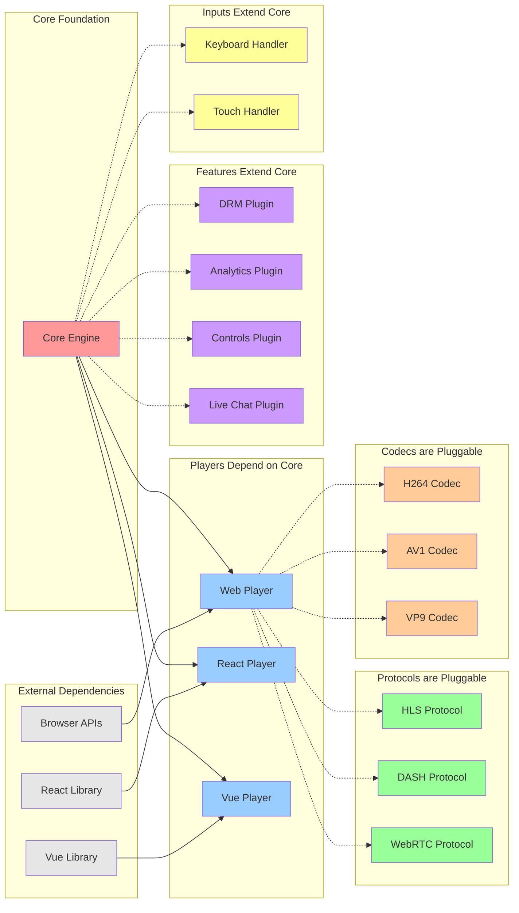
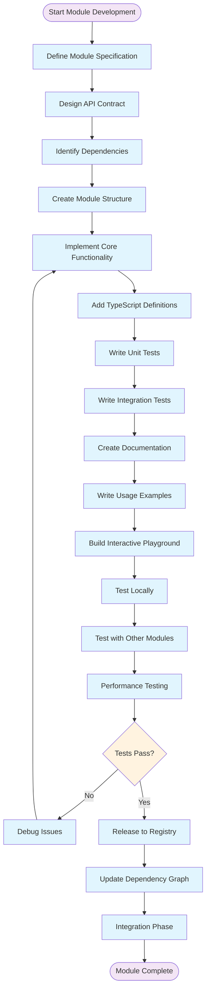
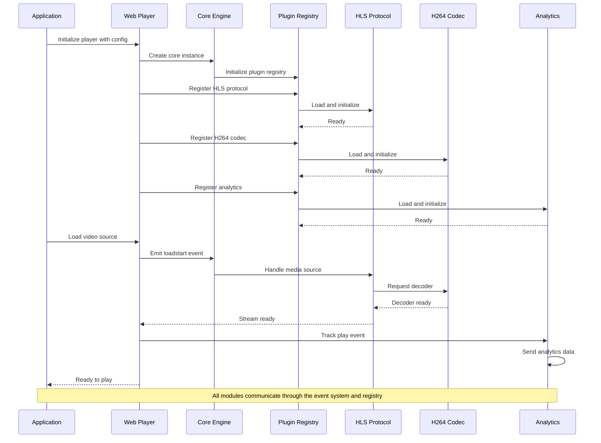
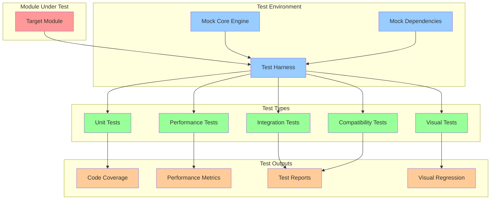

# Micro-Modular Architecture

## Overview

This document defines an **extreme micro-modular architecture** for the video player project, where every component, protocol, codec, and feature is isolated into independent, testable, and pluggable modules. This approach prioritizes educational value, debugging simplicity, and team scalability over traditional monolithic architectures.

## Design Philosophy

### Core Principles
1. **Everything is a Module**: Players, protocols, codecs, features, and adapters are all independent packages
2. **Zero Coupling**: Each module can function independently with minimal dependencies
3. **Clear Contracts**: Well-defined interfaces between all components
4. **Educational First**: Each module teaches specific video streaming concepts
5. **Pluggable by Design**: Mix and match components based on requirements
6. **Testing Isolation**: Each module can be thoroughly tested in isolation

### Trade-offs Accepted
- **Fragmented Structure**: Project appears more complex but enables deeper understanding
- **Bundle Size**: More packages may increase overall size (mitigated by tree shaking)
- **Initial Setup**: Higher complexity for simple use cases (educational benefit)
- **Coordination Overhead**: More modules require better dependency management

## Architecture Overview

### Complete Package Structure

The architecture consists of 86+ micro-modules organized into distinct layers:

```mermaid
graph TD
    A[video-player Ecosystem] --> B[Core Layer]
    A --> C[Player Layer]
    A --> D[Protocol Layer]
    A --> E[Codec Layer]
    A --> F[Feature Layer]
    A --> G[Input Layer]
    A --> H[Adapter Layer]
    A --> I[Playground Layer]

    B --> B1[core - Event System and Plugin Registry]

    C --> C1[web - Browser Implementation]
    C --> C2[chromecast - Cast Receiver]
    C --> C3[webview - Mobile WebView]
    C --> C4[react - React Wrapper]
    C --> C5[vue - Vue Wrapper]
    C --> C6[embed - Embeddable Widget]

    D --> D1[hls - HTTP Live Streaming]
    D --> D2[dash - Dynamic Adaptive Streaming]
    D --> D3[webrtc - Ultra-low Latency]
    D --> D4[rtmp - Legacy RTMP]
    D --> D5[srt - Professional SRT]
    D --> D6[progressive - MP4 and WebM]

    E --> E1[h264 - H264 AVC Decoder]
    E --> E2[h265 - H265 HEVC Decoder]
    E --> E3[av1 - AV1 Next-gen]
    E --> E4[vp9 - VP9 Decoder]
    E --> E5[aac - AAC Audio]
    E --> E6[opus - Opus Audio]

    F --> F1[analytics - Metrics and Tracking]
    F --> F2[controls - UI Controls and Themes]
    F --> F3[drm - Content Protection]
    F --> F4[captions - Subtitles and A11y]
    F --> F5[cast - Chromecast and AirPlay]
    F --> F6[ads - VAST and VPAID]
    F --> F7[thumbnails - Preview Images]
    F --> F8[live-chat - Real-time Messaging]

    G --> G1[keyboard - Keyboard Controls]
    G --> G2[gamepad - Controller Support]
    G --> G3[touch - Touch Gestures]
    G --> G4[remote - TV Remotes]

    H --> H1[videojs - Video.js Bridge]
    H --> H2[shaka - Shaka Player Bridge]
    H --> H3[native - Browser APIs]

    I --> I1[component-explorer - Interactive Browser]
    I --> I2[protocol-tester - Protocol Tools]
    I --> I3[integration-demos - Full Examples]

    classDef coreLayer fill:#ff9999
    classDef playerLayer fill:#99ccff
    classDef protocolLayer fill:#99ff99
    classDef codecLayer fill:#ffcc99
    classDef featureLayer fill:#cc99ff
    classDef inputLayer fill:#ffff99
    classDef adapterLayer fill:#ff99cc
    classDef playgroundLayer fill:#99ffcc

    class B,B1 coreLayer
    class C,C1,C2,C3,C4,C5,C6 playerLayer
    class D,D1,D2,D3,D4,D5,D6 protocolLayer
    class E,E1,E2,E3,E4,E5,E6 codecLayer
    class F,F1,F2,F3,F4,F5,F6,F7,F8 featureLayer
    class G,G1,G2,G3,G4 inputLayer
    class H,H1,H2,H3 adapterLayer
    class I,I1,I2,I3 playgroundLayer
```



### Layer Architecture Interactions

```mermaid
graph TB
    subgraph "Application Layer"
        APP[Your Application]
    end

    subgraph "Player Layer"
        WEB[Web Player]
        REACT[React Player]
        VUE[Vue Player]
    end

    subgraph "Core Engine Layer"
        CORE[Core Engine]
        EVENTS[Event System]
        REGISTRY[Plugin Registry]
    end

    subgraph "Protocol Layer"
        HLS[HLS Handler]
        DASH[DASH Handler]
        WEBRTC[WebRTC Handler]
        PROG[Progressive Handler]
    end

    subgraph "Codec Layer"
        H264[H264 Codec]
        AV1[AV1 Codec]
        VP9[VP9 Codec]
        AAC[AAC Audio]
    end

    subgraph "Feature Layer"
        DRM[DRM Protection]
        ANALYTICS[Analytics]
        CONTROLS[UI Controls]
        CAPTIONS[Captions]
        LIVECHAT[Live Chat]
    end

    subgraph "Input Layer"
        KEYBOARD[Keyboard Input]
        TOUCH[Touch Input]
        GAMEPAD[Gamepad Input]
    end

    subgraph "Adapter Layer"
        VIDEOJS[Video.js Adapter]
        SHAKA[Shaka Adapter]
        NATIVE[Native APIs]
    end

    APP --> WEB
    APP --> REACT
    APP --> VUE

    WEB --> CORE
    REACT --> CORE
    VUE --> CORE

    CORE --> EVENTS
    CORE --> REGISTRY

    REGISTRY --> HLS
    REGISTRY --> DASH
    REGISTRY --> WEBRTC
    REGISTRY --> PROG

    REGISTRY --> H264
    REGISTRY --> AV1
    REGISTRY --> VP9
    REGISTRY --> AAC

    REGISTRY --> DRM
    REGISTRY --> ANALYTICS
    REGISTRY --> CONTROLS
    REGISTRY --> CAPTIONS
    REGISTRY --> LIVECHAT

    REGISTRY --> KEYBOARD
    REGISTRY --> TOUCH
    REGISTRY --> GAMEPAD

    CORE --> VIDEOJS
    CORE --> SHAKA
    CORE --> NATIVE

    classDef appLayer fill:#f9f,stroke:#333
    classDef playerLayer fill:#bbf,stroke:#333
    classDef coreLayer fill:#fbb,stroke:#333
    classDef protocolLayer fill:#bfb,stroke:#333
    classDef codecLayer fill:#fbf,stroke:#333
    classDef featureLayer fill:#ffb,stroke:#333
    classDef inputLayer fill:#bff,stroke:#333
    classDef adapterLayer fill:#faf,stroke:#333

    class APP appLayer
    class WEB,REACT,VUE playerLayer
    class CORE,EVENTS,REGISTRY coreLayer
    class HLS,DASH,WEBRTC,PROG protocolLayer
    class H264,AV1,VP9,AAC codecLayer
    class DRM,ANALYTICS,CONTROLS,CAPTIONS,LIVECHAT featureLayer
    class KEYBOARD,TOUCH,GAMEPAD inputLayer
    class VIDEOJS,SHAKA,NATIVE adapterLayer
```



### Module Dependencies Flow



### Plugin System Architecture

```mermaid
graph TB
    subgraph "Plugin Registry"
        REGISTRY[Plugin Registry]
        LOADER[Module Loader]
        LIFECYCLE[Lifecycle Manager]
    end

    subgraph "Core Events"
        EVENTS[Event Bus]
        STATE[State Manager]
        CONFIG[Configuration]
    end

    subgraph "Plugin Categories"
        PROTOCOL_PLUGINS[Protocol Plugins]
        CODEC_PLUGINS[Codec Plugins]
        FEATURE_PLUGINS[Feature Plugins]
        INPUT_PLUGINS[Input Plugins]
    end

    subgraph "Plugin Lifecycle"
        REGISTER[Register]
        INITIALIZE[Initialize]
        CONFIGURE[Configure]
        ACTIVATE[Activate]
        DEACTIVATE[Deactivate]
        DESTROY[Destroy]
    end

    REGISTRY --> LOADER
    REGISTRY --> LIFECYCLE

    LOADER --> PROTOCOL_PLUGINS
    LOADER --> CODEC_PLUGINS
    LOADER --> FEATURE_PLUGINS
    LOADER --> INPUT_PLUGINS

    LIFECYCLE --> REGISTER
    LIFECYCLE --> INITIALIZE
    LIFECYCLE --> CONFIGURE
    LIFECYCLE --> ACTIVATE
    LIFECYCLE --> DEACTIVATE
    LIFECYCLE --> DESTROY

    EVENTS <--> PROTOCOL_PLUGINS
    EVENTS <--> CODEC_PLUGINS
    EVENTS <--> FEATURE_PLUGINS
    EVENTS <--> INPUT_PLUGINS

    STATE --> PROTOCOL_PLUGINS
    STATE --> CODEC_PLUGINS
    STATE --> FEATURE_PLUGINS
    STATE --> INPUT_PLUGINS

    CONFIG --> PROTOCOL_PLUGINS
    CONFIG --> CODEC_PLUGINS
    CONFIG --> FEATURE_PLUGINS
    CONFIG --> INPUT_PLUGINS

    classDef registry fill:#ff9999
    classDef events fill:#99ccff
    classDef plugins fill:#99ff99
    classDef lifecycle fill:#ffcc99

    class REGISTRY,LOADER,LIFECYCLE registry
    class EVENTS,STATE,CONFIG events
    class PROTOCOL_PLUGINS,CODEC_PLUGINS,FEATURE_PLUGINS,INPUT_PLUGINS plugins
    class REGISTER,INITIALIZE,CONFIGURE,ACTIVATE,DEACTIVATE,DESTROY lifecycle
```



### Development Workflow



### Module Communication Sequence



### Isolated Module Testing



## Visual Architecture Summary

The comprehensive visual diagrams above demonstrate the key architectural principles of the micro-modular video player system:

### 1. Complete Package Structure Visualization
The **Package Structure diagram** shows all 85+ modules organized into 8 distinct layers, each with a specific color coding:
- **Red (Core Layer)**: Foundation engine providing event system and plugin registry
- **Blue (Player Layer)**: Platform-specific implementations (Web, React, Vue, etc.)
- **Green (Protocol Layer)**: Streaming format handlers (HLS, DASH, WebRTC, etc.)
- **Orange (Codec Layer)**: Audio/video decoders (H.264, AV1, VP9, etc.)
- **Purple (Feature Layer)**: Pluggable enhancements (DRM, Analytics, Controls, Live Chat, etc.)
- **Yellow (Input Layer)**: Device input handlers (Keyboard, Touch, Gamepad, etc.)
- **Pink (Adapter Layer)**: Third-party integrations (Video.js, Shaka Player, etc.)
- **Light Green (Playground Layer)**: Educational and testing tools

### 2. Layer Architecture Interactions
The **Layer Interactions diagram** illustrates how data flows through the system:
- Applications interact with Player Layer implementations
- All Player implementations depend on the Core Engine
- The Core Engine manages the Plugin Registry
- All other layers register as plugins through the Registry
- This creates a hub-and-spoke model with Core as the central coordinator

### 3. Module Dependencies Flow
The **Dependencies Flow diagram** shows the relationship patterns:
- **Solid arrows**: Hard dependencies (required for functionality)
- **Dashed arrows**: Soft dependencies (pluggable modules)
- External libraries (React, Vue, Browser APIs) only affect specific players
- Core Engine has zero external dependencies
- Plugins can be mixed and matched without affecting other plugins

### 4. Plugin System Architecture
The **Plugin System diagram** demonstrates the sophisticated plugin management:
- **Plugin Registry**: Central hub for module discovery and management
- **Module Loader**: Handles dynamic loading and dependency resolution
- **Lifecycle Manager**: Controls initialization, configuration, and cleanup
- **Event Bus**: Enables decoupled communication between modules
- **State Manager**: Provides shared state access for all plugins
- **Configuration**: Allows runtime customization of plugin behavior

### 5. Development Workflow
The **Development Workflow diagram** shows the structured development process:
- Starts with specification and API design
- Includes comprehensive testing at multiple levels
- Features iterative debugging and refinement
- Ends with registry publication and integration
- Emphasizes quality gates throughout the process

### 6. Module Communication Sequence
The **Communication Sequence diagram** shows runtime interaction:
- Application initiates player setup
- Core engine orchestrates plugin registration
- Plugins are loaded and initialized in proper order
- Event-driven communication enables loose coupling
- All modules communicate through well-defined interfaces

### 7. Isolated Module Testing
The **Testing diagram** demonstrates how individual modules are tested:
- Each module can be tested in complete isolation
- Mock dependencies prevent external interference
- Multiple test types ensure comprehensive coverage
- Rich outputs enable quality measurement and regression detection

## Educational Value of Visual Architecture

These diagrams serve multiple educational purposes:

### For New Developers
- **Visual Learning**: Complex architecture becomes immediately understandable
- **Dependency Clarity**: Shows exactly what depends on what
- **Flow Understanding**: Illustrates how data moves through the system
- **Isolation Demonstration**: Makes module boundaries visually clear

### For Team Collaboration
- **Shared Mental Model**: Everyone sees the same architectural vision
- **Communication Tool**: Diagrams facilitate technical discussions
- **Onboarding Aid**: New team members understand system organization quickly
- **Design Documentation**: Visual specifications guide implementation decisions

### For System Evolution
- **Impact Analysis**: Changes can be visualized before implementation
- **Complexity Management**: System complexity is broken into digestible components
- **Scaling Planning**: Growth patterns are visible and predictable
- **Architecture Reviews**: Visual format enables effective architecture reviews

### For Quality Assurance
- **Test Planning**: Testing strategies are informed by architectural understanding
- **Coverage Analysis**: Visual representation helps identify untested interactions
- **Performance Planning**: Bottlenecks and optimization opportunities become apparent
- **Integration Testing**: Cross-module interactions are clearly defined

The micro-modular architecture transforms what could be an overwhelming monolithic system into a collection of focused, understandable, and manageable components. Each diagram reinforces the core principle that complexity is conquered through clear separation of concerns and well-defined interfaces.

## Module Specifications

### Core Layer

#### @video-player/core

**Purpose**: Foundation engine providing event system, plugin registry, and base abstractions.

**API Contract**:
```typescript
interface PlayerCore {
  // Event system
  on(event: string, handler: Function): void
  off(event: string, handler?: Function): void
  emit(event: string, data?: any): void

  // Plugin registry
  registerPlugin(name: string, plugin: Plugin): void
  unregisterPlugin(name: string): void
  getPlugin(name: string): Plugin | undefined

  // State management
  getState(): PlayerState
  setState(state: Partial<PlayerState>): void

  // Lifecycle
  initialize(config: PlayerConfig): Promise<void>
  destroy(): Promise<void>
}

interface Plugin {
  name: string
  version: string
  initialize(player: PlayerCore): Promise<void>
  destroy(): Promise<void>
}
```

**Dependencies**: None (zero dependencies)
**Testing**: Unit tests for event system, plugin registry, state management
**Documentation**: API reference, plugin development guide

### Player Layer

#### @video-player/web

**Purpose**: Web browser implementation with DOM manipulation and CSS styling.

**API Contract**:
```typescript
interface WebPlayer extends PlayerCore {
  // DOM integration
  attachTo(element: HTMLElement): void
  detach(): void

  // Media control
  load(source: MediaSource): Promise<void>
  play(): Promise<void>
  pause(): void
  seek(time: number): void

  // Properties
  currentTime: number
  duration: number
  volume: number
  muted: boolean
}
```

**Dependencies**: @video-player/core
**Features**: Responsive design, accessibility support, keyboard navigation
**Testing**: Unit tests + browser automation tests

#### @video-player/react

**Purpose**: React wrapper with hooks and component patterns.

**API Contract**:
```typescript
interface ReactPlayerProps {
  source: MediaSource
  controls?: boolean
  autoplay?: boolean
  onStateChange?: (state: PlayerState) => void
  plugins?: Plugin[]
}

// React hooks
export const usePlayer = (config: PlayerConfig) => PlayerCore
export const usePlayerState = (player: PlayerCore) => PlayerState
export const VideoPlayer: React.FC<ReactPlayerProps>
```

**Dependencies**: @video-player/core, @video-player/web, react
**Features**: React hooks, SSR support, TypeScript definitions
**Testing**: React Testing Library, Storybook components

### Protocol Layer

#### @video-player/hls

**Purpose**: HTTP Live Streaming (HLS) protocol implementation.

**API Contract**:
```typescript
interface HLSProtocol extends ProtocolHandler {
  // HLS-specific methods
  loadPlaylist(url: string): Promise<Playlist>
  selectVariant(bitrate: number): void
  getQualityLevels(): QualityLevel[]

  // Adaptive bitrate
  enableAdaptiveBitrate(enabled: boolean): void
  setMaxBitrate(bitrate: number): void
  setMinBitrate(bitrate: number): void
}
```

**Dependencies**: @video-player/core
**Features**: Adaptive bitrate, quality level selection, live stream support
**Educational Value**: Teaches HLS manifest parsing, segment loading, ABR algorithms
**Testing**: Unit tests with mock HLS streams, integration tests with real streams

#### @video-player/dash

**Purpose**: Dynamic Adaptive Streaming over HTTP (DASH) protocol implementation.

**API Contract**:
```typescript
interface DASHProtocol extends ProtocolHandler {
  // DASH-specific methods
  loadMPD(url: string): Promise<MediaPresentationDescription>
  selectRepresentation(id: string): void
  getAdaptationSets(): AdaptationSet[]
}
```

**Dependencies**: @video-player/core
**Features**: Multi-period support, trick modes, common encryption
**Educational Value**: Teaches DASH MPD parsing, representation selection
**Testing**: DASH conformance tests, multi-period stream tests

### Codec Layer

#### @video-player/h264

**Purpose**: H.264/AVC video codec support and optimization.

**API Contract**:
```typescript
interface H264Codec extends CodecHandler {
  // H.264 specific capabilities
  getSupportedProfiles(): H264Profile[]
  getHardwareSupport(): HardwareSupport
  decodeFrame(frame: EncodedFrame): Promise<VideoFrame>

  // Configuration
  setDecoderConfig(config: H264Config): void
}
```

**Dependencies**: @video-player/core
**Features**: Hardware acceleration detection, profile compatibility checks
**Educational Value**: Teaches H.264 profiles, levels, hardware decoding
**Testing**: Codec compatibility tests across browsers

#### @video-player/av1

**Purpose**: AV1 next-generation video codec support.

**API Contract**:
```typescript
interface AV1Codec extends CodecHandler {
  // AV1 specific capabilities
  checkBrowserSupport(): AV1Support
  getOptimalSettings(): AV1Settings

  // Progressive enhancement
  shouldFallback(): boolean
  getFallbackCodec(): CodecHandler
}
```

**Dependencies**: @video-player/core
**Features**: Progressive enhancement, fallback strategies
**Educational Value**: Teaches next-gen codecs, browser compatibility
**Testing**: Feature detection tests, fallback mechanism tests

### Feature Layer

#### @video-player/analytics

**Purpose**: Video analytics and metrics collection.

**API Contract**:
```typescript
interface AnalyticsPlugin extends Plugin {
  // Tracking methods
  trackPlay(metadata: PlayMetadata): void
  trackPause(position: number): void
  trackSeek(from: number, to: number): void
  trackQualityChange(quality: QualityLevel): void

  // Configuration
  configure(config: AnalyticsConfig): void

  // Providers
  addProvider(provider: AnalyticsProvider): void
}
```

**Dependencies**: @video-player/core
**Providers**: Google Analytics, Adobe Analytics, custom providers
**Educational Value**: Teaches video metrics, user behavior tracking
**Testing**: Event tracking verification, provider integration tests

#### @video-player/drm

**Purpose**: Digital Rights Management and content protection.

**API Contract**:
```typescript
interface DRMPlugin extends Plugin {
  // DRM systems
  supportedSystems(): DRMSystem[]
  initializeDRM(system: DRMSystem, config: DRMConfig): Promise<void>

  // License management
  requestLicense(challenge: Uint8Array): Promise<Uint8Array>
  updateLicense(license: Uint8Array): Promise<void>

  // Key management
  getKeyStatuses(): MediaKeyStatus[]
}
```

**Dependencies**: @video-player/core
**Systems**: Widevine, PlayReady, FairPlay
**Educational Value**: Teaches content protection, EME APIs
**Testing**: DRM system compatibility tests, license server mocks

#### @video-player/live-chat

**Purpose**: Real-time messaging and interactive chat features for live streaming.

**API Contract**:
```typescript
interface LiveChatPlugin extends Plugin {
  // Connection management
  connect(streamId: string): Promise<void>
  disconnect(): void
  reconnect(): Promise<void>

  // Message handling
  sendMessage(text: string): Promise<void>
  onMessage(callback: (message: ChatMessage) => void): void
  onMessageDeleted(callback: (messageId: string) => void): void

  // Moderation
  banUser(userId: string): Promise<void>
  unbanUser(userId: string): Promise<void>
  deleteMessage(messageId: string): Promise<void>
  setSlowMode(seconds: number): Promise<void>
  enableWordFilter(words: string[]): void

  // User management
  setUserRole(userId: string, role: UserRole): Promise<void>
  getUserList(): ChatUser[]
  kickUser(userId: string): Promise<void>

  // UI integration
  showChat(): void
  hideChat(): void
  toggleChat(): void
  setChatPosition(position: ChatPosition): void

  // Chat replay (for VOD)
  enableChatReplay(enabled: boolean): void
  seekChatToTime(time: number): void
  getChatHistory(startTime: number, endTime: number): ChatMessage[]

  // Emotes and reactions
  addCustomEmote(emote: CustomEmote): void
  sendReaction(reaction: ReactionType): Promise<void>
  onReaction(callback: (reaction: ChatReaction) => void): void

  // Analytics integration
  trackChatEngagement(): ChatMetrics
  getChatAnalytics(timeframe: TimeRange): ChatAnalytics

  // Multi-language support
  setLanguage(language: string): void
  enableTranslation(enabled: boolean): void
  translateMessage(messageId: string, targetLanguage: string): Promise<string>

  // Accessibility
  enableScreenReader(enabled: boolean): void
  setFontSize(size: FontSize): void
  enableHighContrast(enabled: boolean): void
}

interface ChatMessage {
  id: string
  userId: string
  username: string
  text: string
  timestamp: number
  emotes?: EmoteData[]
  isModerator: boolean
  isDeleted?: boolean
}

interface ChatUser {
  id: string
  username: string
  role: UserRole
  isOnline: boolean
  joinedAt: number
  messageCount: number
}

interface ChatMetrics {
  totalMessages: number
  activeUsers: number
  messagesPerMinute: number
  engagementRate: number
  moderationActions: number
}

enum UserRole {
  VIEWER = 'viewer',
  MODERATOR = 'moderator',
  BROADCASTER = 'broadcaster'
}

enum ChatPosition {
  RIGHT = 'right',
  LEFT = 'left',
  BOTTOM = 'bottom',
  OVERLAY = 'overlay'
}
```

**Dependencies**: @video-player/core, @video-player/analytics (optional)
**Technology Stack**: Socket.io, Redis (optional), WebRTC (ultra-low latency), Local Storage
**Features**:
- Real-time messaging with WebSockets/SSE
- Advanced moderation tools (spam filtering, word filtering, slow mode)
- User role management (viewer, moderator, broadcaster)
- Custom emote support and reactions
- Chat overlay integration with video player
- Chat replay synchronized with VOD timeline
- Multi-language support and translation
- Full accessibility compliance
- Cross-platform compatibility

**Integration Points**:
- **Video Timeline Sync**: Chat messages synchronized with live stream timeline
- **Analytics Integration**: Chat engagement metrics feeding into player analytics
- **Moderation Tools**: Integration with player admin controls
- **User Authentication**: Seamless integration with existing user systems
- **Mobile Responsive**: Touch-friendly chat interface for mobile devices

**Educational Value**: Teaches real-time communication, WebSocket protocols, chat moderation systems, accessibility design
**Testing**: Real-time messaging tests, moderation workflow tests, accessibility compliance tests, performance tests for high-volume chat

### Input Layer

#### @video-player/keyboard

**Purpose**: Keyboard input handling and shortcuts.

**API Contract**:
```typescript
interface KeyboardInput extends InputHandler {
  // Keyboard shortcuts
  registerShortcut(keys: string, action: KeyboardAction): void
  unregisterShortcut(keys: string): void

  // Key mapping
  setKeymap(keymap: KeyMap): void
  getKeymap(): KeyMap

  // Accessibility
  enableTrapFocus(enabled: boolean): void
  setAriaLabels(labels: AriaLabels): void
}
```

**Dependencies**: @video-player/core
**Features**: Customizable shortcuts, accessibility compliance, focus management
**Educational Value**: Teaches keyboard accessibility, focus trapping
**Testing**: Keyboard event simulation, accessibility audits

#### @video-player/gamepad

**Purpose**: Game controller support for TV and gaming platforms.

**API Contract**:
```typescript
interface GamepadInput extends InputHandler {
  // Controller detection
  getConnectedGamepads(): Gamepad[]
  onGamepadConnect(callback: (gamepad: Gamepad) => void): void

  // Button mapping
  mapButton(button: GamepadButton, action: GamepadAction): void
  mapAxis(axis: GamepadAxis, action: GamepadAxisAction): void

  // Vibration feedback
  vibrate(pattern: VibrationPattern): void
}
```

**Dependencies**: @video-player/core
**Features**: Multiple controller types, button remapping, haptic feedback
**Educational Value**: Teaches Gamepad API, controller patterns
**Testing**: Controller simulation, button mapping tests

### Adapter Layer

#### @video-player/videojs

**Purpose**: Video.js integration adapter for backward compatibility.

**API Contract**:
```typescript
interface VideoJSAdapter extends PlayerAdapter {
  // Video.js bridge
  fromVideoJS(videojsPlayer: VideoJSPlayer): Promise<PlayerCore>
  toVideoJS(player: PlayerCore): VideoJSPlayer

  // Plugin migration
  migratePlugin(videojsPlugin: any): Plugin

  // Event mapping
  mapEvents(player: PlayerCore, videojsPlayer: VideoJSPlayer): void
}
```

**Dependencies**: @video-player/core, video.js
**Features**: Two-way integration, plugin migration, event bridging
**Educational Value**: Teaches adapter patterns, legacy integration
**Testing**: Video.js compatibility tests, plugin migration tests

### Playground Layer

#### component-explorer

**Purpose**: Interactive component browser for exploring modules.

**Features**:
- Visual component catalog
- Live code editing
- Props manipulation
- Event visualization
- Performance profiling
- Device simulation

**API Contract**:
```typescript
interface ComponentExplorer {
  // Component registration
  registerComponent(name: string, component: Component): void

  // Interactive features
  renderComponent(name: string, props: any): void
  updateProps(props: any): void
  simulateEvent(event: string, data: any): void

  // Profiling
  startProfiling(): void
  stopProfiling(): ProfileReport
}
```

#### protocol-tester

**Purpose**: Protocol testing and debugging tools.

**Features**:
- Stream validator
- Manifest analyzer
- Segment inspector
- Quality ladder visualization
- Network simulation
- Error injection

**Educational Value**: Teaches protocol internals, debugging techniques

#### integration-demos

**Purpose**: Complete integration examples and use cases.

**Demos**:
- Basic video player
- Live streaming setup
- Multi-protocol player
- DRM-protected content
- Analytics integration
- Cross-platform deployment

## Development Guidelines

### Module Structure

Each module must follow this standardized structure:

```
@video-player/[module-name]/
├── src/                              # Source code
│   ├── index.ts                      # Main export
│   ├── types.ts                      # TypeScript definitions
│   ├── [module].ts                   # Core implementation
│   └── utils/                        # Utility functions
├── tests/                            # Test suite
│   ├── unit/                         # Unit tests
│   ├── integration/                  # Integration tests
│   └── __fixtures__/                 # Test fixtures
├── docs/                             # Documentation
│   ├── README.md                     # Module overview
│   ├── API.md                        # API reference
│   └── examples/                     # Usage examples
├── playground/                       # Interactive demos
│   └── demo.html                     # Standalone demo
├── package.json                      # Package configuration
├── tsconfig.json                     # TypeScript config
└── rollup.config.js                  # Build configuration
```

### Package Configuration

Each module's `package.json` must include:

```json
{
  "name": "@video-player/[module-name]",
  "version": "1.0.0",
  "description": "[Module description]",
  "main": "dist/index.js",
  "module": "dist/index.esm.js",
  "types": "dist/index.d.ts",
  "exports": {
    ".": {
      "import": "./dist/index.esm.js",
      "require": "./dist/index.js",
      "types": "./dist/index.d.ts"
    }
  },
  "files": ["dist/", "README.md"],
  "keywords": ["video-player", "[module-category]"],
  "peerDependencies": {
    "@video-player/core": "^1.0.0"
  },
  "devDependencies": {
    "@video-player/testing": "^1.0.0"
  }
}
```

### Interface Standards

All modules must implement standard interfaces:

```typescript
// Base interfaces
interface Module {
  name: string
  version: string
  dependencies: string[]
  initialize(config: any): Promise<void>
  destroy(): Promise<void>
}

interface Plugin extends Module {
  register(player: PlayerCore): void
  unregister(player: PlayerCore): void
}

interface ProtocolHandler extends Module {
  canHandle(source: MediaSource): boolean
  load(source: MediaSource): Promise<void>
  unload(): Promise<void>
}

interface CodecHandler extends Module {
  isSupported(): boolean
  canDecode(codec: string): boolean
  configure(config: any): void
}
```

### Testing Requirements

Each module must have:

1. **Unit Tests**: 90%+ code coverage
2. **Integration Tests**: Cross-module compatibility
3. **Visual Tests**: UI component regression testing
4. **Performance Tests**: Memory and CPU profiling
5. **Compatibility Tests**: Browser/platform support matrix

### Documentation Standards

Each module must provide:

1. **README.md**: Overview, installation, basic usage
2. **API.md**: Complete API reference with examples
3. **Examples**: Working code samples
4. **Playground**: Interactive demo page
5. **Migration Guide**: If replacing existing functionality

## Educational Benefits

### Learning Path Structure

The micro-modular approach enables structured learning:

1. **Core Concepts** (`@video-player/core`): Event systems, plugin architecture
2. **Platform Fundamentals** (`@video-player/web`): DOM, media APIs
3. **Streaming Protocols** (`protocols/*`): HLS, DASH, WebRTC
4. **Codec Technologies** (`codecs/*`): H.264, AV1, audio codecs
5. **Advanced Features** (`features/*`): DRM, analytics, advertising
6. **User Interaction** (`input/*`): Accessibility, input devices
7. **Integration Patterns** (`adapters/*`): Legacy system integration

### Exploration Benefits

Each module teaches specific concepts:

- **Protocol modules**: Manifest parsing, adaptive bitrate algorithms
- **Codec modules**: Hardware acceleration, browser compatibility
- **Feature modules**: Plugin patterns, provider abstractions, real-time communication
- **Input modules**: Event handling, accessibility standards
- **Adapter modules**: Integration patterns, API translation

## Development Workflow

### Module Development Process

1. **Specification Phase**
   - Define module purpose and scope
   - Design API contract
   - Identify dependencies
   - Plan testing strategy

2. **Implementation Phase**
   - Create module structure
   - Implement core functionality
   - Add TypeScript definitions
   - Write comprehensive tests

3. **Documentation Phase**
   - Create API documentation
   - Write usage examples
   - Build interactive playground
   - Record educational content

4. **Integration Phase**
   - Test with other modules
   - Validate performance impact
   - Update dependency graph
   - Release to npm registry

### Debugging Advantages

The micro-modular approach simplifies debugging:

1. **Isolation**: Issues are contained within specific modules
2. **Replacement**: Swap problematic modules with alternatives
3. **Profiling**: Profile individual modules for performance bottlenecks
4. **Testing**: Test modules independently with controlled inputs
5. **Monitoring**: Track module-specific metrics and errors

### Team Scalability

Teams can own specific module categories:

- **Core Team**: Foundation modules and architecture
- **Protocol Team**: Streaming protocol implementations
- **Codec Team**: Audio/video codec support
- **Features Team**: Plugin development and UI components
- **Platform Team**: Platform-specific implementations
- **QA Team**: Testing frameworks and automation

## Implementation Roadmap

### Phase 1: Foundation (Weeks 1-2)
- [ ] `@video-player/core` - Base engine and plugin system
- [ ] `@video-player/web` - Basic web player implementation
- [ ] `@video-player/progressive` - Simple MP4 playback
- [ ] Testing infrastructure and CI/CD pipeline

### Phase 2: Core Protocols (Weeks 3-4)
- [ ] `@video-player/hls` - HLS streaming support
- [ ] `@video-player/dash` - DASH streaming support
- [ ] `@video-player/h264` - H.264 codec optimization
- [ ] Basic analytics and metrics

### Phase 3: Advanced Features (Weeks 5-6)
- [ ] `@video-player/drm` - Content protection
- [ ] `@video-player/captions` - Subtitle support
- [ ] `@video-player/controls` - UI controls framework
- [ ] `@video-player/live-chat` - Real-time messaging for live streams
- [ ] Input device handlers (keyboard, touch)

### Phase 4: Ecosystem Integration (Weeks 7-8)
- [ ] `@video-player/react` - React wrapper
- [ ] `@video-player/videojs` - Video.js adapter
- [ ] Component explorer and testing tools
- [ ] Documentation and examples

### Phase 5: Advanced Codecs & Protocols (Weeks 9-10)
- [ ] `@video-player/av1` - AV1 codec support
- [ ] `@video-player/webrtc` - Ultra-low latency streaming
- [ ] `@video-player/cast` - Chromecast integration
- [ ] Performance optimization and profiling

## Success Metrics

### Technical Metrics
- **Bundle Size**: Each module <50KB gzipped
- **Performance**: No >5% overhead from modularity
- **Test Coverage**: >90% for all modules
- **Browser Support**: Modern browsers + IE11 fallbacks
- **Load Time**: First video frame <2 seconds

### Educational Metrics
- **Documentation Coverage**: 100% API documentation
- **Example Quality**: Working examples for all modules
- **Playground Completeness**: Interactive demos for all features
- **Learning Path**: Clear progression through module complexity

### Developer Experience Metrics
- **Setup Time**: New developer productive in <30 minutes
- **Build Time**: Full project builds in <3 minutes
- **Debug Time**: Issue isolation in <10 minutes average
- **Integration Time**: New module integration in <2 hours

## Conclusion

This micro-modular architecture transforms the video player from a monolithic application into an educational ecosystem. Each module serves as both a functional component and a learning resource, enabling developers to understand the intricacies of modern video streaming while building production-ready applications.

The approach trades some initial complexity for long-term benefits:
- **Maintainability**: Issues are isolated and easily identified
- **Scalability**: Teams can work independently on different aspects
- **Education**: Each module teaches specific video streaming concepts
- **Flexibility**: Mix and match components based on requirements
- **Innovation**: Easy to experiment with new technologies and approaches

This architecture positions the project as both a practical video player solution and a comprehensive educational resource for understanding modern video streaming technologies.

---

*This document serves as the foundational specification for the micro-modular video player architecture. Each module will have its own detailed specification document following the guidelines outlined here.*