# Modular Video Player Architecture

## Executive Summary

This document presents a comprehensive modular video player architecture based on the user's vision of a central core player with platform-specific implementations and pluggable libraries. The architecture enables parallel team development, supports multiple platforms, protocols, and DRM systems while maintaining code reusability and scalability.

## Table of Contents

1. [Architecture Overview](#architecture-overview)
2. [Complete Platform Matrix](#complete-platform-matrix)
3. [Extended Protocol Support](#extended-protocol-support)
4. [Comprehensive DRM Ecosystem](#comprehensive-drm-ecosystem)
5. [Plugin Architecture Framework](#plugin-architecture-framework)
6. [Team Parallelization Strategy](#team-parallelization-strategy)
7. [Core Player Architecture](#core-player-architecture)
8. [Platform-Specific Implementations](#platform-specific-implementations)
9. [Development Workflow](#development-workflow)
10. [Testing Strategy](#testing-strategy)

## Architecture Overview

### Modular Design Philosophy

```mermaid
flowchart TB
    subgraph CorePlayer["🎥 Core Player Engine"]
        CORE_API["🔌 Core API<br/>Platform Agnostic"]
        STATE_MGR["🔄 State Manager<br/>Global State"]
        EVENT_BUS["📡 Event Bus<br/>Message System"]
        PLUGIN_MGR["🧩 Plugin Manager<br/>Extension System"]
    end

    subgraph PlatformLayer["📱 Platform Layer"]
        subgraph WebPlatforms["🌐 Web Platforms"]
            WEB_BROWSER["💻 Browser<br/>Video.js"]
            PWA["📱 PWA<br/>Service Worker"]
            WEB_COMP["🧩 Web Components<br/>Custom Elements"]
            AMP["⚡ AMP<br/>AMP Video"]
        end

        subgraph MobilePlatforms["📱 Mobile Platforms"]
            IOS["🍎 iOS<br/>Native/React Native"]
            ANDROID["🤖 Android<br/>ExoPlayer/React Native"]
            FLUTTER["🐦 Flutter<br/>Cross-Platform"]
        end

        subgraph TVPlatforms["📺 Smart TV Platforms"]
            WEBOS["📺 webOS<br/>LG Smart TV"]
            TIZEN["📺 Tizen<br/>Samsung TV"]
            ROKU["📺 Roku<br/>BrightScript"]
            FIRE_TV["📺 Fire TV<br/>Android TV"]
            APPLE_TV["🍎 Apple TV<br/>tvOS"]
            CHROMECAST["📺 Chromecast<br/>Google TV"]
        end

        subgraph GamingPlatforms["🎮 Gaming Platforms"]
            XBOX["🎮 Xbox<br/>UWP"]
            PS["🎮 PlayStation<br/>Native"]
            NINTENDO["🎮 Nintendo Switch<br/>Native"]
            STEAM["🎮 Steam Deck<br/>Proton"]
        end

        subgraph AutomotivePlatforms["🚗 Automotive Platforms"]
            ANDROID_AUTO["🤖 Android Auto<br/>Android"]
            CARPLAY["🍎 CarPlay<br/>iOS"]
            TESLA["🚗 Tesla<br/>Web Browser"]
        end

        subgraph VR_AR_Platforms["🥽 VR/AR Platforms"]
            META_QUEST["🥽 Meta Quest<br/>WebXR"]
            APPLE_VISION["🍎 Vision Pro<br/>visionOS"]
            HOLOLENS["🪟 HoloLens<br/>Mixed Reality"]
        end
    end

    subgraph PluginEcosystem["🔌 Plugin Ecosystem"]
        ANALYTICS["📊 Analytics<br/>Telemetry & QoE"]
        CONTROLS["🎛️ Controls<br/>UI & Interactions"]
        DRM["🔐 DRM<br/>Content Protection"]
        STREAMING["📡 Streaming<br/>Protocol Handlers"]
        UI_THEMES["🎨 UI Themes<br/>Skins & Branding"]
        CAST["📺 Cast<br/>Chromecast/AirPlay"]
        ADS["📢 Ads<br/>VAST/VPAID"]
        CAPTIONS["📝 Captions<br/>Subtitles/WebVTT"]
        SOCIAL["🤝 Social<br/>Sharing & Comments"]
        PLAYLISTS["📄 Playlists<br/>Content Management"]
    end

    %% Core connections
    CORE_API --> STATE_MGR
    STATE_MGR --> EVENT_BUS
    EVENT_BUS --> PLUGIN_MGR

    %% Platform connections
    CORE_API --> WebPlatforms
    CORE_API --> MobilePlatforms
    CORE_API --> TVPlatforms
    CORE_API --> GamingPlatforms
    CORE_API --> AutomotivePlatforms
    CORE_API --> VR_AR_Platforms

    %% Plugin connections
    PLUGIN_MGR --> ANALYTICS
    PLUGIN_MGR --> CONTROLS
    PLUGIN_MGR --> DRM
    PLUGIN_MGR --> STREAMING
    PLUGIN_MGR --> UI_THEMES
    PLUGIN_MGR --> CAST
    PLUGIN_MGR --> ADS
    PLUGIN_MGR --> CAPTIONS
    PLUGIN_MGR --> SOCIAL
    PLUGIN_MGR --> PLAYLISTS

    %% Styling
    classDef core fill:#e8f5e9,stroke:#2e7d32,stroke-width:2px
    classDef platform fill:#e3f2fd,stroke:#1565c0,stroke-width:2px
    classDef plugin fill:#fff3e0,stroke:#ef6c00,stroke-width:2px

    class CORE_API,STATE_MGR,EVENT_BUS,PLUGIN_MGR core
    class WEB_BROWSER,PWA,WEB_COMP,AMP,IOS,ANDROID,FLUTTER,WEBOS,TIZEN,ROKU,FIRE_TV,APPLE_TV,CHROMECAST,XBOX,PS,NINTENDO,STEAM,ANDROID_AUTO,CARPLAY,TESLA,META_QUEST,APPLE_VISION,HOLOLENS platform
    class ANALYTICS,CONTROLS,DRM,STREAMING,UI_THEMES,CAST,ADS,CAPTIONS,SOCIAL,PLAYLISTS plugin
```



## Complete Platform Matrix

### Web Platforms
| Platform | Technology | Status | Notes |
|----------|------------|--------|-------|
| **Browser** | Video.js 8.x | ✅ Core | Standard web implementation |
| **PWA** | Service Worker + Video.js | 🟡 Extend | Offline playback, background sync |
| **Web Components** | Custom Elements API | 🟡 Extend | Framework-agnostic components |
| **AMP** | AMP Video component | 🔴 New | Google AMP integration |
| **Webview** | Embedded browser | ✅ Core | Mobile app webview |
| **Chromecast** | Cast SDK | 🟡 Extend | Sender application |
| **React** | React wrapper | ✅ Core | React integration |
| **Embed** | iframe/script embed | ✅ Core | Third-party embeds |

### Mobile Platforms
| Platform | Technology | Status | Notes |
|----------|------------|--------|-------|
| **iOS Native** | AVPlayer + Swift | 🔴 New | Native iOS implementation |
| **Android Native** | ExoPlayer + Kotlin | 🔴 New | Native Android implementation |
| **React Native** | react-native-video | 🟡 Extend | Cross-platform mobile |
| **Flutter** | video_player plugin | 🔴 New | Dart-based cross-platform |
| **Ionic** | Capacitor Video | 🟡 Extend | Hybrid mobile apps |
| **Cordova/PhoneGap** | cordova-plugin-video | 🟡 Extend | Legacy hybrid support |

### Smart TV Platforms
| Platform | Technology | Status | Notes |
|----------|------------|--------|-------|
| **LG webOS** | webOS SDK | 🟡 Extend | LG Smart TV |
| **Samsung Tizen** | Tizen SDK | 🟡 Extend | Samsung Smart TV |
| **Roku** | BrightScript | 🟡 Extend | Roku streaming devices |
| **Fire TV** | Android TV SDK | 🔴 New | Amazon Fire TV |
| **Apple TV** | tvOS SDK | 🔴 New | Apple TV 4K |
| **Chromecast with Google TV** | Android TV | 🔴 New | Google TV interface |
| **Android TV** | Android TV SDK | 🔴 New | Android TV platform |

### Gaming Platforms
| Platform | Technology | Status | Notes |
|----------|------------|--------|-------|
| **Xbox** | UWP/Win32 | 🔴 New | Xbox Series X/S, Xbox One |
| **PlayStation** | PlayStation SDK | 🔴 New | PS5/PS4 |
| **Nintendo Switch** | Nintendo SDK | 🔴 New | Switch console |
| **Steam Deck** | Proton/Linux | 🔴 New | Valve's handheld PC |
| **PC Gaming** | DirectShow/Media Foundation | 🔴 New | Windows gaming PCs |

### Automotive Platforms
| Platform | Technology | Status | Notes |
|----------|------------|--------|-------|
| **Android Auto** | Android Auto SDK | 🔴 New | Google automotive platform |
| **Apple CarPlay** | CarPlay SDK | 🔴 New | Apple automotive platform |
| **Tesla** | Tesla Browser | 🔴 New | Tesla in-car entertainment |
| **Android Automotive** | AAOS | 🔴 New | Built-in Android system |

### VR/AR Platforms
| Platform | Technology | Status | Notes |
|----------|------------|--------|-------|
| **Meta Quest** | WebXR/Oculus SDK | 🔴 New | VR headset support |
| **Apple Vision Pro** | visionOS SDK | 🔴 New | Mixed reality headset |
| **Microsoft HoloLens** | Mixed Reality SDK | 🔴 New | AR platform |
| **WebXR** | WebXR API | 🔴 New | Browser-based VR/AR |

### Desktop Platforms
| Platform | Technology | Status | Notes |
|----------|------------|--------|-------|
| **Electron** | Electron + Video.js | 🟡 Extend | Cross-platform desktop |
| **Windows** | WinUI 3/UWP | 🔴 New | Native Windows app |
| **macOS** | AppKit/SwiftUI | 🔴 New | Native macOS app |
| **Linux** | GTK/Qt | 🔴 New | Native Linux app |

## Extended Protocol Support

### Streaming Protocols Matrix

| Protocol | Use Case | Latency | Browser Support | Implementation Priority |
|----------|----------|---------|-----------------|------------------------|
| **HLS** | Live/VOD | 6-30s | Safari native, others via hls.js | ✅ Core |
| **DASH** | Live/VOD | 6-30s | MSE-based players | ✅ Core |
| **MPEG-TS** | Live broadcast | 2-6s | Limited, needs transcoding | 🟡 Extend |
| **WebRTC** | Ultra-low latency | <1s | Native browser support | 🔴 New |
| **SRT** | Secure transport | 2-5s | Via WebAssembly/proxy | 🔴 New |
| **RTMP/RTMPS** | Legacy streaming | 3-10s | Flash deprecated, proxy needed | 🟡 Extend |
| **LL-HLS** | Low latency HLS | 2-6s | Recent hls.js versions | 🟡 Extend |
| **LL-DASH** | Low latency DASH | 2-6s | dash.js support | 🟡 Extend |
| **WebM** | Progressive | Instant | Native browser support | ✅ Core |
| **MP4** | Progressive | Instant | Native browser support | ✅ Core |
| **RTSP** | IP cameras | Variable | Via WebRTC gateway | 🔴 New |
| **UDP/Multicast** | IPTV | Low | Via WebRTC/proxy | 🔴 New |

### Protocol Implementation Strategy

```typescript
// Protocol manager with pluggable handlers
abstract class ProtocolHandler {
  abstract canHandle(url: string): boolean;
  abstract initialize(player: CorePlayer, config: ProtocolConfig): Promise<void>;
  abstract load(url: string): Promise<void>;
  abstract dispose(): void;
}

class HLSHandler extends ProtocolHandler {
  private hlsInstance: Hls;

  canHandle(url: string): boolean {
    return url.includes('.m3u8') || url.includes('application/x-mpegURL');
  }

  async initialize(player: CorePlayer, config: ProtocolConfig) {
    this.hlsInstance = new Hls({
      lowLatencyMode: config.lowLatency,
      maxBufferLength: config.bufferLength || 30,
      enableWorker: true,
      ...config.hlsOptions
    });
  }
}

class WebRTCHandler extends ProtocolHandler {
  private peerConnection: RTCPeerConnection;

  canHandle(url: string): boolean {
    return url.startsWith('webrtc:') || url.includes('signaling');
  }

  async initialize(player: CorePlayer, config: ProtocolConfig) {
    this.peerConnection = new RTCPeerConnection({
      iceServers: config.iceServers || [
        { urls: 'stun:stun.l.google.com:19302' }
      ]
    });

    await this.setupWebRTCStreaming(config);
  }
}

class SRTHandler extends ProtocolHandler {
  private srtProxy: SRTProxy;

  canHandle(url: string): boolean {
    return url.startsWith('srt://');
  }

  async initialize(player: CorePlayer, config: ProtocolConfig) {
    // SRT via WebAssembly or server-side proxy
    this.srtProxy = new SRTProxy(config.proxyEndpoint);
    await this.srtProxy.initialize();
  }
}

// Protocol manager
class ProtocolManager {
  private handlers: ProtocolHandler[] = [
    new HLSHandler(),
    new DASHHandler(),
    new WebRTCHandler(),
    new SRTHandler(),
    new RTMPHandler(),
    new ProgressiveHandler()
  ];

  getHandler(url: string): ProtocolHandler {
    return this.handlers.find(handler => handler.canHandle(url));
  }

  registerHandler(handler: ProtocolHandler) {
    this.handlers.unshift(handler); // Higher priority
  }
}
```

### Codec Support Matrix

| Codec | Container | Browser Support | Hardware Acceleration | Notes |
|-------|-----------|-----------------|----------------------|-------|
| **H.264/AVC** | MP4, TS, WebM | Universal | Yes | Most compatible |
| **H.265/HEVC** | MP4, TS | Limited (Safari) | Yes | 4K/HDR content |
| **AV1** | MP4, WebM | Chrome, Firefox | Limited | Next-gen codec |
| **VP8** | WebM | Universal | Limited | Open source |
| **VP9** | WebM | Chrome, Firefox | Yes | High efficiency |
| **AAC** | MP4, TS | Universal | Yes | Audio codec |
| **Opus** | WebM, Ogg | Chrome, Firefox | No | Low latency audio |
| **MP3** | MP4, MP3 | Universal | Yes | Legacy audio |

## Comprehensive DRM Ecosystem

### DRM Support Matrix

| DRM System | Platform Support | Content Types | Implementation Priority |
|------------|------------------|---------------|------------------------|
| **Widevine** | Chrome, Android, Edge | Live/VOD | ✅ Core |
| **PlayReady** | Edge, Xbox, Windows | Live/VOD | ✅ Core |
| **FairPlay** | Safari, iOS, tvOS | Live/VOD | ✅ Core |
| **ClearKey** | All MSE browsers | Testing/Demo | 🟡 Extend |
| **Adobe Primetime** | Legacy Flash | VOD | 🟡 Legacy |
| **Marlin** | Android, STB | VOD | 🔴 New |
| **Nagra** | STB, Smart TV | Live/VOD | 🔴 New |
| **Verimatrix** | STB, Smart TV | Live/VOD | 🔴 New |
| **Custom DRM** | Server-side | Any | 🔴 New |

### Multi-DRM Architecture

```typescript
interface DRMConfig {
  keySystem: string;
  licenseUrl: string;
  certificateUrl?: string;
  headers?: Record<string, string>;
  withCredentials?: boolean;
  sessionTypes?: string[];
  audioRobustness?: string;
  videoRobustness?: string;
  persistentLicense?: boolean;
}

class DRMManager {
  private drmSystems: Map<string, DRMHandler> = new Map();
  private activeDRM: DRMHandler | null = null;

  constructor() {
    this.registerDRMSystems();
  }

  private registerDRMSystems() {
    this.drmSystems.set('com.widevine.alpha', new WidevineHandler());
    this.drmSystems.set('com.microsoft.playready', new PlayReadyHandler());
    this.drmSystems.set('com.apple.fps.1_0', new FairPlayHandler());
    this.drmSystems.set('org.w3.clearkey', new ClearKeyHandler());
  }

  async setupDRM(video: HTMLVideoElement, configs: DRMConfig[]): Promise<void> {
    // Try each DRM system in order of preference
    for (const config of configs) {
      const handler = this.drmSystems.get(config.keySystem);
      if (!handler) continue;

      try {
        const isSupported = await handler.isSupported(config);
        if (isSupported) {
          await handler.initialize(video, config);
          this.activeDRM = handler;
          break;
        }
      } catch (error) {
        console.warn(`Failed to initialize ${config.keySystem}:`, error);
      }
    }

    if (!this.activeDRM) {
      throw new Error('No supported DRM system found');
    }
  }
}

abstract class DRMHandler {
  abstract isSupported(config: DRMConfig): Promise<boolean>;
  abstract initialize(video: HTMLVideoElement, config: DRMConfig): Promise<void>;
  abstract dispose(): void;
}

class WidevineHandler extends DRMHandler {
  async isSupported(config: DRMConfig): Promise<boolean> {
    try {
      const access = await navigator.requestMediaKeySystemAccess(
        'com.widevine.alpha',
        [{
          initDataTypes: ['cenc'],
          audioCapabilities: [{ contentType: 'audio/mp4; codecs="mp4a.40.2"' }],
          videoCapabilities: [{ contentType: 'video/mp4; codecs="avc1.42E01E"' }],
          distinctiveIdentifier: 'optional',
          persistentState: config.persistentLicense ? 'required' : 'optional',
          sessionTypes: config.sessionTypes || ['temporary']
        }]
      );
      return !!access;
    } catch {
      return false;
    }
  }

  async initialize(video: HTMLVideoElement, config: DRMConfig): Promise<void> {
    const access = await navigator.requestMediaKeySystemAccess('com.widevine.alpha', [/* ... */]);
    const mediaKeys = await access.createMediaKeys();
    await video.setMediaKeys(mediaKeys);

    video.addEventListener('encrypted', (event) => {
      this.handleEncrypted(event, mediaKeys, config);
    });
  }

  private async handleEncrypted(
    event: MediaEncryptedEvent,
    mediaKeys: MediaKeys,
    config: DRMConfig
  ): Promise<void> {
    const session = mediaKeys.createSession();

    session.addEventListener('message', async (event) => {
      const license = await this.fetchLicense(event.message, config);
      await session.update(license);
    });

    await session.generateRequest(event.initDataType, event.initData);
  }

  private async fetchLicense(message: ArrayBuffer, config: DRMConfig): Promise<ArrayBuffer> {
    const response = await fetch(config.licenseUrl, {
      method: 'POST',
      headers: {
        'Content-Type': 'application/octet-stream',
        ...config.headers
      },
      body: message,
      credentials: config.withCredentials ? 'include' : 'same-origin'
    });

    if (!response.ok) {
      throw new Error(`License request failed: ${response.status}`);
    }

    return response.arrayBuffer();
  }

  dispose(): void {
    // Cleanup sessions and keys
  }
}

class FairPlayHandler extends DRMHandler {
  async isSupported(): Promise<boolean> {
    return 'WebKitMediaKeys' in window;
  }

  async initialize(video: HTMLVideoElement, config: DRMConfig): Promise<void> {
    // FairPlay implementation for Safari/iOS
    video.addEventListener('webkitneedkey', (event) => {
      this.handleNeedKey(event, config);
    });
  }

  private async handleNeedKey(event: any, config: DRMConfig): Promise<void> {
    // FairPlay key request logic
    const certificate = await this.fetchCertificate(config.certificateUrl!);
    const contentId = this.extractContentId(event.initData);

    const keyRequest = new Uint8Array([/* ... */]);
    const license = await this.fetchLicense(keyRequest, config);

    event.target.webkitSetMediaKeys(new WebKitMediaKeys('com.apple.fps.1_0'));
    // Additional FairPlay setup...
  }

  dispose(): void {
    // Cleanup FairPlay resources
  }
}
```

### Content Protection Features

```typescript
interface ContentProtectionConfig {
  // DRM settings
  drm: DRMConfig[];

  // Token-based authentication
  tokenAuth: {
    endpoint: string;
    refreshThreshold: number;
    headers: Record<string, string>;
  };

  // Geo-blocking
  geoRestrictions: {
    allowedCountries: string[];
    blockedCountries: string[];
    ipWhitelist: string[];
  };

  // Device limits
  deviceLimits: {
    maxConcurrentStreams: number;
    maxRegisteredDevices: number;
    deviceFingerprinting: boolean;
  };

  // Watermarking
  watermark: {
    enabled: boolean;
    text: string;
    position: 'top-left' | 'top-right' | 'bottom-left' | 'bottom-right';
    userId: string;
  };

  // Screen capture protection
  screenProtection: {
    preventScreenshots: boolean;
    preventRecording: boolean;
    hdcpRequired: boolean;
  };
}

class ContentProtectionManager {
  async validateAccess(config: ContentProtectionConfig): Promise<boolean> {
    // Check geo-restrictions
    if (!await this.checkGeoRestrictions(config.geoRestrictions)) {
      throw new Error('Content not available in your region');
    }

    // Validate device limits
    if (!await this.checkDeviceLimits(config.deviceLimits)) {
      throw new Error('Device limit exceeded');
    }

    // Verify token authentication
    if (!await this.validateToken(config.tokenAuth)) {
      throw new Error('Authentication failed');
    }

    return true;
  }

  async setupWatermarking(video: HTMLVideoElement, config: any): Promise<void> {
    if (!config.watermark.enabled) return;

    // Create watermark overlay
    const overlay = document.createElement('div');
    overlay.style.cssText = `
      position: absolute;
      ${config.watermark.position.includes('top') ? 'top: 10px' : 'bottom: 10px'};
      ${config.watermark.position.includes('left') ? 'left: 10px' : 'right: 10px'};
      background: rgba(0,0,0,0.5);
      color: white;
      padding: 5px 10px;
      border-radius: 3px;
      font-size: 12px;
      pointer-events: none;
      z-index: 1000;
    `;
    overlay.textContent = `${config.watermark.text} - ${config.watermark.userId}`;

    video.parentElement?.appendChild(overlay);
  }
}
```

## Plugin Architecture Framework

### Core Plugin System

```typescript
interface PluginMetadata {
  name: string;
  version: string;
  description: string;
  author: string;
  license: string;
  homepage?: string;
  keywords: string[];
  dependencies: string[];
  peerDependencies: string[];
  platforms: string[];
  minCoreVersion: string;
}

interface PluginCapabilities {
  hooks: string[];
  events: string[];
  apis: string[];
  ui: boolean;
  background: boolean;
  persistent: boolean;
}

abstract class BasePlugin {
  abstract metadata: PluginMetadata;
  abstract capabilities: PluginCapabilities;

  protected player: CorePlayer;
  protected config: any;
  private initialized = false;

  constructor(player: CorePlayer, config: any = {}) {
    this.player = player;
    this.config = config;
  }

  abstract initialize(): Promise<void>;
  abstract dispose(): void;

  // Lifecycle methods
  async enable(): Promise<void> {
    if (this.initialized) return;

    await this.initialize();
    this.initialized = true;

    this.player.emit('plugin:enabled', this.metadata.name);
  }

  async disable(): Promise<void> {
    if (!this.initialized) return;

    this.dispose();
    this.initialized = false;

    this.player.emit('plugin:disabled', this.metadata.name);
  }

  // Hook system
  protected registerHook(event: string, handler: Function): void {
    this.player.hooks.register(this.metadata.name, event, handler);
  }

  protected unregisterHook(event: string): void {
    this.player.hooks.unregister(this.metadata.name, event);
  }

  // Event system
  protected on(event: string, handler: Function): void {
    this.player.on(event, handler);
  }

  protected emit(event: string, data?: any): void {
    this.player.emit(`${this.metadata.name}:${event}`, data);
  }
}
```

### Plugin Examples

#### Analytics Plugin

```typescript
interface AnalyticsConfig {
  endpoint: string;
  batchSize: number;
  flushInterval: number;
  enableQoE: boolean;
  enablePerformance: boolean;
  customDimensions: Record<string, any>;
}

class AnalyticsPlugin extends BasePlugin {
  metadata: PluginMetadata = {
    name: 'player-analytics',
    version: '2.1.0',
    description: 'Advanced video analytics and QoE monitoring',
    author: 'VideoJS Team',
    license: 'Apache-2.0',
    keywords: ['analytics', 'qoe', 'metrics', 'telemetry'],
    dependencies: [],
    peerDependencies: [],
    platforms: ['web', 'mobile', 'tv'],
    minCoreVersion: '1.0.0'
  };

  capabilities: PluginCapabilities = {
    hooks: ['player:created', 'video:loaded', 'playback:started'],
    events: ['analytics:collected', 'qoe:calculated'],
    apis: ['trackEvent', 'getMetrics', 'getQoEScore'],
    ui: false,
    background: true,
    persistent: true
  };

  private collector: AnalyticsCollector;
  private qoeCalculator: QoECalculator;
  private worker: Worker;

  async initialize(): Promise<void> {
    const config = this.config as AnalyticsConfig;

    this.collector = new AnalyticsCollector(config);
    this.qoeCalculator = new QoECalculator();
    this.worker = new Worker('/workers/analytics.worker.js');

    this.setupEventTracking();
    this.setupPerformanceMonitoring();
    this.setupQoEMonitoring();
  }

  private setupEventTracking(): void {
    const events = [
      'play', 'pause', 'seeking', 'seeked', 'ended', 'error',
      'volumechange', 'fullscreenchange', 'qualitychange'
    ];

    events.forEach(event => {
      this.on(event, (data) => {
        this.collector.trackEvent(event, {
          timestamp: Date.now(),
          currentTime: this.player.currentTime(),
          ...data
        });
      });
    });
  }

  private setupPerformanceMonitoring(): void {
    const interval = setInterval(() => {
      if (this.player.readyState() < 2) return;

      const metrics = {
        buffered: this.player.bufferedPercent(),
        dropped: this.player.droppedFrames(),
        decoded: this.player.decodedFrames(),
        bandwidth: this.player.bandwidth(),
        bitrate: this.player.currentBitrate(),
        resolution: this.player.currentResolution()
      };

      this.collector.trackPerformance(metrics);
      this.worker.postMessage({ type: 'PROCESS_METRICS', data: metrics });
    }, 1000);

    // Store interval ID for cleanup
    this.intervals.add(interval);
  }

  // Public API
  trackEvent(name: string, data: any): void {
    this.collector.trackEvent(name, data);
  }

  getMetrics(): AnalyticsMetrics {
    return this.collector.getMetrics();
  }

  getQoEScore(): number {
    return this.qoeCalculator.calculateScore();
  }

  dispose(): void {
    this.worker.terminate();
    this.collector.flush();
    this.intervals.forEach(id => clearInterval(id));
  }
}
```

#### DRM Plugin

```typescript
class DRMPlugin extends BasePlugin {
  metadata: PluginMetadata = {
    name: 'player-drm',
    version: '1.5.0',
    description: 'Multi-DRM content protection',
    author: 'VideoJS Team',
    license: 'Commercial',
    keywords: ['drm', 'widevine', 'playready', 'fairplay'],
    dependencies: [],
    peerDependencies: [],
    platforms: ['web', 'mobile', 'tv'],
    minCoreVersion: '1.0.0'
  };

  capabilities: PluginCapabilities = {
    hooks: ['video:loading', 'video:encrypted'],
    events: ['drm:initialized', 'drm:error', 'license:acquired'],
    apis: ['setupDRM', 'changeLicense', 'getDRMInfo'],
    ui: true,
    background: false,
    persistent: false
  };

  private drmManager: DRMManager;
  private currentConfig: DRMConfig;

  async initialize(): Promise<void> {
    this.drmManager = new DRMManager();

    this.registerHook('video:loading', this.onVideoLoading.bind(this));
    this.registerHook('video:encrypted', this.onVideoEncrypted.bind(this));
  }

  private async onVideoLoading(url: string): Promise<void> {
    if (this.currentConfig) {
      await this.setupDRM(this.player.videoElement(), this.currentConfig);
    }
  }

  private async onVideoEncrypted(event: MediaEncryptedEvent): Promise<void> {
    this.emit('encrypted', event);
  }

  // Public API
  async setupDRM(video: HTMLVideoElement, config: DRMConfig): Promise<void> {
    this.currentConfig = config;
    await this.drmManager.setupDRM(video, [config]);
    this.emit('initialized', config);
  }

  getDRMInfo(): DRMInfo {
    return this.drmManager.getDRMInfo();
  }

  dispose(): void {
    this.drmManager.dispose();
  }
}
```

#### Controls Plugin

```typescript
class ControlsPlugin extends BasePlugin {
  metadata: PluginMetadata = {
    name: 'player-controls',
    version: '3.0.0',
    description: 'Customizable player controls UI',
    author: 'VideoJS Team',
    license: 'Apache-2.0',
    keywords: ['controls', 'ui', 'interface'],
    dependencies: [],
    peerDependencies: [],
    platforms: ['web', 'mobile', 'tv'],
    minCoreVersion: '1.0.0'
  };

  capabilities: PluginCapabilities = {
    hooks: ['ui:created', 'player:ready'],
    events: ['controls:shown', 'controls:hidden', 'button:clicked'],
    apis: ['addButton', 'removeButton', 'updateLayout'],
    ui: true,
    background: false,
    persistent: false
  };

  private controlsContainer: HTMLElement;
  private buttons: Map<string, ControlButton> = new Map();
  private theme: ControlsTheme;

  async initialize(): Promise<void> {
    this.theme = new ControlsTheme(this.config.theme || 'default');
    this.createControlsUI();
    this.setupEventListeners();
    this.registerCustomButtons();
  }

  private createControlsUI(): void {
    this.controlsContainer = document.createElement('div');
    this.controlsContainer.className = 'video-controls';
    this.controlsContainer.innerHTML = `
      <div class="controls-left">
        <button class="play-pause-btn" data-action="playPause">
          <svg class="icon-play"><use href="#icon-play"></use></svg>
          <svg class="icon-pause"><use href="#icon-pause"></use></svg>
        </button>
        <div class="volume-control">
          <button class="mute-btn" data-action="mute">
            <svg class="icon-volume"><use href="#icon-volume"></use></svg>
          </button>
          <input type="range" class="volume-slider" min="0" max="100" value="100">
        </div>
        <div class="time-display">
          <span class="current-time">0:00</span>
          <span class="separator">/</span>
          <span class="duration">0:00</span>
        </div>
      </div>

      <div class="controls-center">
        <div class="progress-container">
          <div class="progress-bar">
            <div class="progress-buffer"></div>
            <div class="progress-played"></div>
            <div class="progress-handle"></div>
          </div>
        </div>
      </div>

      <div class="controls-right">
        <div class="settings-menu-container">
          <button class="settings-btn" data-action="settings">
            <svg class="icon-settings"><use href="#icon-settings"></use></svg>
          </button>
        </div>
        <button class="fullscreen-btn" data-action="fullscreen">
          <svg class="icon-fullscreen"><use href="#icon-fullscreen"></use></svg>
        </button>
      </div>
    `;

    this.player.container.appendChild(this.controlsContainer);
  }

  // Public API
  addButton(config: ButtonConfig): void {
    const button = new ControlButton(config);
    this.buttons.set(config.id, button);

    const targetContainer = this.controlsContainer.querySelector(`.controls-${config.position}`);
    targetContainer?.appendChild(button.element);
  }

  removeButton(buttonId: string): void {
    const button = this.buttons.get(buttonId);
    if (button) {
      button.element.remove();
      this.buttons.delete(buttonId);
    }
  }

  dispose(): void {
    this.controlsContainer.remove();
    this.buttons.clear();
  }
}
```

### Plugin Manager

```typescript
class PluginManager {
  private plugins: Map<string, BasePlugin> = new Map();
  private registry: Map<string, typeof BasePlugin> = new Map();
  private dependencies: DependencyResolver = new DependencyResolver();
  private loader: PluginLoader = new PluginLoader();

  // Plugin registration
  register(pluginClass: typeof BasePlugin): void {
    const instance = new pluginClass(null as any, {});
    this.registry.set(instance.metadata.name, pluginClass);
    this.dependencies.addPackage(instance.metadata);
  }

  // Plugin loading
  async load(pluginName: string, config: any = {}): Promise<void> {
    if (this.plugins.has(pluginName)) {
      throw new Error(`Plugin ${pluginName} is already loaded`);
    }

    // Resolve dependencies
    const loadOrder = this.dependencies.resolve(pluginName);

    // Load all required plugins
    for (const name of loadOrder) {
      if (!this.plugins.has(name)) {
        await this.loadSingle(name, name === pluginName ? config : {});
      }
    }
  }

  private async loadSingle(pluginName: string, config: any): Promise<void> {
    const PluginClass = this.registry.get(pluginName);
    if (!PluginClass) {
      // Try to load from external source
      const loadedClass = await this.loader.load(pluginName);
      this.register(loadedClass);
    }

    const plugin = new PluginClass!(this.player, config);

    // Validate compatibility
    this.validatePlugin(plugin);

    // Initialize plugin
    await plugin.enable();
    this.plugins.set(pluginName, plugin);

    this.player.emit('plugin:loaded', pluginName);
  }

  // Plugin unloading
  async unload(pluginName: string): Promise<void> {
    const plugin = this.plugins.get(pluginName);
    if (!plugin) return;

    // Check if other plugins depend on this one
    const dependents = this.dependencies.getDependents(pluginName);
    if (dependents.length > 0) {
      throw new Error(
        `Cannot unload ${pluginName}: required by ${dependents.join(', ')}`
      );
    }

    await plugin.disable();
    this.plugins.delete(pluginName);

    this.player.emit('plugin:unloaded', pluginName);
  }

  // Plugin management
  getPlugin(name: string): BasePlugin | undefined {
    return this.plugins.get(name);
  }

  getLoadedPlugins(): string[] {
    return Array.from(this.plugins.keys());
  }

  async reloadPlugin(name: string, config?: any): Promise<void> {
    const currentConfig = this.plugins.get(name)?.config;
    await this.unload(name);
    await this.load(name, config || currentConfig);
  }

  private validatePlugin(plugin: BasePlugin): void {
    // Check core version compatibility
    if (!this.isVersionCompatible(plugin.metadata.minCoreVersion)) {
      throw new Error(
        `Plugin ${plugin.metadata.name} requires core version ${plugin.metadata.minCoreVersion}`
      );
    }

    // Check platform compatibility
    if (!plugin.metadata.platforms.includes(this.player.platform)) {
      throw new Error(
        `Plugin ${plugin.metadata.name} is not compatible with platform ${this.player.platform}`
      );
    }
  }

  private isVersionCompatible(requiredVersion: string): boolean {
    // Semantic version comparison
    return true; // Simplified for example
  }
}
```

## Team Parallelization Strategy

### Development Team Structure

```mermaid
flowchart TB
    subgraph CoreTeam["🏗️ Core Architecture Team"]
        ARCH["👨‍💻 Technical Architect<br/>Platform-agnostic APIs"]
        CORE_DEV["👩‍💻 Core Developers<br/>Event system, State mgmt"]
        API_DEV["👨‍💻 API Developers<br/>Plugin interfaces"]
    end

    subgraph PlatformTeams["📱 Platform Teams"]
        WEB_TEAM["🌐 Web Team<br/>Browser, PWA, WebComponents"]
        MOBILE_TEAM["📱 Mobile Team<br/>iOS, Android, React Native"]
        TV_TEAM["📺 TV Team<br/>webOS, Tizen, Roku, Fire TV"]
        DESKTOP_TEAM["🖥️ Desktop Team<br/>Electron, Native apps"]
        GAMING_TEAM["🎮 Gaming Team<br/>Xbox, PlayStation, Switch"]
        AUTO_TEAM["🚗 Automotive Team<br/>Android Auto, CarPlay"]
        VR_TEAM["🥽 VR/AR Team<br/>Quest, Vision Pro, WebXR"]
    end

    subgraph FeatureTeams["⭐ Feature Teams"]
        ANALYTICS_TEAM["📊 Analytics Team<br/>Telemetry, QoE, Metrics"]
        CONTROLS_TEAM["🎛️ Controls Team<br/>UI, UX, Interactions"]
        DRM_TEAM["🔐 DRM Team<br/>Content Protection"]
        STREAMING_TEAM["📡 Streaming Team<br/>Protocols, ABR"]
        ADS_TEAM["📢 Ads Team<br/>VAST, VPAID, Monetization"]
        CAST_TEAM["📺 Cast Team<br/>Chromecast, AirPlay"]
        CAPTIONS_TEAM["📝 Captions Team<br/>Subtitles, Accessibility"]
    end

    subgraph QualityTeams["🧪 Quality Assurance Teams"]
        CORE_QA["🧪 Core QA<br/>API testing, Integration"]
        PLATFORM_QA["📱 Platform QA<br/>Device-specific testing"]
        PERF_QA["⚡ Performance QA<br/>Load, Stress, Benchmarks"]
        AUTO_QA["🤖 Automation QA<br/>CI/CD, Test frameworks"]
    end

    subgraph SupportTeams["🛠️ Support Teams"]
        DEVOPS["☁️ DevOps<br/>Infrastructure, Deployment"]
        DOCS["📚 Documentation<br/>API docs, Guides"]
        DESIGN["🎨 Design System<br/>UI/UX, Branding"]
        SEC["🔒 Security<br/>Pentesting, Compliance"]
    end

    %% Team relationships
    ARCH --> PlatformTeams
    ARCH --> FeatureTeams
    CORE_DEV --> CORE_QA

    PlatformTeams --> PLATFORM_QA
    FeatureTeams --> CORE_QA

    DEVOPS --> PlatformTeams
    DEVOPS --> FeatureTeams

    DOCS --> PlatformTeams
    DOCS --> FeatureTeams

    DESIGN --> CONTROLS_TEAM
    SEC --> DRM_TEAM

    %% Styling
    classDef core fill:#e8f5e9,stroke:#2e7d32,stroke-width:2px
    classDef platform fill:#e3f2fd,stroke:#1565c0,stroke-width:2px
    classDef feature fill:#fff3e0,stroke:#ef6c00,stroke-width:2px
    classDef quality fill:#f3e5f5,stroke:#6a1b9a,stroke-width:2px
    classDef support fill:#fce4ec,stroke:#c2185b,stroke-width:2px

    class ARCH,CORE_DEV,API_DEV core
    class WEB_TEAM,MOBILE_TEAM,TV_TEAM,DESKTOP_TEAM,GAMING_TEAM,AUTO_TEAM,VR_TEAM platform
    class ANALYTICS_TEAM,CONTROLS_TEAM,DRM_TEAM,STREAMING_TEAM,ADS_TEAM,CAST_TEAM,CAPTIONS_TEAM feature
    class CORE_QA,PLATFORM_QA,PERF_QA,AUTO_QA quality
    class DEVOPS,DOCS,DESIGN,SEC support
```



### Parallel Development Workflow

```typescript
interface TeamWorkflow {
  team: string;
  responsibilities: string[];
  deliverables: string[];
  dependencies: string[];
  testingStrategy: string[];
  deploymentTarget: string;
}

const teamWorkflows: TeamWorkflow[] = [
  {
    team: 'Core Architecture',
    responsibilities: [
      'Platform-agnostic player core',
      'Plugin system architecture',
      'Event bus and state management',
      'API contracts and interfaces'
    ],
    deliverables: [
      '@videojs/core package',
      'Plugin API specification',
      'Platform adapter interfaces',
      'Core documentation'
    ],
    dependencies: [],
    testingStrategy: [
      'Unit tests for core logic',
      'Integration tests for plugin system',
      'API contract testing'
    ],
    deploymentTarget: 'npm registry'
  },

  {
    team: 'Web Platform',
    responsibilities: [
      'Browser-based player implementation',
      'PWA integration',
      'Web Components',
      'Performance optimization'
    ],
    deliverables: [
      '@videojs/web package',
      'Browser compatibility matrix',
      'PWA service worker',
      'Web performance benchmarks'
    ],
    dependencies: ['@videojs/core'],
    testingStrategy: [
      'Cross-browser testing',
      'Performance testing',
      'Accessibility testing',
      'PWA compliance testing'
    ],
    deploymentTarget: 'CDN + npm registry'
  },

  {
    team: 'Mobile Platform',
    responsibilities: [
      'iOS native player',
      'Android native player',
      'React Native bridge',
      'Mobile-specific optimizations'
    ],
    deliverables: [
      '@videojs/mobile-ios package',
      '@videojs/mobile-android package',
      'React Native module',
      'Mobile performance guidelines'
    ],
    dependencies: ['@videojs/core'],
    testingStrategy: [
      'Device farm testing',
      'Performance profiling',
      'Battery usage testing',
      'Network condition testing'
    ],
    deploymentTarget: 'App stores + npm registry'
  }
];
```

### Independent Development Strategies

#### 1. Contract-First Development

```typescript
// Core team defines contracts first
interface PlayerContract {
  // State management contract
  getState(): PlayerState;
  setState(state: Partial<PlayerState>): void;

  // Playback contract
  play(): Promise<void>;
  pause(): void;
  seek(time: number): void;

  // Plugin contract
  loadPlugin(name: string, config: any): Promise<void>;
  unloadPlugin(name: string): Promise<void>;

  // Event contract
  on(event: string, handler: Function): void;
  off(event: string, handler: Function): void;
  emit(event: string, data?: any): void;
}

// Platform teams implement contracts
class WebPlayer implements PlayerContract {
  // Web-specific implementation
}

class MobilePlayer implements PlayerContract {
  // Mobile-specific implementation
}
```

#### 2. Plugin Development Framework

```typescript
// Plugin development kit
class PluginDevKit {
  createPlugin(metadata: PluginMetadata): PluginTemplate {
    return {
      metadata,
      boilerplate: this.generateBoilerplate(metadata),
      tests: this.generateTests(metadata),
      documentation: this.generateDocs(metadata),
      buildConfig: this.generateBuildConfig(metadata)
    };
  }

  validatePlugin(plugin: BasePlugin): ValidationResult {
    return {
      apiCompliance: this.checkAPICompliance(plugin),
      platformSupport: this.checkPlatformSupport(plugin),
      performance: this.benchmarkPlugin(plugin),
      security: this.securityAudit(plugin)
    };
  }
}
```

#### 3. Continuous Integration Pipeline

```yaml
# .github/workflows/parallel-teams.yml
name: Parallel Team Development

on:
  pull_request:
    paths:
      - 'packages/**'
      - 'plugins/**'

jobs:
  detect-changes:
    runs-on: ubuntu-latest
    outputs:
      core-changed: ${{ steps.changes.outputs.core }}
      web-changed: ${{ steps.changes.outputs.web }}
      mobile-changed: ${{ steps.changes.outputs.mobile }}
      plugins-changed: ${{ steps.changes.outputs.plugins }}
    steps:
      - uses: dorny/paths-filter@v2
        id: changes
        with:
          filters: |
            core:
              - 'packages/core/**'
            web:
              - 'packages/web/**'
            mobile:
              - 'packages/mobile/**'
            plugins:
              - 'plugins/**'

  test-core:
    needs: detect-changes
    if: needs.detect-changes.outputs.core-changed == 'true'
    runs-on: ubuntu-latest
    steps:
      - name: Test Core Package
        run: |
          cd packages/core
          npm test
          npm run test:integration

  test-web:
    needs: [detect-changes, test-core]
    if: needs.detect-changes.outputs.web-changed == 'true'
    runs-on: ubuntu-latest
    strategy:
      matrix:
        browser: [chrome, firefox, safari, edge]
    steps:
      - name: Cross-browser Testing
        run: |
          cd packages/web
          npm test -- --browser ${{ matrix.browser }}

  test-mobile:
    needs: [detect-changes, test-core]
    if: needs.detect-changes.outputs.mobile-changed == 'true'
    runs-on: macos-latest
    strategy:
      matrix:
        platform: [ios, android]
    steps:
      - name: Mobile Platform Testing
        run: |
          cd packages/mobile
          npm test -- --platform ${{ matrix.platform }}

  test-plugins:
    needs: detect-changes
    if: needs.detect-changes.outputs.plugins-changed == 'true'
    runs-on: ubuntu-latest
    strategy:
      matrix:
        plugin: [analytics, drm, controls, streaming]
    steps:
      - name: Plugin Testing
        run: |
          cd plugins/${{ matrix.plugin }}
          npm test
```

#### 4. Feature Flag System

```typescript
class FeatureFlags {
  private flags: Map<string, FeatureFlag> = new Map();

  register(flag: FeatureFlag): void {
    this.flags.set(flag.name, flag);
  }

  isEnabled(flagName: string, context?: any): boolean {
    const flag = this.flags.get(flagName);
    if (!flag) return false;

    return flag.evaluate(context);
  }

  // Enable gradual rollout of new features
  enableForTeam(flagName: string, team: string): void {
    const flag = this.flags.get(flagName);
    if (flag) {
      flag.addRule({ type: 'team', value: team, enabled: true });
    }
  }
}

// Usage in plugins
class NewAnalyticsFeature extends BasePlugin {
  async initialize(): Promise<void> {
    if (this.player.featureFlags.isEnabled('new-analytics-v2')) {
      this.initializeV2();
    } else {
      this.initializeV1();
    }
  }
}
```

### Communication and Coordination Tools

#### 1. Inter-team API Documentation

```typescript
// Automatic API documentation generation
class APIDocGenerator {
  generateContract(pluginClass: typeof BasePlugin): APIContract {
    const instance = new pluginClass(null as any, {});

    return {
      metadata: instance.metadata,
      capabilities: instance.capabilities,
      publicMethods: this.extractPublicMethods(instance),
      events: this.extractEvents(instance),
      hooks: this.extractHooks(instance),
      examples: this.generateExamples(instance)
    };
  }

  generateIntegrationGuide(contracts: APIContract[]): string {
    return `
# Plugin Integration Guide

${contracts.map(contract => `
## ${contract.metadata.name}

### Installation
\`\`\`bash
npm install ${contract.metadata.name}
\`\`\`

### Usage
\`\`\`typescript
${contract.examples.basic}
\`\`\`

### Events
${contract.events.map(e => `- \`${e.name}\`: ${e.description}`).join('\n')}
    `).join('\n')}
    `;
  }
}
```

#### 2. Cross-team Testing Framework

```typescript
class CrossTeamTestRunner {
  async runIntegrationTests(teams: string[]): Promise<TestResults> {
    const results: TestResults = {};

    // Test core + platform combinations
    for (const platform of ['web', 'mobile', 'tv']) {
      results[platform] = await this.testPlatform(platform);
    }

    // Test plugin combinations
    const pluginCombinations = this.generatePluginCombinations();
    for (const combination of pluginCombinations) {
      results[combination.name] = await this.testPluginCombination(combination);
    }

    // Test cross-platform compatibility
    results.crossPlatform = await this.testCrossPlatformCompatibility();

    return results;
  }

  private generatePluginCombinations(): PluginCombination[] {
    // Generate test combinations based on common usage patterns
    return [
      { name: 'basic', plugins: ['controls', 'analytics'] },
      { name: 'premium', plugins: ['controls', 'analytics', 'drm', 'ads'] },
      { name: 'streaming', plugins: ['controls', 'streaming', 'cast'] }
    ];
  }
}
```

## Core Player Architecture

### Central Player Engine

```typescript
interface CorePlayerConfig {
  platform: string;
  autoplay: boolean;
  muted: boolean;
  controls: boolean;
  preload: 'auto' | 'metadata' | 'none';
  sources: VideoSource[];
  plugins: PluginConfig[];
  features: FeatureConfig;
}

abstract class CorePlayer extends EventEmitter {
  protected config: CorePlayerConfig;
  protected state: PlayerState;
  protected pluginManager: PluginManager;
  protected featureFlags: FeatureFlags;
  protected hooks: HookManager;

  constructor(container: HTMLElement, config: CorePlayerConfig) {
    super();

    this.container = container;
    this.config = config;
    this.state = new PlayerState();
    this.pluginManager = new PluginManager(this);
    this.featureFlags = new FeatureFlags();
    this.hooks = new HookManager();

    this.initialize();
  }

  protected async initialize(): Promise<void> {
    // Platform detection and adapter selection
    this.platformAdapter = this.createPlatformAdapter();

    // Initialize core systems
    await this.setupState();
    await this.setupEventSystem();
    await this.setupPluginSystem();

    // Load configured plugins
    await this.loadPlugins();

    this.emit('player:ready');
  }

  // Abstract methods for platform-specific implementation
  abstract createPlatformAdapter(): PlatformAdapter;
  abstract createElement(): HTMLElement;
  abstract dispose(): void;

  // Core playback methods
  async play(): Promise<void> {
    await this.hooks.execute('pre:play');
    await this.platformAdapter.play();
    this.state.isPlaying = true;
    await this.hooks.execute('post:play');
    this.emit('play');
  }

  pause(): void {
    this.hooks.execute('pre:pause');
    this.platformAdapter.pause();
    this.state.isPlaying = false;
    this.hooks.execute('post:pause');
    this.emit('pause');
  }

  seek(time: number): void {
    this.hooks.execute('pre:seek', time);
    this.platformAdapter.seek(time);
    this.state.currentTime = time;
    this.hooks.execute('post:seek', time);
    this.emit('seek', time);
  }

  // Plugin management
  async loadPlugin(name: string, config: any = {}): Promise<void> {
    await this.pluginManager.load(name, config);
  }

  async unloadPlugin(name: string): Promise<void> {
    await this.pluginManager.unload(name);
  }

  getPlugin<T extends BasePlugin>(name: string): T | undefined {
    return this.pluginManager.getPlugin(name) as T;
  }

  // State management
  getState(): PlayerState {
    return this.state.snapshot();
  }

  setState(updates: Partial<PlayerState>): void {
    this.state.update(updates);
    this.emit('state:change', updates);
  }
}
```

### Platform Adapter Interface

```typescript
interface PlatformAdapter {
  readonly platform: string;
  readonly capabilities: PlatformCapabilities;

  initialize(container: HTMLElement, config: any): Promise<void>;

  // Playback control
  play(): Promise<void>;
  pause(): void;
  seek(time: number): void;
  setVolume(volume: number): void;
  setPlaybackRate(rate: number): void;

  // Source management
  loadSource(source: VideoSource): Promise<void>;
  getCurrentSource(): VideoSource | null;

  // Quality control
  getQualityLevels(): QualityLevel[];
  setQuality(level: QualityLevel): void;

  // State accessors
  getCurrentTime(): number;
  getDuration(): number;
  getBuffered(): TimeRanges;
  getVolume(): number;
  isMuted(): boolean;
  isPaused(): boolean;

  // Event handling
  addEventListener(event: string, handler: Function): void;
  removeEventListener(event: string, handler: Function): void;

  dispose(): void;
}

interface PlatformCapabilities {
  // Playback capabilities
  formats: string[];
  codecs: string[];
  drm: string[];
  streaming: string[];

  // Feature support
  fullscreen: boolean;
  pip: boolean;
  casting: boolean;
  backgroundPlay: boolean;

  // Performance characteristics
  hardwareAcceleration: boolean;
  maxResolution: string;
  maxBitrate: number;
}
```

## Platform-Specific Implementations

### Web Platform Adapter

```typescript
class WebPlatformAdapter implements PlatformAdapter {
  readonly platform = 'web';
  readonly capabilities: PlatformCapabilities = {
    formats: ['mp4', 'webm', 'hls', 'dash'],
    codecs: ['h264', 'h265', 'vp8', 'vp9', 'av1'],
    drm: ['widevine', 'playready', 'fairplay'],
    streaming: ['hls', 'dash', 'mse'],
    fullscreen: true,
    pip: true,
    casting: true,
    backgroundPlay: false,
    hardwareAcceleration: true,
    maxResolution: '4k',
    maxBitrate: 50000000
  };

  private videoElement: HTMLVideoElement;
  private videojs: any;
  private streamingManager: StreamingManager;

  async initialize(container: HTMLElement, config: any): Promise<void> {
    this.videoElement = document.createElement('video');
    this.videoElement.setAttribute('playsinline', '');
    this.videoElement.setAttribute('webkit-playsinline', '');

    container.appendChild(this.videoElement);

    // Initialize Video.js
    this.videojs = videojs(this.videoElement, {
      html5: {
        vhs: { enableLowInitialPlaylist: true },
        nativeVideoTracks: false,
        nativeAudioTracks: false,
        nativeTextTracks: false
      },
      ...config
    });

    this.streamingManager = new StreamingManager(this.videoElement);
    this.setupEventForwarding();
  }

  async play(): Promise<void> {
    try {
      await this.videoElement.play();
    } catch (error) {
      if (error.name === 'NotAllowedError') {
        throw new PlaybackError('Autoplay blocked by browser', 'AUTOPLAY_BLOCKED');
      }
      throw error;
    }
  }

  async loadSource(source: VideoSource): Promise<void> {
    const sourceType = this.detectSourceType(source.src);

    switch (sourceType) {
      case 'hls':
        await this.streamingManager.loadHLS(source.src);
        break;
      case 'dash':
        await this.streamingManager.loadDASH(source.src);
        break;
      default:
        this.videoElement.src = source.src;
    }
  }

  private detectSourceType(url: string): string {
    if (url.includes('.m3u8')) return 'hls';
    if (url.includes('.mpd')) return 'dash';
    if (url.includes('.mp4')) return 'mp4';
    if (url.includes('.webm')) return 'webm';
    return 'unknown';
  }

  dispose(): void {
    if (this.videojs) {
      this.videojs.dispose();
    }
    this.streamingManager.dispose();
  }
}
```

### Mobile Platform Adapter

```typescript
class MobilePlatformAdapter implements PlatformAdapter {
  readonly platform = 'mobile';
  readonly capabilities: PlatformCapabilities = {
    formats: ['mp4', 'hls'],
    codecs: ['h264', 'h265'],
    drm: ['widevine', 'fairplay'],
    streaming: ['hls', 'native'],
    fullscreen: true,
    pip: true,
    casting: true,
    backgroundPlay: true,
    hardwareAcceleration: true,
    maxResolution: '4k',
    maxBitrate: 25000000
  };

  private nativePlayer: any;
  private isIOS: boolean;
  private isAndroid: boolean;

  constructor() {
    this.isIOS = /iPad|iPhone|iPod/.test(navigator.userAgent);
    this.isAndroid = /Android/.test(navigator.userAgent);
  }

  async initialize(container: HTMLElement, config: any): Promise<void> {
    if (this.isIOS) {
      await this.initializeIOS(container, config);
    } else if (this.isAndroid) {
      await this.initializeAndroid(container, config);
    } else {
      // Fallback to web implementation
      await this.initializeWeb(container, config);
    }
  }

  private async initializeIOS(container: HTMLElement, config: any): Promise<void> {
    // Use native iOS player APIs via React Native bridge or WebView
    if (window.ReactNativeWebView) {
      this.nativePlayer = new IOSNativePlayer(config);
    } else {
      // Fallback to HTML5 video with iOS optimizations
      this.nativePlayer = new IOSWebPlayer(container, config);
    }
  }

  private async initializeAndroid(container: HTMLElement, config: any): Promise<void> {
    // Use ExoPlayer via React Native bridge or WebView
    if (window.ReactNativeWebView) {
      this.nativePlayer = new AndroidNativePlayer(config);
    } else {
      // Fallback to HTML5 video with Android optimizations
      this.nativePlayer = new AndroidWebPlayer(container, config);
    }
  }

  async play(): Promise<void> {
    await this.nativePlayer.play();
  }

  async loadSource(source: VideoSource): Promise<void> {
    // Mobile-optimized source loading
    if (this.isIOS && source.src.includes('.m3u8')) {
      // Use native HLS support on iOS
      await this.nativePlayer.loadNativeHLS(source.src);
    } else {
      await this.nativePlayer.loadSource(source);
    }
  }

  dispose(): void {
    this.nativePlayer.dispose();
  }
}
```

### TV Platform Adapter

```typescript
class TVPlatformAdapter implements PlatformAdapter {
  readonly platform = 'tv';
  readonly capabilities: PlatformCapabilities = {
    formats: ['mp4', 'hls', 'dash'],
    codecs: ['h264', 'h265', 'vp9'],
    drm: ['widevine', 'playready'],
    streaming: ['hls', 'dash'],
    fullscreen: true,
    pip: false,
    casting: false,
    backgroundPlay: true,
    hardwareAcceleration: true,
    maxResolution: '4k',
    maxBitrate: 100000000
  };

  private tvPlayer: any;
  private tvPlatform: 'webos' | 'tizen' | 'roku' | 'androidtv';

  constructor() {
    this.tvPlatform = this.detectTVPlatform();
  }

  private detectTVPlatform(): 'webos' | 'tizen' | 'roku' | 'androidtv' {
    const userAgent = navigator.userAgent.toLowerCase();

    if (userAgent.includes('webos')) return 'webos';
    if (userAgent.includes('tizen')) return 'tizen';
    if (userAgent.includes('roku')) return 'roku';
    if (userAgent.includes('android')) return 'androidtv';

    return 'webos'; // Default fallback
  }

  async initialize(container: HTMLElement, config: any): Promise<void> {
    switch (this.tvPlatform) {
      case 'webos':
        this.tvPlayer = new WebOSPlayer(container, config);
        break;
      case 'tizen':
        this.tvPlayer = new TizenPlayer(container, config);
        break;
      case 'roku':
        this.tvPlayer = new RokuPlayer(container, config);
        break;
      case 'androidtv':
        this.tvPlayer = new AndroidTVPlayer(container, config);
        break;
    }

    await this.tvPlayer.initialize();
    this.setupRemoteControlSupport();
  }

  private setupRemoteControlSupport(): void {
    // Handle TV remote control events
    document.addEventListener('keydown', (event) => {
      switch (event.keyCode) {
        case 415: // Play button
          this.play();
          break;
        case 19: // Pause button
          this.pause();
          break;
        case 37: // Left arrow (rewind)
          this.seek(this.getCurrentTime() - 10);
          break;
        case 39: // Right arrow (fast forward)
          this.seek(this.getCurrentTime() + 10);
          break;
      }
    });
  }

  async play(): Promise<void> {
    await this.tvPlayer.play();
  }

  dispose(): void {
    this.tvPlayer.dispose();
  }
}
```

## Development Workflow

### Parallel Development Process


### Branch Strategy

```yaml
# Git workflow for parallel development
branches:
  main:
    protection: true
    required_reviews: 2
    dismiss_stale_reviews: true

  develop:
    protection: true
    required_reviews: 1

  feature_branches:
    pattern: "feature/{team}/{feature-name}"
    examples:
      - "feature/core/plugin-system"
      - "feature/web/pwa-integration"
      - "feature/mobile/ios-player"
      - "feature/analytics/qoe-calculator"

  release_branches:
    pattern: "release/{version}"
    examples:
      - "release/1.0.0"
      - "release/1.1.0"

  hotfix_branches:
    pattern: "hotfix/{version}/{issue}"
    examples:
      - "hotfix/1.0.1/memory-leak"
```

### Release Strategy

```typescript
interface ReleaseStrategy {
  version: string;
  type: 'major' | 'minor' | 'patch';
  packages: ReleasePackage[];
  compatibility: CompatibilityMatrix;
  rollout: RolloutPlan;
}

interface ReleasePackage {
  name: string;
  version: string;
  changes: string[];
  breakingChanges: string[];
  dependencies: string[];
  platforms: string[];
}

const releaseStrategy: ReleaseStrategy = {
  version: '1.0.0',
  type: 'major',
  packages: [
    {
      name: '@videojs/core',
      version: '1.0.0',
      changes: ['Initial core player implementation'],
      breakingChanges: [],
      dependencies: [],
      platforms: ['all']
    },
    {
      name: '@videojs/web',
      version: '1.0.0',
      changes: ['Browser player implementation'],
      breakingChanges: [],
      dependencies: ['@videojs/core@^1.0.0'],
      platforms: ['web']
    }
  ],
  compatibility: {
    backward: true,
    forward: true,
    pluginAPI: '1.0.0'
  },
  rollout: {
    phases: [
      { name: 'alpha', duration: '2 weeks', audience: 'internal' },
      { name: 'beta', duration: '4 weeks', audience: 'early-adopters' },
      { name: 'stable', duration: 'ongoing', audience: 'general' }
    ]
  }
};
```

## Testing Strategy

### Comprehensive Test Coverage

```typescript
interface TestStrategy {
  unit: UnitTestConfig;
  integration: IntegrationTestConfig;
  e2e: E2ETestConfig;
  performance: PerformanceTestConfig;
  compatibility: CompatibilityTestConfig;
  security: SecurityTestConfig;
}

const testStrategy: TestStrategy = {
  unit: {
    framework: 'Jest',
    coverage: 90,
    files: ['**/*.test.ts', '**/*.spec.ts'],
    setup: 'src/test/setup.ts',
    mocks: true
  },

  integration: {
    framework: 'Jest + Testing Library',
    scenarios: [
      'Core + Web Platform',
      'Core + Mobile Platform',
      'Core + TV Platform',
      'Multiple Plugin Combinations',
      'Cross-Platform State Sync'
    ]
  },

  e2e: {
    framework: 'Playwright',
    browsers: ['chromium', 'firefox', 'webkit'],
    devices: ['Desktop', 'Mobile', 'Tablet'],
    scenarios: [
      'Basic playback workflow',
      'Plugin loading/unloading',
      'Quality switching',
      'Fullscreen mode',
      'Cast functionality'
    ]
  },

  performance: {
    framework: 'Lighthouse + Custom',
    metrics: [
      'Startup time < 1s',
      'Memory usage < 100MB',
      'CPU usage < 10%',
      'Bundle size < 500KB'
    ],
    benchmarks: [
      'Player initialization',
      'Video loading',
      'Plugin loading',
      'Quality switching'
    ]
  },

  compatibility: {
    browsers: {
      chrome: '>=88',
      firefox: '>=85',
      safari: '>=14',
      edge: '>=88'
    },
    devices: [
      'iPhone 12+',
      'Android 8.0+',
      'iPad (6th gen)+',
      'Smart TV (2020+)'
    ],
    platforms: [
      'Windows 10+',
      'macOS 10.15+',
      'Linux (Ubuntu 18.04+)',
      'iOS 14+',
      'Android 8.0+'
    ]
  },

  security: {
    tools: ['Snyk', 'npm audit', 'OWASP ZAP'],
    tests: [
      'Dependency vulnerabilities',
      'XSS prevention',
      'CSRF protection',
      'DRM security',
      'API security'
    ]
  }
};
```

### Test Automation Framework

```typescript
class TestAutomation {
  private testSuites: Map<string, TestSuite> = new Map();

  registerSuite(suite: TestSuite): void {
    this.testSuites.set(suite.name, suite);
  }

  async runParallelTests(teams: string[]): Promise<TestResults> {
    const promises = teams.map(team => this.runTeamTests(team));
    const results = await Promise.all(promises);

    return this.aggregateResults(results);
  }

  private async runTeamTests(team: string): Promise<TeamTestResult> {
    const suite = this.testSuites.get(team);
    if (!suite) throw new Error(`No test suite for team: ${team}`);

    return {
      team,
      unit: await this.runUnitTests(suite),
      integration: await this.runIntegrationTests(suite),
      e2e: await this.runE2ETests(suite),
      performance: await this.runPerformanceTests(suite)
    };
  }

  private async runCrossPlatformTests(): Promise<CrossPlatformResults> {
    const platforms = ['web', 'mobile', 'tv'];
    const combinations = this.generatePlatformCombinations(platforms);

    const results = await Promise.all(
      combinations.map(combo => this.testPlatformCombination(combo))
    );

    return this.analyzeCrossPlatformCompatibility(results);
  }
}
```

### Performance Benchmarking

```typescript
class PerformanceBenchmark {
  private metrics: Map<string, MetricCollector> = new Map();

  async benchmarkStartupTime(): Promise<BenchmarkResult> {
    const iterations = 100;
    const results: number[] = [];

    for (let i = 0; i < iterations; i++) {
      const start = performance.now();

      const player = new CorePlayer(container, config);
      await player.ready();

      const end = performance.now();
      results.push(end - start);

      player.dispose();
    }

    return {
      metric: 'startup-time',
      min: Math.min(...results),
      max: Math.max(...results),
      avg: results.reduce((a, b) => a + b) / results.length,
      p95: this.percentile(results, 95),
      p99: this.percentile(results, 99)
    };
  }

  async benchmarkPluginLoading(): Promise<BenchmarkResult> {
    const plugins = ['analytics', 'controls', 'drm', 'streaming'];
    const results = new Map<string, number>();

    for (const plugin of plugins) {
      const start = performance.now();
      await player.loadPlugin(plugin);
      const end = performance.now();

      results.set(plugin, end - start);
    }

    return {
      metric: 'plugin-loading',
      details: Object.fromEntries(results),
      total: Array.from(results.values()).reduce((a, b) => a + b)
    };
  }

  async benchmarkMemoryUsage(): Promise<BenchmarkResult> {
    const baseline = this.measureMemory();

    const player = new CorePlayer(container, config);
    await player.ready();

    const afterInit = this.measureMemory();

    await player.loadPlugin('analytics');
    const afterPlugin = this.measureMemory();

    for (let i = 0; i < 10; i++) {
      await player.loadSource({ src: testVideo });
      await new Promise(resolve => setTimeout(resolve, 1000));
    }

    const afterPlayback = this.measureMemory();

    return {
      metric: 'memory-usage',
      baseline: baseline,
      afterInit: afterInit - baseline,
      afterPlugin: afterPlugin - baseline,
      afterPlayback: afterPlayback - baseline
    };
  }

  private measureMemory(): number {
    return (performance as any).memory?.usedJSHeapSize || 0;
  }
}
```

---

## Conclusion

This modular video player architecture provides a comprehensive foundation for parallel team development while maintaining code quality, performance, and cross-platform compatibility. The design enables:

1. **True Modularity**: Core player with pluggable components
2. **Platform Flexibility**: Support for 25+ platforms and devices
3. **Team Independence**: Clear contracts and isolated development
4. **Protocol Extensibility**: Support for current and future streaming protocols
5. **Comprehensive DRM**: Multi-DRM with advanced content protection
6. **Scalable Architecture**: Plugin system that grows with requirements
7. **Quality Assurance**: Comprehensive testing and performance benchmarking

The architecture supports the user's vision of a central core with platform-specific implementations and enables teams to work in parallel without blocking each other, while ensuring consistent APIs and seamless integration across all platforms.

---

*This document serves as the technical blueprint for implementing the modular video player architecture. Each team can use their respective sections as implementation guides while maintaining compatibility with the overall system design.*