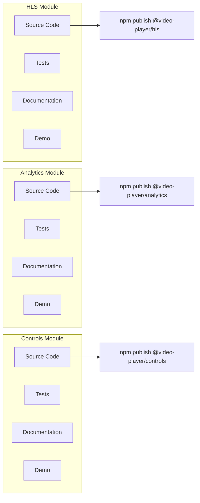
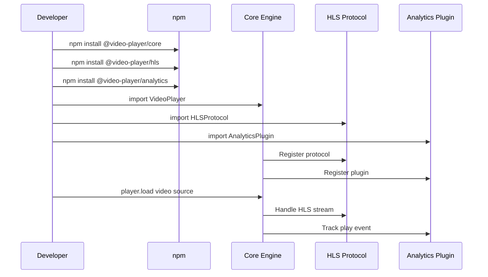
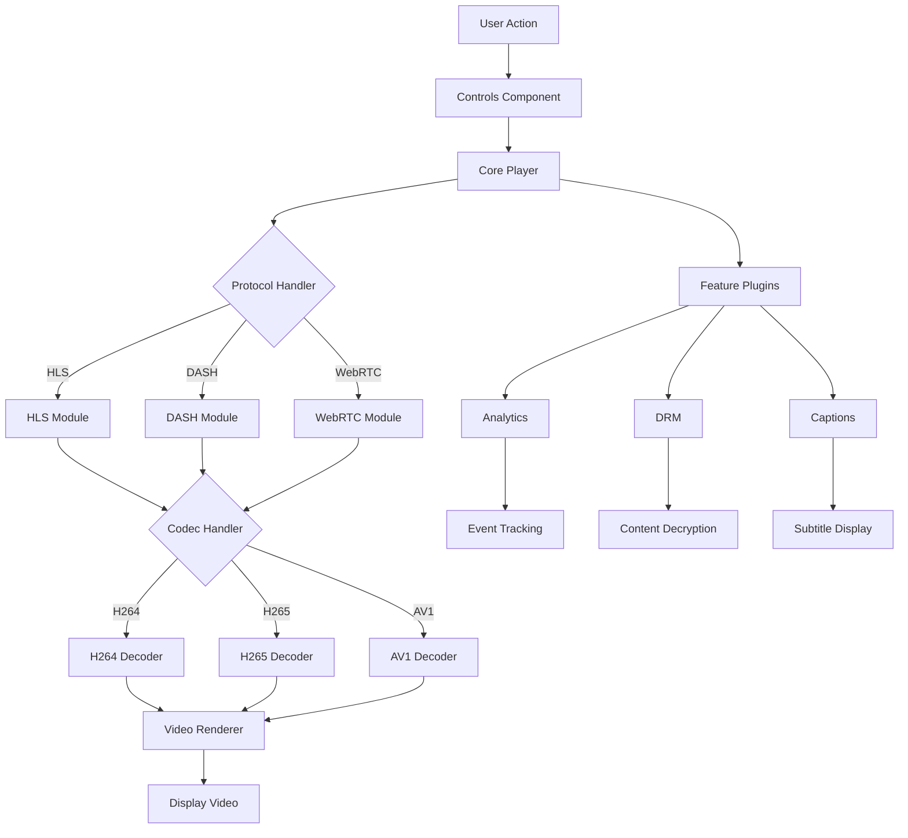
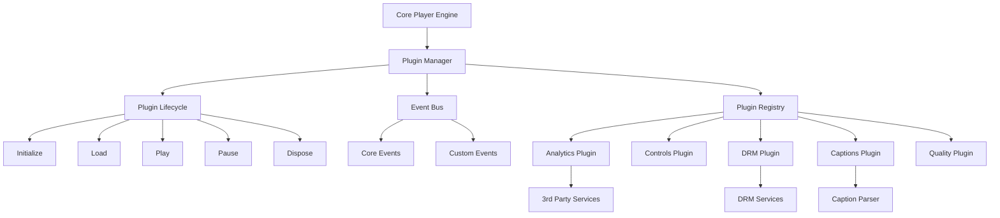

# Visual Architecture

Clear visual diagrams showing the project structure and module relationships using Mermaid diagrams.

## 1. Simple Package Tree Structure

The complete folder and package structure organized as a clear tree:

```mermaid
graph TD
    ROOT[Video Player Project]

    ROOT --> CORE[core/]
    CORE --> CORE_PKG[@video-player/core]

    ROOT --> PLAYERS[players/]
    PLAYERS --> WEB[@video-player/web]
    PLAYERS --> CHROMECAST[@video-player/chromecast]
    PLAYERS --> WEBVIEW[@video-player/webview]
    PLAYERS --> REACT[@video-player/react]
    PLAYERS --> EMBED[@video-player/embed]

    ROOT --> PROTOCOLS[protocols/]
    PROTOCOLS --> HLS[@video-player/hls]
    PROTOCOLS --> DASH[@video-player/dash]
    PROTOCOLS --> WEBRTC[@video-player/webrtc]
    PROTOCOLS --> RTMP[@video-player/rtmp]

    ROOT --> CODECS[codecs/]
    CODECS --> H264[@video-player/h264]
    CODECS --> H265[@video-player/h265]
    CODECS --> AV1[@video-player/av1]
    CODECS --> VP9[@video-player/vp9]

    ROOT --> FEATURES[features/]
    FEATURES --> ANALYTICS[@video-player/analytics]
    FEATURES --> CONTROLS[@video-player/controls]
    FEATURES --> DRM[@video-player/drm]
    FEATURES --> CAPTIONS[@video-player/captions]

    ROOT --> INPUT[input/]
    INPUT --> KEYBOARD[@video-player/keyboard]
    INPUT --> GAMEPAD[@video-player/gamepad]
    INPUT --> TOUCH[@video-player/touch]

    ROOT --> PLAYGROUND[playground/]
    PLAYGROUND --> EXPLORER[component-explorer/]
    PLAYGROUND --> TESTER[protocol-tester/]
```

## 2. How Modules Connect

Simple flowchart showing how modules plug together in your application:

```mermaid
flowchart TD
    APP[Your App] --> CORE[@video-player/core]

    CORE --> PLAYER[Choose Player]
    PLAYER --> WEB[Web Player]
    PLAYER --> CAST[Chromecast Player]

    CORE --> PROTOCOL[Choose Protocol]
    PROTOCOL --> HLS[HLS Streaming]
    PROTOCOL --> DASH[DASH Streaming]

    CORE --> FEATURES[Add Features]
    FEATURES --> ANALYTICS[Analytics Plugin]
    FEATURES --> CONTROLS[Controls Plugin]
    FEATURES --> DRM[DRM Plugin]

    WEB --> VIDEO[Playing Video!]
    HLS --> VIDEO
    ANALYTICS --> VIDEO
```

## 3. Module Development View

Shows how each module is developed and published independently:



## 4. Usage Example

Sequence showing how a developer would use the modules:



## 5. Component Interaction Flow

Detailed view of how components interact during video playback:



## 6. Plugin System Architecture

Shows how plugins extend the core functionality:



These diagrams provide a clear visual understanding of the project structure, making it easy to see how modules are organized and how they interact with each other.