# Video Player Design System

## Overview

This design system serves as the single source of truth for the video player UI/UX, ensuring consistency, accessibility, and scalability across all player implementations. Built with Video.js, Tailwind CSS, and documented in Storybook.

## Player Layout Structure

```mermaid
graph TB
    subgraph "Video Player Container"
        VideoElement["🎥 Video Element<br/>• Native HTML5 video<br/>• Source management<br/>• Playback engine"]

        subgraph "Overlay Layer"
            BigPlayButton["▶️ Big Play Button<br/>• Center positioned<br/>• Auto-hide on play<br/>• Touch/Click target"]
            LoadingSpinner["⏳ Loading Spinner<br/>• Buffering indicator<br/>• Network status<br/>• Progress feedback"]
            ErrorDisplay["⚠️ Error Display<br/>• Error messages<br/>• Retry actions<br/>• Fallback options"]
        end

        subgraph "Control Bar"
            direction LR
            PlayPause["⏯️ Play/Pause"]
            Volume["🔊 Volume"]
            TimeDisplay["⏱️ Time"]
            ProgressBar["━━━ Progress"]
            Settings["⚙️ Settings"]
            PiP["📱 PiP"]
            Fullscreen["⛶ Fullscreen"]
        end

        subgraph "Context Menus"
            QualityMenu["📊 Quality<br/>• Resolution list<br/>• Auto quality<br/>• Bitrate info"]
            SpeedMenu["⏩ Speed<br/>• Playback rates<br/>• Custom speed<br/>• Reset option"]
            CaptionsMenu["💬 Captions<br/>• Language list<br/>• Style settings<br/>• Position control"]
        end

        subgraph "Top Bar"
            Logo["🏷️ Brand Logo"]
            Title["📝 Video Title"]
            LiveBadge["🔴 LIVE"]
        end
    end

    VideoElement -.-> BigPlayButton
    VideoElement -.-> LoadingSpinner
    VideoElement -.-> ErrorDisplay
    Settings --> QualityMenu
    Settings --> SpeedMenu
    Settings --> CaptionsMenu

    style VideoElement fill:#3b82f6,color:#fff
    style BigPlayButton fill:#22c55e,color:#fff
    style LoadingSpinner fill:#eab308
    style ErrorDisplay fill:#ef4444,color:#fff
    style LiveBadge fill:#ef4444,color:#fff
```



## Design Principles

### 1. **Performance First**
- Optimize for smooth playback and minimal UI overhead
- Lazy load non-critical components
- Prioritize 60fps animations

### 2. **Accessible by Default**
- WCAG 2.1 AA compliant
- Full keyboard navigation
- Screen reader optimized

### 3. **Progressive Enhancement**
- Core functionality works without JavaScript
- Enhanced features layer on top
- Graceful degradation for older browsers

### 4. **Mobile-First Responsive**
- Touch-first interactions
- Adaptive layouts for all screen sizes
- Context-aware controls

---

## Design Tokens

### Color System

```css
/* Base Colors */
--vjs-color-primary: #3B82F6;        /* Blue 500 */
--vjs-color-primary-hover: #2563EB;  /* Blue 600 */
--vjs-color-primary-active: #1D4ED8; /* Blue 700 */

--vjs-color-secondary: #10B981;      /* Emerald 500 */
--vjs-color-accent: #F59E0B;         /* Amber 500 */

/* Semantic Colors */
--vjs-color-play: #22C55E;           /* Green 500 */
--vjs-color-pause: #EF4444;          /* Red 500 */
--vjs-color-live: #EF4444;           /* Red 500 */
--vjs-color-error: #DC2626;          /* Red 600 */
--vjs-color-warning: #F59E0B;        /* Amber 500 */
--vjs-color-success: #22C55E;        /* Green 500 */

/* Light Theme */
--vjs-bg-primary: #FFFFFF;
--vjs-bg-secondary: #F9FAFB;
--vjs-bg-tertiary: #F3F4F6;
--vjs-text-primary: #111827;
--vjs-text-secondary: #6B7280;
--vjs-text-tertiary: #9CA3AF;
--vjs-border: #E5E7EB;
--vjs-overlay: rgba(0, 0, 0, 0.75);

/* Dark Theme */
--vjs-dark-bg-primary: #111827;
--vjs-dark-bg-secondary: #1F2937;
--vjs-dark-bg-tertiary: #374151;
--vjs-dark-text-primary: #F9FAFB;
--vjs-dark-text-secondary: #D1D5DB;
--vjs-dark-text-tertiary: #9CA3AF;
--vjs-dark-border: #374151;
--vjs-dark-overlay: rgba(0, 0, 0, 0.9);
```

### Typography Scale

```css
/* Font Families */
--vjs-font-primary: system-ui, -apple-system, 'Segoe UI', sans-serif;
--vjs-font-mono: 'SF Mono', Monaco, 'Cascadia Code', monospace;

/* Font Sizes */
--vjs-text-xs: 0.75rem;    /* 12px */
--vjs-text-sm: 0.875rem;   /* 14px */
--vjs-text-base: 1rem;     /* 16px */
--vjs-text-lg: 1.125rem;   /* 18px */
--vjs-text-xl: 1.25rem;    /* 20px */
--vjs-text-2xl: 1.5rem;    /* 24px */
--vjs-text-3xl: 1.875rem;  /* 30px */

/* Font Weights */
--vjs-font-normal: 400;
--vjs-font-medium: 500;
--vjs-font-semibold: 600;
--vjs-font-bold: 700;

/* Line Heights */
--vjs-leading-tight: 1.25;
--vjs-leading-normal: 1.5;
--vjs-leading-relaxed: 1.75;
```

### Spacing System

```css
/* Spacing Scale (8px base) */
--vjs-space-0: 0;
--vjs-space-1: 0.25rem;  /* 4px */
--vjs-space-2: 0.5rem;   /* 8px */
--vjs-space-3: 0.75rem;  /* 12px */
--vjs-space-4: 1rem;     /* 16px */
--vjs-space-5: 1.25rem;  /* 20px */
--vjs-space-6: 1.5rem;   /* 24px */
--vjs-space-8: 2rem;     /* 32px */
--vjs-space-10: 2.5rem;  /* 40px */
--vjs-space-12: 3rem;    /* 48px */
--vjs-space-16: 4rem;    /* 64px */
```

### Animation Tokens

```css
/* Durations */
--vjs-duration-instant: 100ms;
--vjs-duration-fast: 200ms;
--vjs-duration-normal: 300ms;
--vjs-duration-slow: 500ms;

/* Easings */
--vjs-ease-in: cubic-bezier(0.4, 0, 1, 1);
--vjs-ease-out: cubic-bezier(0, 0, 0.2, 1);
--vjs-ease-in-out: cubic-bezier(0.4, 0, 0.2, 1);
--vjs-ease-bounce: cubic-bezier(0.68, -0.55, 0.265, 1.55);
```

### Elevation System

```css
/* Shadows */
--vjs-shadow-sm: 0 1px 2px 0 rgba(0, 0, 0, 0.05);
--vjs-shadow-md: 0 4px 6px -1px rgba(0, 0, 0, 0.1);
--vjs-shadow-lg: 0 10px 15px -3px rgba(0, 0, 0, 0.1);
--vjs-shadow-xl: 0 20px 25px -5px rgba(0, 0, 0, 0.1);
--vjs-shadow-2xl: 0 25px 50px -12px rgba(0, 0, 0, 0.25);

/* Z-index Scale */
--vjs-z-base: 0;
--vjs-z-dropdown: 10;
--vjs-z-sticky: 20;
--vjs-z-overlay: 30;
--vjs-z-modal: 40;
--vjs-z-popover: 50;
--vjs-z-tooltip: 60;
--vjs-z-fullscreen: 100;
```

---

## Responsive Breakpoints

### Breakpoint Definitions

```css
/* Mobile First Breakpoints */
--vjs-screen-xs: 320px;   /* Small phones */
--vjs-screen-sm: 640px;   /* Large phones */
--vjs-screen-md: 768px;   /* Tablets */
--vjs-screen-lg: 1024px;  /* Desktop */
--vjs-screen-xl: 1280px;  /* Large desktop */
--vjs-screen-2xl: 1536px; /* Wide screens */
--vjs-screen-tv: 1920px;  /* TV displays */
```

### Responsive Behaviors

| Breakpoint | Control Bar | Menu Layout | Touch Targets | Font Scale |
|------------|-------------|-------------|---------------|------------|
| **Mobile** (320-768px) | Bottom fixed, large buttons | Full screen overlays | 44x44px minimum | 14px base |
| **Tablet** (768-1024px) | Bottom fixed, medium buttons | Modal dialogs | 40x40px minimum | 14px base |
| **Desktop** (1024px+) | Bottom hover, small buttons | Dropdown menus | 32x32px minimum | 12px base |
| **TV** (1920px+) | Bottom persistent, XL buttons | Grid navigation | 56x56px minimum | 16px base |

### Responsive Breakpoints Visualization

```mermaid
graph LR
    subgraph "Device Breakpoints"
        XS["📱 320px<br/>Small Phone"]
        SM["📱 640px<br/>Large Phone"]
        MD["📱 768px<br/>Tablet"]
        LG["💻 1024px<br/>Desktop"]
        XL["🖥️ 1280px<br/>Large Desktop"]
        XXL["🖥️ 1536px<br/>Wide Screen"]
        TV["📺 1920px<br/>TV Display"]
    end

    XS --> SM
    SM --> MD
    MD --> LG
    LG --> XL
    XL --> XXL
    XXL --> TV

    subgraph "Layout Changes"
        XS -.->|"Stacked<br/>Controls"| MobileLayout["Mobile Layout<br/>• Full width buttons<br/>• Bottom sheet menus<br/>• Large touch targets"]
        MD -.->|"Hybrid<br/>Layout"| TabletLayout["Tablet Layout<br/>• Modal dialogs<br/>• Medium controls<br/>• Mixed navigation"]
        LG -.->|"Desktop<br/>UI"| DesktopLayout["Desktop Layout<br/>• Dropdown menus<br/>• Hover states<br/>• Compact controls"]
        TV -.->|"10-foot<br/>UI"| TVLayout["TV Layout<br/>• Grid navigation<br/>• XL buttons<br/>• Voice control"]
    end

    style XS fill:#ef4444
    style SM fill:#f97316
    style MD fill:#eab308
    style LG fill:#22c55e
    style XL fill:#3b82f6
    style XXL fill:#8b5cf6
    style TV fill:#ec4899
```



### Responsive Design Flow

```mermaid
flowchart TB
    subgraph "Mobile Layout 320-768px"
        MobileVideo["📱 Video Area<br/>16:9 aspect ratio"]
        MobileOverlay["Overlay Controls<br/>• Big play button<br/>• Tap zones<br/>• Gesture areas"]
        MobileControlBar["Fixed Bottom Bar<br/>• Large touch targets<br/>• Essential controls<br/>• Overflow menu"]
        MobileMenus["Full Screen Menus<br/>• Bottom sheets<br/>• Swipe navigation<br/>• Back button"]
    end

    subgraph "Tablet Layout 768-1024px"
        TabletVideo["📱 Video Area<br/>Flexible aspect ratio"]
        TabletOverlay["Smart Overlays<br/>• Context buttons<br/>• Info cards<br/>• Tooltips"]
        TabletControlBar["Adaptive Control Bar<br/>• Medium buttons<br/>• More controls<br/>• Dropdown menus"]
        TabletMenus["Modal Dialogs<br/>• Centered modals<br/>• Keyboard nav<br/>• Escape to close"]
    end

    subgraph "Desktop Layout 1024px+"
        DesktopVideo["💻 Video Area<br/>Theater/Normal modes"]
        DesktopOverlay["Minimal Overlays<br/>• Hover effects<br/>• Small indicators<br/>• Keyboard hints"]
        DesktopControlBar["Auto-hide Control Bar<br/>• Compact controls<br/>• All features<br/>• Hover states"]
        DesktopMenus["Dropdown Menus<br/>• Hover dropdowns<br/>• Multi-level<br/>• Arrow navigation"]
    end

    subgraph "TV Layout 1920px+"
        TVVideo["📺 Full Screen Video<br/>4K/8K support"]
        TVOverlay["10-foot UI<br/>• Large text<br/>• High contrast<br/>• Simple graphics"]
        TVControlBar["D-pad Navigation<br/>• Focus indicators<br/>• Grid layout<br/>• Voice control"]
        TVMenus["Grid Menus<br/>• Card layout<br/>• Remote control<br/>• Voice commands"]
    end

    %% Responsive transitions
    MobileVideo -.->|"Rotate"| TabletVideo
    TabletVideo -.->|"Resize"| DesktopVideo
    DesktopVideo -.->|"Cast"| TVVideo

    MobileControlBar -.->|"Expand"| TabletControlBar
    TabletControlBar -.->|"Compact"| DesktopControlBar
    DesktopControlBar -.->|"Enhance"| TVControlBar

    style MobileVideo fill:#ef4444,color:#fff
    style TabletVideo fill:#eab308
    style DesktopVideo fill:#22c55e,color:#fff
    style TVVideo fill:#3b82f6,color:#fff
```



---

## Player Controls Components

### 1. Play/Pause Button

```typescript
interface PlayPauseButton {
  state: 'playing' | 'paused' | 'buffering';
  size: 'small' | 'medium' | 'large' | 'xlarge';
  variant: 'primary' | 'overlay' | 'minimal';
}
```

**Specifications:**
- **Sizes:** 32px (S), 44px (M), 56px (L), 72px (XL)
- **Icons:** Material Symbols Rounded
- **States:** Default, Hover, Active, Disabled, Loading
- **Accessibility:** aria-label, role="button", keyboard focus ring

### 2. Progress Bar

```typescript
interface ProgressBar {
  duration: number;
  currentTime: number;
  buffered: TimeRanges;
  seekable: TimeRanges;
  showThumbnails: boolean;
  showChapters: boolean;
}
```

**Specifications:**
- **Height:** 4px (default), 8px (hover), 12px (dragging)
- **Colors:** Primary (played), Secondary (buffered), Tertiary (seekable)
- **Interactions:** Click to seek, drag to scrub, keyboard arrows for frame stepping
- **Accessibility:** role="slider", aria-valuemin/max/now, aria-label

### 3. Volume Control

```typescript
interface VolumeControl {
  volume: number; // 0-100
  muted: boolean;
  orientation: 'horizontal' | 'vertical';
  showSlider: 'hover' | 'always' | 'never';
}
```

**Specifications:**
- **Slider:** 80px (horizontal), 100px (vertical)
- **Icons:** Muted, Low (0-33%), Medium (34-66%), High (67-100%)
- **Interactions:** Click to mute/unmute, drag slider, scroll wheel
- **Accessibility:** Keyboard up/down arrows, screen reader announcements

### 4. Quality Selector

```typescript
interface QualitySelector {
  qualities: Quality[];
  currentQuality: string;
  autoQuality: boolean;
  showBitrate: boolean;
}

interface Quality {
  label: string; // "1080p", "720p", etc.
  value: string; // "hd1080", "hd720", etc.
  bitrate?: number;
  framerate?: number;
}
```

**Specifications:**
- **Menu Style:** Dropdown (desktop), Bottom sheet (mobile)
- **Indicators:** "HD" badge, "4K" badge, "Auto" indicator
- **Sorting:** Highest to lowest quality
- **Accessibility:** Arrow key navigation, enter to select

### 5. Fullscreen Toggle

```typescript
interface FullscreenToggle {
  isFullscreen: boolean;
  supportsFullscreen: boolean;
  pictureInPicture: boolean;
}
```

**Specifications:**
- **Icons:** Enter fullscreen, Exit fullscreen, Picture-in-picture
- **Transitions:** 300ms ease-out scale animation
- **Fallback:** Maximize for unsupported browsers
- **Accessibility:** F key shortcut, Escape to exit

### 6. Playback Speed Control

```typescript
interface PlaybackSpeed {
  speeds: number[]; // [0.25, 0.5, 0.75, 1, 1.25, 1.5, 1.75, 2]
  currentSpeed: number;
  showInMenu: boolean;
}
```

**Specifications:**
- **Display:** "1x" format, highlight current speed
- **Presets:** 0.25x to 2x in 0.25 increments
- **Custom:** Input field for custom values
- **Accessibility:** Keyboard shortcuts (Shift + < / >)

### 7. Captions/Subtitles Menu

```typescript
interface CaptionsMenu {
  tracks: TextTrack[];
  currentTrack: string | null;
  settings: CaptionSettings;
}

interface CaptionSettings {
  fontSize: 'small' | 'medium' | 'large';
  fontFamily: string;
  textColor: string;
  backgroundColor: string;
  backgroundOpacity: number;
  edgeStyle: 'none' | 'dropshadow' | 'raised' | 'depressed' | 'uniform';
}
```

**Specifications:**
- **Menu Layout:** List with language names and indicators
- **Settings:** Font size, color, background, positioning
- **Preview:** Live preview of caption styling
- **Accessibility:** C key shortcut, ARIA descriptions

---

## Player States

### Loading State

```css
.vjs-loading {
  /* Spinner animation */
  animation: vjs-spin 1.5s linear infinite;

  /* Skeleton screens for UI */
  background: linear-gradient(
    90deg,
    var(--vjs-bg-tertiary) 25%,
    var(--vjs-bg-secondary) 50%,
    var(--vjs-bg-tertiary) 75%
  );
}
```

**Components:**
- Circular spinner (48px)
- Progress percentage (optional)
- Cancel button (after 5s)
- Loading message

### Buffering Overlay

```typescript
interface BufferingOverlay {
  showAfterMs: number; // Default: 500ms
  minDuration: number; // Default: 250ms
  showNetworkInfo: boolean;
}
```

**Display Logic:**
- Show after 500ms of buffering
- Minimum display time of 250ms
- Network speed indicator (optional)
- Buffered percentage display

### Error States

```typescript
interface ErrorState {
  code: string;
  message: string;
  recoverable: boolean;
  actions: ErrorAction[];
}

type ErrorAction = 'retry' | 'report' | 'selectQuality' | 'checkNetwork';
```

**Error Types:**
1. **Network Error:** Connection issues, retry button
2. **Media Error:** Unsupported format, codec info
3. **Source Error:** 404, alternative sources
4. **DRM Error:** License issues, support link
5. **Generic Error:** Unknown errors, report button

### End Screen

```typescript
interface EndScreen {
  showReplay: boolean;
  showNext: boolean;
  showRelated: boolean;
  autoplayCountdown: number; // seconds
}
```

**Components:**
- Replay button (center)
- Next video card (if playlist)
- Related videos grid (optional)
- Share buttons
- Autoplay countdown

### Live Indicator

```css
.vjs-live-indicator {
  background: var(--vjs-color-live);
  animation: vjs-pulse 2s ease-in-out infinite;
}
```

**States:**
- **Live:** Red dot pulsing
- **Live Edge:** Solid red
- **Behind Live:** Gray with "Go Live" button
- **DVR Available:** Seekable progress bar

### DVR Controls

```typescript
interface DVRControls {
  seekableStart: number;
  seekableEnd: number;
  liveEdgeThreshold: number; // seconds behind live
  showGoLive: boolean;
}
```

**Components:**
- Seekable window indicator
- "Go Live" button
- Time behind live display
- DVR progress bar

---

## Theme System

### Theme System Architecture

```mermaid
graph TB
    subgraph "Theme Cascade"
        GlobalTheme["🌍 Global Theme<br/>• Base tokens<br/>• Default values<br/>• System preferences"]

        subgraph "Theme Layers"
            BaseLayer["🎨 Base Layer<br/>• Color primitives<br/>• Typography scale<br/>• Spacing units"]
            SemanticLayer["🏷️ Semantic Layer<br/>• Component colors<br/>• State colors<br/>• Intent colors"]
            ComponentLayer["🧩 Component Layer<br/>• Control styles<br/>• Layout rules<br/>• Animations"]
            BrandLayer["🏢 Brand Layer<br/>• Custom colors<br/>• Logo placement<br/>• Overrides"]
        end

        subgraph "Theme Modes"
            LightMode["☀️ Light Mode<br/>• Light backgrounds<br/>• Dark text<br/>• High contrast"]
            DarkMode["🌙 Dark Mode<br/>• Dark backgrounds<br/>• Light text<br/>• Reduced glare"]
            AutoMode["🔄 Auto Mode<br/>• System detection<br/>• Time-based<br/>• User preference"]
            CustomMode["🎨 Custom Mode<br/>• Brand colors<br/>• Unique styles<br/>• Full control"]
        end

        subgraph "CSS Variables"
            RootVars[":root<br/>• --vjs-color-*<br/>• --vjs-space-*<br/>• --vjs-font-*"]
            ThemeVars[".vjs-theme-*<br/>• Override root<br/>• Scoped styles<br/>• Cascading"]
            ComponentVars[".vjs-component<br/>• Local overrides<br/>• Inline styles<br/>• Dynamic values"]
        end
    end

    GlobalTheme --> BaseLayer
    BaseLayer --> SemanticLayer
    SemanticLayer --> ComponentLayer
    ComponentLayer --> BrandLayer

    GlobalTheme --> LightMode
    GlobalTheme --> DarkMode
    GlobalTheme --> AutoMode
    AutoMode -.->|"Detects"| LightMode
    AutoMode -.->|"Detects"| DarkMode
    LightMode --> CustomMode
    DarkMode --> CustomMode

    BaseLayer --> RootVars
    SemanticLayer --> ThemeVars
    ComponentLayer --> ComponentVars
    BrandLayer --> ComponentVars

    style GlobalTheme fill:#3b82f6,color:#fff
    style BaseLayer fill:#fef3c7
    style SemanticLayer fill:#dbeafe
    style ComponentLayer fill:#dcfce7
    style BrandLayer fill:#fce7f3
    style LightMode fill:#fbbf24
    style DarkMode fill:#6366f1,color:#fff
    style AutoMode fill:#10b981,color:#fff
    style CustomMode fill:#ec4899,color:#fff
```



### Theme Structure

```typescript
interface Theme {
  name: string;
  mode: 'light' | 'dark' | 'auto';
  colors: ColorTokens;
  typography: TypographyTokens;
  spacing: SpacingTokens;
  animations: AnimationTokens;
  customCSS?: string;
}
```

### Light Theme

```css
.vjs-theme-light {
  --vjs-control-bg: rgba(255, 255, 255, 0.9);
  --vjs-control-color: #111827;
  --vjs-progress-bg: rgba(0, 0, 0, 0.2);
  --vjs-progress-filled: #3B82F6;
  --vjs-hover-bg: rgba(0, 0, 0, 0.05);
}
```

### Dark Theme

```css
.vjs-theme-dark {
  --vjs-control-bg: rgba(0, 0, 0, 0.7);
  --vjs-control-color: #F9FAFB;
  --vjs-progress-bg: rgba(255, 255, 255, 0.2);
  --vjs-progress-filled: #3B82F6;
  --vjs-hover-bg: rgba(255, 255, 255, 0.1);
}
```

### Custom Brand Theming

```typescript
interface BrandTheme extends Theme {
  logo?: {
    src: string;
    position: 'top-left' | 'top-right' | 'bottom-left' | 'bottom-right';
    size: 'small' | 'medium' | 'large';
  };
  primaryColor: string;
  accentColor: string;
  customControls?: ControlConfig[];
}
```

**Implementation:**
```css
.vjs-theme-custom {
  --vjs-brand-primary: var(--brand-color-primary);
  --vjs-brand-accent: var(--brand-color-accent);
  --vjs-control-bg: var(--brand-control-bg);
}
```

---

## Interaction Patterns

### User Interaction Flow


### Touch Gestures

| Gesture | Action | Context |
|---------|--------|---------|
| **Tap** | Play/Pause | Center of video |
| **Double Tap Left** | Rewind 10s | Left third of video |
| **Double Tap Right** | Forward 10s | Right third of video |
| **Swipe Up** | Increase volume | Right side of video |
| **Swipe Down** | Decrease volume | Right side of video |
| **Swipe Left** | Seek forward | Progress bar area |
| **Swipe Right** | Seek backward | Progress bar area |
| **Pinch** | Zoom (if supported) | Video area |
| **Long Press** | Playback speed menu | Center of video |

### Keyboard Shortcuts

| Key | Action | Modifier |
|-----|--------|----------|
| **Space/K** | Play/Pause | - |
| **F** | Fullscreen | - |
| **M** | Mute/Unmute | - |
| **C** | Captions toggle | - |
| **↑/↓** | Volume up/down | - |
| **←/→** | Seek -/+ 5s | - |
| **J/L** | Seek -/+ 10s | - |
| **,/.** | Previous/Next frame | - |
| **</>** | Decrease/Increase speed | Shift |
| **0-9** | Seek to 0-90% | - |
| **Home/End** | Seek to start/end | - |
| **P** | Picture-in-Picture | - |
| **Escape** | Exit fullscreen | - |

### Focus Management

```typescript
interface FocusConfig {
  trapFocus: boolean; // In fullscreen
  autoFocus: boolean; // On play
  focusIndicator: 'ring' | 'outline' | 'background';
  skipLinks: boolean; // For accessibility
}
```

**Focus Order:**
1. Skip to content link
2. Play/Pause button
3. Volume control
4. Progress bar
5. Playback speed
6. Captions
7. Quality selector
8. Picture-in-Picture
9. Fullscreen

### Hover States

```css
/* Control Hover States */
.vjs-control:hover {
  transform: scale(1.1);
  background: var(--vjs-hover-bg);
  transition: all var(--vjs-duration-fast) var(--vjs-ease-out);
}

/* Tooltip on Hover */
.vjs-control:hover .vjs-tooltip {
  opacity: 1;
  transform: translateY(-8px);
  transition-delay: 500ms;
}
```

---

## Accessibility Requirements

### WCAG 2.1 AA Compliance

#### Perceivable
- **Text Alternatives:** All controls have descriptive labels
- **Time-based Media:** Captions, audio descriptions, transcripts
- **Adaptable:** Responsive to user preferences
- **Distinguishable:** 4.5:1 contrast ratio minimum

#### Operable
- **Keyboard Accessible:** All functionality via keyboard
- **Enough Time:** Adjustable time limits
- **Seizures:** No flashing > 3Hz
- **Navigable:** Clear focus indicators, skip links

#### Understandable
- **Readable:** Clear labels and instructions
- **Predictable:** Consistent navigation and controls
- **Input Assistance:** Error messages and suggestions

#### Robust
- **Compatible:** Works with assistive technologies
- **Valid HTML:** Semantic markup
- **ARIA:** Proper roles, states, and properties

### Screen Reader Support

```html
<!-- Example: Progress Bar -->
<div role="slider"
     aria-label="Seek slider"
     aria-valuemin="0"
     aria-valuemax="100"
     aria-valuenow="45"
     aria-valuetext="45 seconds of 100 seconds"
     tabindex="0">
</div>
```

### High Contrast Mode

```css
@media (prefers-contrast: high) {
  .vjs-control {
    border: 2px solid currentColor;
  }

  .vjs-progress-bar {
    outline: 1px solid currentColor;
  }
}
```

### Reduced Motion

```css
@media (prefers-reduced-motion: reduce) {
  .vjs-control {
    transition: none;
  }

  .vjs-loading {
    animation: none;
    opacity: 0.8;
  }
}
```

---

## Component Architecture

### Component Composition

```mermaid
graph TD
    subgraph "Atomic Design Pattern"
        subgraph "Atoms"
            Icon["🔷 Icon<br/>• SVG icons<br/>• Size variants<br/>• Color states"]
            Button["🔲 Button<br/>• Click handler<br/>• States<br/>• Accessibility"]
            Label["📝 Label<br/>• Text display<br/>• Typography<br/>• Truncation"]
            Spinner["⏳ Spinner<br/>• Loading state<br/>• Size variants<br/>• Animation"]
        end

        subgraph "Molecules"
            PlayButton["▶️ Play Button<br/>• Icon + Button<br/>• State toggle<br/>• Tooltip"]
            VolumeSlider["🔊 Volume Slider<br/>• Icon + Slider<br/>• Mute toggle<br/>• Value display"]
            TimeDisplay["⏱️ Time Display<br/>• Current/Duration<br/>• Format options<br/>• Live indicator"]
            MenuItem["📋 Menu Item<br/>• Icon + Label<br/>• Selection state<br/>• Keyboard nav"]
        end

        subgraph "Organisms"
            ControlBar["🎛️ Control Bar<br/>• Multiple controls<br/>• Responsive layout<br/>• Show/Hide logic"]
            SettingsMenu["⚙️ Settings Menu<br/>• Menu items list<br/>• Nested menus<br/>• Animations"]
            ProgressBar["━━━ Progress Bar<br/>• Seek slider<br/>• Buffer display<br/>• Thumbnails"]
            ErrorScreen["⚠️ Error Screen<br/>• Error message<br/>• Action buttons<br/>• Retry logic"]
        end

        subgraph "Templates"
            VideoPlayer["🎬 Video Player<br/>• Complete player<br/>• All organisms<br/>• State management"]
            LivePlayer["🔴 Live Player<br/>• Live controls<br/>• DVR support<br/>• Live edge"]
            PlaylistPlayer["📑 Playlist Player<br/>• Playlist UI<br/>• Navigation<br/>• Auto-advance"]
        end
    end

    %% Composition relationships
    Icon --> PlayButton
    Button --> PlayButton
    Icon --> VolumeSlider
    Button --> VolumeSlider
    Label --> TimeDisplay
    Icon --> MenuItem
    Label --> MenuItem

    PlayButton --> ControlBar
    VolumeSlider --> ControlBar
    TimeDisplay --> ControlBar
    MenuItem --> SettingsMenu

    ControlBar --> VideoPlayer
    SettingsMenu --> VideoPlayer
    ProgressBar --> VideoPlayer
    ErrorScreen --> VideoPlayer

    VideoPlayer --> LivePlayer
    VideoPlayer --> PlaylistPlayer

    style Icon fill:#fef3c7
    style Button fill:#fef3c7
    style Label fill:#fef3c7
    style Spinner fill:#fef3c7
    style PlayButton fill:#dbeafe
    style VolumeSlider fill:#dbeafe
    style TimeDisplay fill:#dbeafe
    style MenuItem fill:#dbeafe
    style ControlBar fill:#dcfce7
    style SettingsMenu fill:#dcfce7
    style ProgressBar fill:#dcfce7
    style ErrorScreen fill:#dcfce7
    style VideoPlayer fill:#fce7f3
    style LivePlayer fill:#fce7f3
    style PlaylistPlayer fill:#fce7f3
```



### Component Structure

```typescript
// Base Component Interface
interface VideoJSComponent {
  el: HTMLElement;
  options: ComponentOptions;
  player: VideoJSPlayer;

  // Lifecycle
  ready(): void;
  dispose(): void;

  // State
  show(): void;
  hide(): void;
  enable(): void;
  disable(): void;

  // Events
  on(event: string, handler: Function): void;
  off(event: string, handler: Function): void;
  trigger(event: string, data?: any): void;
}
```

### Storybook Organization

```
stories/
├── atoms/
│   ├── Button.stories.js
│   ├── Icon.stories.js
│   ├── Spinner.stories.js
│   └── Tooltip.stories.js
├── molecules/
│   ├── ProgressBar.stories.js
│   ├── VolumeControl.stories.js
│   ├── TimeDisplay.stories.js
│   └── MenuItem.stories.js
├── organisms/
│   ├── ControlBar.stories.js
│   ├── SettingsMenu.stories.js
│   ├── ErrorDisplay.stories.js
│   └── LoadingScreen.stories.js
└── templates/
    ├── PlayerDefault.stories.js
    ├── PlayerLive.stories.js
    ├── PlayerPlaylist.stories.js
    └── PlayerTheater.stories.js
```

### Component Documentation Template

```javascript
/**
 * @component PlayButton
 * @description Primary play/pause control for video playback
 *
 * @prop {string} size - Button size: 'small' | 'medium' | 'large'
 * @prop {boolean} showTooltip - Display tooltip on hover
 * @prop {string} tooltipPosition - Tooltip position: 'top' | 'bottom'
 *
 * @fires play - Triggered when play is clicked
 * @fires pause - Triggered when pause is clicked
 *
 * @keyboard
 * - Space: Toggle play/pause
 * - K: Toggle play/pause
 *
 * @accessibility
 * - Role: button
 * - Aria-label: "Play video" / "Pause video"
 * - Aria-pressed: true when playing
 *
 * @example
 * const playButton = player.controlBar.playToggle;
 * playButton.on('play', () => console.log('Playing'));
 */
```

---

## Performance Guidelines

### Loading Performance

```typescript
interface PerformanceConfig {
  lazyLoadControls: boolean;
  preloadMetadata: boolean;
  bufferGoal: number; // seconds
  maxBufferLength: number; // seconds
  enableWebWorkers: boolean;
}
```

**Optimization Strategies:**
1. Lazy load non-critical controls
2. Use CSS containment for layout stability
3. Implement virtual scrolling for long playlists
4. Debounce/throttle input handlers
5. Use requestAnimationFrame for animations

### Rendering Performance

```css
/* CSS Containment */
.vjs-player {
  contain: layout style paint;
}

/* Hardware Acceleration */
.vjs-control {
  will-change: transform;
  transform: translateZ(0);
}

/* Efficient Animations */
.vjs-transition {
  transition: transform 200ms, opacity 200ms;
  /* Avoid transitioning expensive properties like width/height */
}
```

---

## Testing Requirements

### Component Testing

```javascript
// Example Storybook Test
describe('PlayButton', () => {
  it('should toggle play state on click', () => {
    const button = mount(<PlayButton />);
    button.simulate('click');
    expect(button.prop('playing')).toBe(true);
  });

  it('should be keyboard accessible', () => {
    const button = mount(<PlayButton />);
    button.simulate('keydown', { key: 'Space' });
    expect(button.prop('playing')).toBe(true);
  });

  it('should meet WCAG contrast requirements', () => {
    const button = mount(<PlayButton />);
    const contrast = getContrastRatio(button);
    expect(contrast).toBeGreaterThanOrEqual(4.5);
  });
});
```

### Accessibility Testing

- **Axe-core:** Automated accessibility testing
- **Screen Reader:** NVDA/JAWS (Windows), VoiceOver (Mac/iOS), TalkBack (Android)
- **Keyboard Navigation:** Full functionality without mouse
- **Color Contrast:** WCAG AA compliance checker

### Performance Testing

- **Core Web Vitals:** LCP < 2.5s, FID < 100ms, CLS < 0.1
- **Frame Rate:** Maintain 60fps during playback
- **Memory Usage:** Monitor for leaks during long sessions
- **Network:** Test on 3G, 4G, and WiFi conditions

---

## Migration Guide

### From Default Video.js Theme

```javascript
// Before: Default Video.js
videojs('my-player', {
  controls: true,
  theme: 'default'
});

// After: Custom Design System
videojs('my-player', {
  controls: true,
  theme: 'vjs-custom-theme',
  customControls: {
    progressBar: { showThumbnails: true },
    volumeControl: { orientation: 'vertical' },
    qualitySelector: { showBitrate: true }
  }
});
```

### Component Updates

| Old Component | New Component | Migration Notes |
|---------------|---------------|-----------------|
| vjs-play-control | vjs-play-button | New size prop, updated icons |
| vjs-volume-menu-button | vjs-volume-control | Vertical slider option |
| vjs-fullscreen-control | vjs-fullscreen-toggle | PiP support added |
| vjs-playback-rate | vjs-speed-control | Custom speed input |

---

## Resources

### Design Files
- Figma: [Video Player UI Kit](#)
- Adobe XD: [Component Library](#)
- Sketch: [Design System](#)

### Documentation
- [Storybook](http://localhost:6006)
- [API Documentation](#)
- [Accessibility Guide](#)

### Code Examples
- [GitHub Repository](#)
- [CodePen Demos](#)
- [CodeSandbox Templates](#)

### Tools
- [Contrast Checker](https://webaim.org/resources/contrastchecker/)
- [Screen Reader Testing](https://www.nvaccess.org/)
- [Keyboard Navigation Tester](https://www.ssa.gov/accessibility/keyboard_nav.html)

---

## Version History

| Version | Date | Changes |
|---------|------|---------|
| 1.0.0 | 2024-01 | Initial design system release |
| 1.1.0 | 2024-02 | Added touch gestures, improved mobile UX |
| 1.2.0 | 2024-03 | Enhanced accessibility, WCAG 2.1 AA compliance |
| 1.3.0 | 2024-04 | TV interface support, voice control |

---

## Contributing

### Design Principles
1. Maintain consistency with existing patterns
2. Prioritize accessibility and performance
3. Test across all supported devices
4. Document all new components in Storybook

### Component Checklist
- [ ] Responsive across all breakpoints
- [ ] Keyboard accessible
- [ ] Screen reader compatible
- [ ] Touch gesture support
- [ ] Theme system compatible
- [ ] Documented in Storybook
- [ ] Unit tests written
- [ ] Accessibility tests passing
- [ ] Performance benchmarks met

### Review Process
1. Design review by UX team
2. Code review by development team
3. Accessibility audit
4. Performance testing
5. User acceptance testing

---

*This design system is a living document and will evolve based on user feedback and technological advances.*