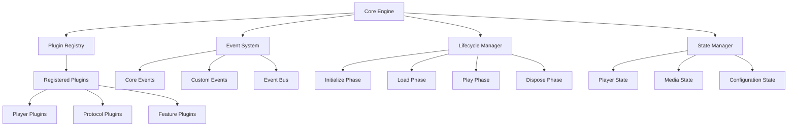

# Core Engine Specification (@video-player/core)

The foundation module that provides the plugin architecture, event system, and lifecycle management for all video player implementations.

## Overview

The Core Engine is the central orchestrator that:
- Manages plugin lifecycle (load, initialize, play, pause, dispose)
- Provides unified event system for all modules
- Handles player state management
- Coordinates between different player implementations and protocols
- Maintains configuration and settings

## Architecture



## Core Interfaces

### VideoPlayerCore

```typescript
interface VideoPlayerCore {
  // Plugin Management
  registerPlugin<T extends BasePlugin>(plugin: T): void;
  unregisterPlugin(pluginId: string): void;
  getPlugin<T extends BasePlugin>(pluginId: string): T | null;

  // Event System
  on(event: CoreEvent | string, handler: EventHandler): void;
  off(event: CoreEvent | string, handler: EventHandler): void;
  emit(event: CoreEvent | string, data?: any): void;

  // Lifecycle Management
  initialize(config: PlayerConfig): Promise<void>;
  load(source: MediaSource): Promise<void>;
  play(): Promise<void>;
  pause(): void;
  dispose(): void;

  // State Management
  getState(): PlayerState;
  setState(state: Partial<PlayerState>): void;

  // Configuration
  configure(config: Partial<PlayerConfig>): void;
  getConfig(): PlayerConfig;
}
```

### Plugin Registry System

```typescript
interface PluginRegistry {
  register<T extends BasePlugin>(plugin: T): void;
  unregister(pluginId: string): boolean;
  get<T extends BasePlugin>(pluginId: string): T | null;
  getAll(): BasePlugin[];
  getByType(type: PluginType): BasePlugin[];
  clear(): void;
}

enum PluginType {
  PLAYER = 'player',
  PROTOCOL = 'protocol',
  CODEC = 'codec',
  FEATURE = 'feature',
  INPUT = 'input',
  ADAPTER = 'adapter'
}
```

### Event System

```typescript
interface EventSystem {
  subscribe(event: string, handler: EventHandler): Subscription;
  unsubscribe(subscription: Subscription): void;
  emit(event: string, payload?: any): void;
  createEventBus(): EventBus;
}

interface EventBus {
  on(event: string, handler: EventHandler): void;
  off(event: string, handler: EventHandler): void;
  emit(event: string, data?: any): void;
  once(event: string, handler: EventHandler): void;
}

// Core Events
enum CoreEvents {
  // Lifecycle Events
  INITIALIZED = 'core:initialized',
  LOADING = 'core:loading',
  LOADED = 'core:loaded',
  PLAYING = 'core:playing',
  PAUSED = 'core:paused',
  DISPOSED = 'core:disposed',

  // State Events
  STATE_CHANGED = 'core:state-changed',
  CONFIG_CHANGED = 'core:config-changed',

  // Plugin Events
  PLUGIN_REGISTERED = 'core:plugin-registered',
  PLUGIN_UNREGISTERED = 'core:plugin-unregistered',

  // Error Events
  ERROR = 'core:error',
  WARNING = 'core:warning'
}
```

### State Management

```typescript
interface PlayerState {
  // Playback State
  currentTime: number;
  duration: number;
  volume: number;
  muted: boolean;
  playbackRate: number;

  // Media State
  source: MediaSource | null;
  mediaInfo: MediaInfo | null;

  // Player State
  isPlaying: boolean;
  isPaused: boolean;
  isLoading: boolean;
  isBuffering: boolean;
  hasError: boolean;

  // UI State
  isFullscreen: boolean;
  isControlsVisible: boolean;

  // Quality State
  availableQualities: Quality[];
  currentQuality: Quality | null;

  // Network State
  networkState: NetworkState;
  bufferedRanges: TimeRange[];
}

interface MediaInfo {
  title?: string;
  description?: string;
  thumbnail?: string;
  duration: number;
  format: string;
  codecs: {
    video?: string;
    audio?: string;
  };
  dimensions?: {
    width: number;
    height: number;
  };
}
```

## Plugin Lifecycle

### Lifecycle Phases

1. **Registration Phase**
   - Plugin registers with core engine
   - Dependencies are validated
   - Plugin receives core engine reference

2. **Initialization Phase**
   - Plugin initializes internal state
   - Sets up event listeners
   - Validates configuration

3. **Load Phase**
   - Media source is provided
   - Plugin prepares for playback
   - Resource allocation occurs

4. **Play Phase**
   - Active playback management
   - Event handling and processing
   - Real-time operations

5. **Pause Phase**
   - Suspend active operations
   - Maintain state for resume
   - Reduce resource usage

6. **Dispose Phase**
   - Cleanup resources
   - Remove event listeners
   - Release memory

### Lifecycle Interface

```typescript
interface PluginLifecycle {
  onRegister(core: VideoPlayerCore): void;
  onInitialize(config: PlayerConfig): Promise<void>;
  onLoad(source: MediaSource): Promise<void>;
  onPlay(): Promise<void>;
  onPause(): void;
  onDispose(): void;
  onError(error: Error): void;
}
```

## Configuration System

```typescript
interface PlayerConfig {
  // Core Settings
  autoplay: boolean;
  preload: 'none' | 'metadata' | 'auto';
  loop: boolean;
  muted: boolean;
  volume: number;
  playbackRate: number;

  // UI Settings
  controls: boolean;
  width?: number | string;
  height?: number | string;
  aspectRatio?: string;

  // Feature Settings
  analytics: AnalyticsConfig;
  captions: CaptionsConfig;
  drm: DRMConfig;

  // Plugin Configuration
  plugins: PluginConfig[];

  // Advanced Settings
  debug: boolean;
  errorRecovery: boolean;
  bufferSettings: BufferConfig;
}
```

## Error Handling

```typescript
interface ErrorHandler {
  handleError(error: VideoPlayerError): void;
  registerErrorHandler(handler: (error: VideoPlayerError) => void): void;
  getLastError(): VideoPlayerError | null;
  clearErrors(): void;
}

class VideoPlayerError extends Error {
  code: ErrorCode;
  severity: ErrorSeverity;
  recoverable: boolean;
  context: any;

  constructor(
    message: string,
    code: ErrorCode,
    severity: ErrorSeverity = ErrorSeverity.ERROR,
    recoverable: boolean = false,
    context?: any
  ) {
    super(message);
    this.code = code;
    this.severity = severity;
    this.recoverable = recoverable;
    this.context = context;
  }
}

enum ErrorCode {
  // Core Errors
  INITIALIZATION_FAILED = 'CORE_001',
  PLUGIN_REGISTRATION_FAILED = 'CORE_002',
  INVALID_CONFIGURATION = 'CORE_003',

  // Media Errors
  MEDIA_LOAD_FAILED = 'MEDIA_001',
  MEDIA_DECODE_ERROR = 'MEDIA_002',
  NETWORK_ERROR = 'MEDIA_003',

  // Plugin Errors
  PLUGIN_LOAD_FAILED = 'PLUGIN_001',
  PLUGIN_COMPATIBILITY_ERROR = 'PLUGIN_002'
}

enum ErrorSeverity {
  INFO = 'info',
  WARNING = 'warning',
  ERROR = 'error',
  FATAL = 'fatal'
}
```

## Implementation Requirements

### Core Engine Class

```typescript
class VideoPlayerCoreEngine implements VideoPlayerCore {
  private registry: PluginRegistry;
  private eventSystem: EventSystem;
  private stateManager: StateManager;
  private errorHandler: ErrorHandler;
  private config: PlayerConfig;

  constructor(config: PlayerConfig) {
    this.config = { ...defaultConfig, ...config };
    this.registry = new PluginRegistryImpl();
    this.eventSystem = new EventSystemImpl();
    this.stateManager = new StateManagerImpl(this.config);
    this.errorHandler = new ErrorHandlerImpl();

    this.setupErrorHandling();
  }

  // Implementation methods...
}
```

### Plugin Base Class

```typescript
abstract class BasePlugin implements PluginLifecycle {
  protected core: VideoPlayerCore;
  protected config: PluginConfig;
  readonly id: string;
  readonly type: PluginType;
  readonly version: string;

  constructor(id: string, type: PluginType, version: string = '1.0.0') {
    this.id = id;
    this.type = type;
    this.version = version;
  }

  // Lifecycle methods with default implementations
  onRegister(core: VideoPlayerCore): void {
    this.core = core;
  }

  abstract onInitialize(config: PlayerConfig): Promise<void>;
  abstract onLoad(source: MediaSource): Promise<void>;
  abstract onPlay(): Promise<void>;
  abstract onPause(): void;
  abstract onDispose(): void;

  onError(error: Error): void {
    this.core.emit(CoreEvents.ERROR, error);
  }

  // Utility methods
  protected emit(event: string, data?: any): void {
    this.core.emit(event, data);
  }

  protected on(event: string, handler: EventHandler): void {
    this.core.on(event, handler);
  }
}
```

## Testing Requirements

### Unit Tests

- Plugin registry functionality
- Event system reliability
- State management consistency
- Error handling robustness
- Configuration validation
- Lifecycle management

### Integration Tests

- Plugin loading and unloading
- Event propagation across plugins
- State synchronization
- Error recovery scenarios
- Configuration changes during playback

### Performance Tests

- Memory usage during plugin lifecycle
- Event system performance under load
- State update efficiency
- Startup time optimization

## Documentation Requirements

1. **API Documentation**: Complete TypeScript interfaces and method signatures
2. **Plugin Development Guide**: How to create new plugins using the base classes
3. **Event System Guide**: Available events and how to use them
4. **Configuration Reference**: All configuration options and their effects
5. **Error Handling Guide**: Error codes, recovery strategies, and debugging
6. **Performance Guidelines**: Best practices for plugin development

## Dependencies

### Required Dependencies
- TypeScript 5.0+
- EventTarget polyfill (for older browsers)

### Development Dependencies
- Jest (testing)
- TypeScript
- ESLint
- Prettier

### Peer Dependencies
- None (this is the foundation module)

## Package Structure

```
packages/core/
├── src/
│   ├── core/
│   │   ├── VideoPlayerCore.ts
│   │   └── index.ts
│   ├── registry/
│   │   ├── PluginRegistry.ts
│   │   └── index.ts
│   ├── events/
│   │   ├── EventSystem.ts
│   │   ├── EventBus.ts
│   │   └── index.ts
│   ├── state/
│   │   ├── StateManager.ts
│   │   └── index.ts
│   ├── errors/
│   │   ├── ErrorHandler.ts
│   │   ├── VideoPlayerError.ts
│   │   └── index.ts
│   ├── plugins/
│   │   ├── BasePlugin.ts
│   │   └── index.ts
│   ├── types/
│   │   └── index.ts
│   └── index.ts
├── tests/
├── docs/
├── package.json
├── tsconfig.json
├── jest.config.js
└── README.md
```

This core engine specification provides the foundation for all other modules in the video player ecosystem. It ensures consistent plugin architecture, reliable event handling, and robust state management across all player implementations.