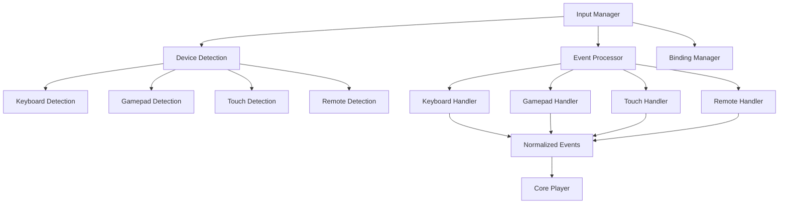

# Input Device Framework Specification

Unified input handling system for keyboard, gamepad, touch, and remote control devices across all player platforms.

## Overview

The Input Framework provides:
- Unified input abstraction across all device types
- Platform-specific input handlers (web, Chromecast, WebView)
- Configurable key bindings and gesture mappings
- Input event normalization and processing
- Multi-device input coordination

## Architecture



## Core Interfaces

### Input Manager

```typescript
interface InputManager {
  // Device Management
  registerDevice(device: InputDevice): void;
  unregisterDevice(deviceId: string): void;
  getActiveDevices(): InputDevice[];

  // Event Processing
  processInput(event: InputEvent): void;
  setEventProcessor(processor: InputEventProcessor): void;

  // Key Bindings
  setKeyBinding(key: string, action: PlayerAction): void;
  setGestureBinding(gesture: GestureType, action: PlayerAction): void;
  clearBindings(): void;

  // Configuration
  configure(config: InputConfig): void;
  getConfig(): InputConfig;

  // State
  isInputEnabled(): boolean;
  enableInput(): void;
  disableInput(): void;
}
```

### Input Device Base

```typescript
abstract class InputDevice {
  readonly id: string;
  readonly type: DeviceType;
  readonly platform: Platform;
  protected eventProcessor: InputEventProcessor;

  constructor(id: string, type: DeviceType, platform: Platform) {
    this.id = id;
    this.type = type;
    this.platform = platform;
  }

  abstract initialize(): Promise<void>;
  abstract dispose(): void;
  abstract isConnected(): boolean;

  protected emitEvent(event: NormalizedInputEvent): void {
    this.eventProcessor?.processEvent(event);
  }
}

enum DeviceType {
  KEYBOARD = 'keyboard',
  GAMEPAD = 'gamepad',
  TOUCH = 'touch',
  REMOTE = 'remote',
  MOUSE = 'mouse'
}

enum Platform {
  WEB = 'web',
  CHROMECAST = 'chromecast',
  WEBVIEW = 'webview',
  NATIVE = 'native'
}
```

### Normalized Input Events

```typescript
interface NormalizedInputEvent {
  type: InputEventType;
  action: InputAction;
  device: DeviceType;
  timestamp: number;
  data: InputEventData;
}

enum InputEventType {
  KEY_DOWN = 'key_down',
  KEY_UP = 'key_up',
  BUTTON_DOWN = 'button_down',
  BUTTON_UP = 'button_up',
  TOUCH_START = 'touch_start',
  TOUCH_END = 'touch_end',
  TOUCH_MOVE = 'touch_move',
  GESTURE = 'gesture',
  AXIS_MOVE = 'axis_move'
}

enum InputAction {
  // Navigation
  UP = 'up',
  DOWN = 'down',
  LEFT = 'left',
  RIGHT = 'right',
  SELECT = 'select',
  BACK = 'back',

  // Playback
  PLAY_PAUSE = 'play_pause',
  PLAY = 'play',
  PAUSE = 'pause',
  STOP = 'stop',
  SEEK_FORWARD = 'seek_forward',
  SEEK_BACKWARD = 'seek_backward',
  SKIP_FORWARD = 'skip_forward',
  SKIP_BACKWARD = 'skip_backward',

  // Volume
  VOLUME_UP = 'volume_up',
  VOLUME_DOWN = 'volume_down',
  MUTE = 'mute',

  // Display
  FULLSCREEN = 'fullscreen',
  EXIT_FULLSCREEN = 'exit_fullscreen',
  SHOW_CONTROLS = 'show_controls',
  HIDE_CONTROLS = 'hide_controls',

  // Quality
  QUALITY_UP = 'quality_up',
  QUALITY_DOWN = 'quality_down',

  // Accessibility
  SHOW_CAPTIONS = 'show_captions',
  HIDE_CAPTIONS = 'hide_captions',
  AUDIO_DESCRIPTION = 'audio_description'
}
```

## Keyboard Input (@video-player/keyboard)

### Keyboard Handler

```typescript
class KeyboardInputDevice extends InputDevice {
  private keyBindings: Map<string, InputAction>;
  private activeKeys: Set<string>;
  private eventListener: (event: KeyboardEvent) => void;

  constructor() {
    super('keyboard', DeviceType.KEYBOARD, Platform.WEB);
    this.keyBindings = new Map();
    this.activeKeys = new Set();
    this.setupDefaultBindings();
  }

  async initialize(): Promise<void> {
    this.eventListener = (event: KeyboardEvent) => {
      this.handleKeyboardEvent(event);
    };

    document.addEventListener('keydown', this.eventListener);
    document.addEventListener('keyup', this.eventListener);
  }

  private setupDefaultBindings(): void {
    // Media Keys
    this.keyBindings.set('Space', InputAction.PLAY_PAUSE);
    this.keyBindings.set('MediaPlayPause', InputAction.PLAY_PAUSE);
    this.keyBindings.set('MediaPlay', InputAction.PLAY);
    this.keyBindings.set('MediaPause', InputAction.PAUSE);
    this.keyBindings.set('MediaStop', InputAction.STOP);

    // Navigation
    this.keyBindings.set('ArrowUp', InputAction.UP);
    this.keyBindings.set('ArrowDown', InputAction.DOWN);
    this.keyBindings.set('ArrowLeft', InputAction.LEFT);
    this.keyBindings.set('ArrowRight', InputAction.RIGHT);
    this.keyBindings.set('Enter', InputAction.SELECT);
    this.keyBindings.set('Escape', InputAction.BACK);

    // Volume
    this.keyBindings.set('ArrowUp', InputAction.VOLUME_UP); // with modifier
    this.keyBindings.set('ArrowDown', InputAction.VOLUME_DOWN); // with modifier
    this.keyBindings.set('KeyM', InputAction.MUTE);

    // Seeking
    this.keyBindings.set('ArrowLeft', InputAction.SEEK_BACKWARD); // with modifier
    this.keyBindings.set('ArrowRight', InputAction.SEEK_FORWARD); // with modifier
    this.keyBindings.set('KeyJ', InputAction.SKIP_BACKWARD);
    this.keyBindings.set('KeyL', InputAction.SKIP_FORWARD);

    // Display
    this.keyBindings.set('KeyF', InputAction.FULLSCREEN);
    this.keyBindings.set('KeyC', InputAction.SHOW_CAPTIONS);

    // Numbers for quality selection
    for (let i = 1; i <= 9; i++) {
      this.keyBindings.set(`Digit${i}`, `quality_${i}` as InputAction);
    }
  }

  private handleKeyboardEvent(event: KeyboardEvent): void {
    const key = this.normalizeKeyCode(event.code, event.key);
    const action = this.keyBindings.get(key);

    if (action && !this.isInputBlocked(event)) {
      event.preventDefault();
      this.emitEvent({
        type: event.type === 'keydown' ? InputEventType.KEY_DOWN : InputEventType.KEY_UP,
        action,
        device: DeviceType.KEYBOARD,
        timestamp: Date.now(),
        data: {
          key,
          code: event.code,
          modifiers: {
            ctrl: event.ctrlKey,
            alt: event.altKey,
            shift: event.shiftKey,
            meta: event.metaKey
          }
        }
      });
    }
  }
}
```

## Gamepad Input (@video-player/gamepad)

### Gamepad Handler

```typescript
class GamepadInputDevice extends InputDevice {
  private gamepadIndex: number;
  private buttonBindings: Map<number, InputAction>;
  private axisBindings: Map<number, { action: InputAction; deadzone: number }>;
  private previousButtonStates: boolean[];
  private polling: boolean = false;

  constructor(gamepadIndex: number) {
    super(`gamepad_${gamepadIndex}`, DeviceType.GAMEPAD, Platform.WEB);
    this.gamepadIndex = gamepadIndex;
    this.buttonBindings = new Map();
    this.axisBindings = new Map();
    this.previousButtonStates = [];
    this.setupDefaultBindings();
  }

  private setupDefaultBindings(): void {
    // Standard gamepad button mappings
    this.buttonBindings.set(0, InputAction.SELECT); // A/Cross
    this.buttonBindings.set(1, InputAction.BACK); // B/Circle
    this.buttonBindings.set(2, InputAction.SHOW_CONTROLS); // X/Square
    this.buttonBindings.set(3, InputAction.SHOW_CAPTIONS); // Y/Triangle

    // Shoulder buttons
    this.buttonBindings.set(4, InputAction.SKIP_BACKWARD); // L1/LB
    this.buttonBindings.set(5, InputAction.SKIP_FORWARD); // R1/RB
    this.buttonBindings.set(6, InputAction.VOLUME_DOWN); // L2/LT
    this.buttonBindings.set(7, InputAction.VOLUME_UP); // R2/RT

    // Special buttons
    this.buttonBindings.set(8, InputAction.BACK); // Select/Share
    this.buttonBindings.set(9, InputAction.PLAY_PAUSE); // Start/Options
    this.buttonBindings.set(16, InputAction.FULLSCREEN); // Guide/PS

    // D-pad
    this.buttonBindings.set(12, InputAction.UP); // D-pad up
    this.buttonBindings.set(13, InputAction.DOWN); // D-pad down
    this.buttonBindings.set(14, InputAction.LEFT); // D-pad left
    this.buttonBindings.set(15, InputAction.RIGHT); // D-pad right

    // Analog sticks (axis bindings)
    this.axisBindings.set(0, { action: InputAction.LEFT, deadzone: 0.2 }); // Left stick X
    this.axisBindings.set(1, { action: InputAction.UP, deadzone: 0.2 }); // Left stick Y
  }

  async initialize(): Promise<void> {
    this.polling = true;
    this.pollGamepad();
  }

  private pollGamepad(): void {
    if (!this.polling) return;

    const gamepad = navigator.getGamepads()[this.gamepadIndex];
    if (gamepad) {
      this.processButtons(gamepad.buttons);
      this.processAxes(gamepad.axes);
    }

    requestAnimationFrame(() => this.pollGamepad());
  }

  private processButtons(buttons: readonly GamepadButton[]): void {
    buttons.forEach((button, index) => {
      const wasPressed = this.previousButtonStates[index] || false;
      const isPressed = button.pressed;

      if (isPressed !== wasPressed) {
        const action = this.buttonBindings.get(index);
        if (action) {
          this.emitEvent({
            type: isPressed ? InputEventType.BUTTON_DOWN : InputEventType.BUTTON_UP,
            action,
            device: DeviceType.GAMEPAD,
            timestamp: Date.now(),
            data: {
              buttonIndex: index,
              value: button.value
            }
          });
        }
      }

      this.previousButtonStates[index] = isPressed;
    });
  }
}
```

## Touch Input (@video-player/touch)

### Touch Handler

```typescript
class TouchInputDevice extends InputDevice {
  private gestureDetector: GestureDetector;
  private touchPoints: Map<number, TouchPoint>;

  constructor() {
    super('touch', DeviceType.TOUCH, Platform.WEB);
    this.gestureDetector = new GestureDetector();
    this.touchPoints = new Map();
  }

  async initialize(): Promise<void> {
    const element = document.getElementById('video-player');
    if (element) {
      element.addEventListener('touchstart', this.handleTouchStart.bind(this));
      element.addEventListener('touchmove', this.handleTouchMove.bind(this));
      element.addEventListener('touchend', this.handleTouchEnd.bind(this));
    }
  }

  private handleTouchStart(event: TouchEvent): void {
    Array.from(event.changedTouches).forEach(touch => {
      const touchPoint: TouchPoint = {
        id: touch.identifier,
        x: touch.clientX,
        y: touch.clientY,
        startTime: Date.now()
      };
      this.touchPoints.set(touch.identifier, touchPoint);
    });

    this.gestureDetector.processTouchStart(event);
  }

  private handleTouchMove(event: TouchEvent): void {
    Array.from(event.changedTouches).forEach(touch => {
      const touchPoint = this.touchPoints.get(touch.identifier);
      if (touchPoint) {
        touchPoint.x = touch.clientX;
        touchPoint.y = touch.clientY;
      }
    });

    this.gestureDetector.processTouchMove(event);
  }

  private handleTouchEnd(event: TouchEvent): void {
    Array.from(event.changedTouches).forEach(touch => {
      this.touchPoints.delete(touch.identifier);
    });

    const gesture = this.gestureDetector.processTouchEnd(event);
    if (gesture) {
      const action = this.getActionForGesture(gesture.type);
      if (action) {
        this.emitEvent({
          type: InputEventType.GESTURE,
          action,
          device: DeviceType.TOUCH,
          timestamp: Date.now(),
          data: gesture
        });
      }
    }
  }

  private getActionForGesture(gestureType: GestureType): InputAction | null {
    switch (gestureType) {
      case GestureType.TAP: return InputAction.PLAY_PAUSE;
      case GestureType.DOUBLE_TAP: return InputAction.FULLSCREEN;
      case GestureType.SWIPE_LEFT: return InputAction.SEEK_BACKWARD;
      case GestureType.SWIPE_RIGHT: return InputAction.SEEK_FORWARD;
      case GestureType.SWIPE_UP: return InputAction.VOLUME_UP;
      case GestureType.SWIPE_DOWN: return InputAction.VOLUME_DOWN;
      case GestureType.PINCH_IN: return InputAction.EXIT_FULLSCREEN;
      case GestureType.PINCH_OUT: return InputAction.FULLSCREEN;
      default: return null;
    }
  }
}

interface TouchPoint {
  id: number;
  x: number;
  y: number;
  startTime: number;
}

enum GestureType {
  TAP = 'tap',
  DOUBLE_TAP = 'double_tap',
  LONG_PRESS = 'long_press',
  SWIPE_LEFT = 'swipe_left',
  SWIPE_RIGHT = 'swipe_right',
  SWIPE_UP = 'swipe_up',
  SWIPE_DOWN = 'swipe_down',
  PINCH_IN = 'pinch_in',
  PINCH_OUT = 'pinch_out'
}
```

## Remote Control Input (Chromecast/WebView)

### Remote Handler

```typescript
class RemoteInputDevice extends InputDevice {
  private remoteType: RemoteType;
  private keyMappings: Map<string, InputAction>;

  constructor(remoteType: RemoteType) {
    super(`remote_${remoteType}`, DeviceType.REMOTE, Platform.CHROMECAST);
    this.remoteType = remoteType;
    this.keyMappings = new Map();
    this.setupRemoteBindings();
  }

  private setupRemoteBindings(): void {
    switch (this.remoteType) {
      case RemoteType.CHROMECAST:
        this.setupChromecastBindings();
        break;
      case RemoteType.ANDROID_TV:
        this.setupAndroidTVBindings();
        break;
      case RemoteType.APPLE_TV:
        this.setupAppleTVBindings();
        break;
    }
  }

  private setupChromecastBindings(): void {
    this.keyMappings.set('MediaPlayPause', InputAction.PLAY_PAUSE);
    this.keyMappings.set('MediaStop', InputAction.STOP);
    this.keyMappings.set('ArrowUp', InputAction.UP);
    this.keyMappings.set('ArrowDown', InputAction.DOWN);
    this.keyMappings.set('ArrowLeft', InputAction.LEFT);
    this.keyMappings.set('ArrowRight', InputAction.RIGHT);
    this.keyMappings.set('Enter', InputAction.SELECT);
    this.keyMappings.set('GoBack', InputAction.BACK);
  }
}

enum RemoteType {
  CHROMECAST = 'chromecast',
  ANDROID_TV = 'android_tv',
  APPLE_TV = 'apple_tv',
  ROKU = 'roku',
  FIRE_TV = 'fire_tv'
}
```

## Configuration System

```typescript
interface InputConfig {
  // Global Settings
  enabled: boolean;
  priority: DeviceType[];

  // Device-specific settings
  keyboard: KeyboardConfig;
  gamepad: GamepadConfig;
  touch: TouchConfig;
  remote: RemoteConfig;

  // Accessibility
  accessibility: AccessibilityConfig;
}

interface KeyboardConfig {
  enabled: boolean;
  customBindings: Record<string, InputAction>;
  modifierBehavior: ModifierBehavior;
  preventDefault: boolean;
}

interface GamepadConfig {
  enabled: boolean;
  deadzone: number;
  autoDetect: boolean;
  vibration: boolean;
  customBindings: Record<number, InputAction>;
}

interface TouchConfig {
  enabled: boolean;
  gestures: GestureConfig[];
  multitouch: boolean;
  sensitivity: number;
}

interface AccessibilityConfig {
  highContrast: boolean;
  largeText: boolean;
  reducedMotion: boolean;
  screenReader: boolean;
}
```

## Testing Strategy

### Unit Tests
- Individual device input processing
- Gesture detection accuracy
- Key binding customization
- Event normalization

### Integration Tests
- Multi-device input coordination
- Platform-specific behavior
- Accessibility compliance
- Performance under load

### Device Tests
- Physical gamepad testing
- Touch device testing
- Remote control testing
- Cross-platform compatibility

This Input Framework provides a solid foundation for handling all types of user input across different platforms and devices, ensuring consistent behavior while allowing for platform-specific optimizations.