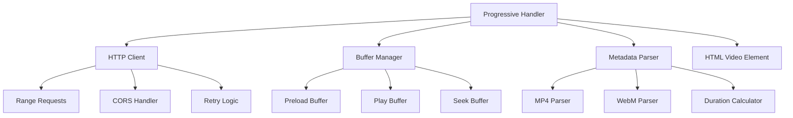

# Progressive Protocol Handler Specification (@video-player/progressive)

Basic HTTP progressive download protocol handler for MP4, WebM, and other container formats. This serves as the foundation protocol handler and reference implementation for the plugin system.

## Overview

The Progressive Protocol Handler provides:
- HTTP progressive download support for standard container formats
- Basic seeking and buffering capabilities
- Simple fallback when adaptive streaming is not available
- Reference implementation for other protocol handlers
- CORS and range request handling

## Architecture



## Core Implementation

### Progressive Protocol Handler

```typescript
class ProgressiveProtocolHandler extends BaseProtocol {
  private httpClient: HTTPClient;
  private bufferManager: BufferManager;
  private metadataParser: MetadataParser;
  private currentSource: MediaSource | null = null;
  private loadingState: LoadingState = LoadingState.IDLE;

  constructor() {
    super('progressive', '1.0.0');
    this.httpClient = new HTTPClient();
    this.bufferManager = new BufferManager();
    this.metadataParser = new MetadataParser();
  }

  // Protocol Interface Implementation
  canHandle(source: MediaSource): boolean {
    return this.getSupportedMimeTypes().some(mimeType =>
      source.mimeType === mimeType ||
      this.inferMimeTypeFromUrl(source.url) === mimeType
    );
  }

  async load(source: MediaSource, videoElement: HTMLVideoElement): Promise<void> {
    this.currentSource = source;
    this.loadingState = LoadingState.LOADING;

    try {
      // Step 1: Validate source and check availability
      await this.validateSource(source);

      // Step 2: Fetch initial metadata if range requests are supported
      const metadata = await this.fetchMetadata(source);

      // Step 3: Configure buffer management
      this.bufferManager.configure({
        preloadSize: this.getPreloadSize(metadata),
        bufferAhead: this.getBufferAhead(),
        maxBufferSize: this.getMaxBufferSize()
      });

      // Step 4: Set source on video element
      videoElement.src = source.url;

      // Step 5: Setup event listeners
      this.setupVideoElementListeners(videoElement);

      this.loadingState = LoadingState.LOADED;
      this.emit('loaded', { source, metadata });

    } catch (error) {
      this.loadingState = LoadingState.ERROR;
      this.emit('error', error);
      throw error;
    }
  }

  async seek(time: number): Promise<void> {
    if (!this.currentSource) {
      throw new Error('No source loaded');
    }

    // For progressive download, seeking might require range requests
    // if the content supports it, otherwise we rely on browser buffering
    if (this.supportsRangeRequests()) {
      await this.performRangeSeek(time);
    } else {
      // Browser will handle seeking within buffered content
      this.emit('seeked', { time });
    }
  }

  dispose(): void {
    this.httpClient.dispose();
    this.bufferManager.dispose();
    this.currentSource = null;
    this.loadingState = LoadingState.DISPOSED;
  }

  // Protocol-specific methods
  private getSupportedMimeTypes(): string[] {
    return [
      'video/mp4',
      'video/webm',
      'video/ogg',
      'video/avi',
      'video/quicktime',
      'video/x-msvideo'
    ];
  }

  private inferMimeTypeFromUrl(url: string): string | null {
    const extension = url.split('.').pop()?.toLowerCase();

    switch (extension) {
      case 'mp4': return 'video/mp4';
      case 'webm': return 'video/webm';
      case 'ogv': return 'video/ogg';
      case 'avi': return 'video/avi';
      case 'mov': return 'video/quicktime';
      default: return null;
    }
  }

  private async validateSource(source: MediaSource): Promise<void> {
    try {
      const response = await fetch(source.url, { method: 'HEAD' });

      if (!response.ok) {
        throw new Error(`HTTP ${response.status}: ${response.statusText}`);
      }

      // Check if Content-Length is available
      const contentLength = response.headers.get('Content-Length');
      if (contentLength) {
        source.size = parseInt(contentLength, 10);
      }

      // Check if range requests are supported
      const acceptRanges = response.headers.get('Accept-Ranges');
      this.setRangeSupport(acceptRanges === 'bytes');

    } catch (error) {
      throw new Error(`Failed to validate source: ${error.message}`);
    }
  }

  private async fetchMetadata(source: MediaSource): Promise<MediaMetadata> {
    if (!this.supportsRangeRequests()) {
      return { duration: null, hasVideo: true, hasAudio: true };
    }

    try {
      // Fetch first chunk to parse container metadata
      const headerChunk = await this.httpClient.fetchRange(source.url, 0, 8192);
      const metadata = await this.metadataParser.parse(headerChunk, source.mimeType);

      return metadata;
    } catch (error) {
      // Fallback to basic metadata
      return { duration: null, hasVideo: true, hasAudio: true };
    }
  }
}
```

### HTTP Client

```typescript
class HTTPClient {
  private abortController: AbortController | null = null;
  private retryConfig: RetryConfig;

  constructor(retryConfig?: Partial<RetryConfig>) {
    this.retryConfig = {
      maxRetries: 3,
      retryDelay: 1000,
      backoffMultiplier: 2,
      ...retryConfig
    };
  }

  async fetchRange(url: string, start: number, end: number): Promise<ArrayBuffer> {
    this.abortController = new AbortController();

    const headers = new Headers();
    headers.set('Range', `bytes=${start}-${end}`);

    let lastError: Error;

    for (let attempt = 0; attempt <= this.retryConfig.maxRetries; attempt++) {
      try {
        const response = await fetch(url, {
          headers,
          signal: this.abortController.signal
        });

        if (response.status === 206 || response.status === 200) {
          return await response.arrayBuffer();
        } else if (response.status === 416) {
          throw new Error('Range not satisfiable');
        } else {
          throw new Error(`HTTP ${response.status}: ${response.statusText}`);
        }
      } catch (error) {
        lastError = error;

        if (attempt < this.retryConfig.maxRetries && this.isRetryableError(error)) {
          await this.delay(this.retryConfig.retryDelay * Math.pow(this.retryConfig.backoffMultiplier, attempt));
        }
      }
    }

    throw lastError;
  }

  private isRetryableError(error: Error): boolean {
    return error.name === 'NetworkError' ||
           error.message.includes('timeout') ||
           error.message.includes('5');
  }

  private delay(ms: number): Promise<void> {
    return new Promise(resolve => setTimeout(resolve, ms));
  }

  dispose(): void {
    if (this.abortController) {
      this.abortController.abort();
      this.abortController = null;
    }
  }
}

interface RetryConfig {
  maxRetries: number;
  retryDelay: number;
  backoffMultiplier: number;
}
```

### Buffer Manager

```typescript
class BufferManager {
  private config: BufferConfig;
  private preloadBuffer: ArrayBuffer | null = null;
  private isPreloading: boolean = false;

  constructor() {
    this.config = {
      preloadSize: 1024 * 1024, // 1MB
      bufferAhead: 30, // seconds
      maxBufferSize: 50 * 1024 * 1024 // 50MB
    };
  }

  configure(config: Partial<BufferConfig>): void {
    this.config = { ...this.config, ...config };
  }

  async preloadContent(source: MediaSource, httpClient: HTTPClient): Promise<void> {
    if (this.isPreloading || this.preloadBuffer) {
      return;
    }

    this.isPreloading = true;

    try {
      this.preloadBuffer = await httpClient.fetchRange(
        source.url,
        0,
        this.config.preloadSize
      );
    } catch (error) {
      console.warn('Preload failed:', error);
    } finally {
      this.isPreloading = false;
    }
  }

  getBufferStatus(): BufferStatus {
    return {
      preloaded: !!this.preloadBuffer,
      preloadSize: this.preloadBuffer?.byteLength || 0,
      isPreloading: this.isPreloading
    };
  }

  dispose(): void {
    this.preloadBuffer = null;
    this.isPreloading = false;
  }
}

interface BufferConfig {
  preloadSize: number;
  bufferAhead: number;
  maxBufferSize: number;
}

interface BufferStatus {
  preloaded: boolean;
  preloadSize: number;
  isPreloading: boolean;
}
```

### Metadata Parser

```typescript
class MetadataParser {
  async parse(data: ArrayBuffer, mimeType: string): Promise<MediaMetadata> {
    switch (mimeType) {
      case 'video/mp4':
        return this.parseMP4(data);
      case 'video/webm':
        return this.parseWebM(data);
      default:
        return this.parseGeneric();
    }
  }

  private async parseMP4(data: ArrayBuffer): Promise<MediaMetadata> {
    const view = new DataView(data);
    let offset = 0;
    let duration: number | null = null;
    let hasVideo = false;
    let hasAudio = false;

    // Basic MP4 box parsing
    while (offset < data.byteLength - 8) {
      const boxSize = view.getUint32(offset);
      const boxType = this.readString(data, offset + 4, 4);

      if (boxType === 'mvhd') {
        // Movie header box - contains duration
        const version = view.getUint8(offset + 8);
        const timeScale = version === 1 ?
          view.getUint32(offset + 28) :
          view.getUint32(offset + 20);
        const durationValue = version === 1 ?
          this.readUint64(view, offset + 32) :
          view.getUint32(offset + 24);

        duration = durationValue / timeScale;
      }

      if (boxType === 'trak') {
        // Track box - check for video/audio tracks
        const trackType = this.parseTrackType(data.slice(offset, offset + boxSize));
        if (trackType === 'video') hasVideo = true;
        if (trackType === 'audio') hasAudio = true;
      }

      offset += boxSize;
      if (boxSize === 0) break; // Invalid box size
    }

    return {
      duration,
      hasVideo,
      hasAudio,
      container: 'mp4'
    };
  }

  private parseWebM(data: ArrayBuffer): Promise<MediaMetadata> {
    // Basic WebM/Matroska parsing would go here
    // For now, return basic metadata
    return Promise.resolve({
      duration: null,
      hasVideo: true,
      hasAudio: true,
      container: 'webm'
    });
  }

  private parseGeneric(): MediaMetadata {
    return {
      duration: null,
      hasVideo: true,
      hasAudio: true,
      container: 'unknown'
    };
  }

  private readString(buffer: ArrayBuffer, offset: number, length: number): string {
    const view = new Uint8Array(buffer, offset, length);
    return String.fromCharCode(...view);
  }

  private readUint64(view: DataView, offset: number): number {
    const high = view.getUint32(offset);
    const low = view.getUint32(offset + 4);
    return high * Math.pow(2, 32) + low;
  }

  private parseTrackType(trackBox: ArrayBuffer): 'video' | 'audio' | 'unknown' {
    // Simplified track type detection
    const trackData = new Uint8Array(trackBox);
    const trackString = String.fromCharCode(...trackData);

    if (trackString.includes('vide')) return 'video';
    if (trackString.includes('soun')) return 'audio';
    return 'unknown';
  }
}

interface MediaMetadata {
  duration: number | null;
  hasVideo: boolean;
  hasAudio: boolean;
  container?: string;
  bitrate?: number;
  dimensions?: {
    width: number;
    height: number;
  };
}
```

## Protocol Base Class

```typescript
abstract class BaseProtocol extends BasePlugin {
  constructor(id: string, version: string = '1.0.0') {
    super(id, PluginType.PROTOCOL, version);
  }

  // Protocol interface methods that must be implemented
  abstract canHandle(source: MediaSource): boolean;
  abstract load(source: MediaSource, videoElement: HTMLVideoElement): Promise<void>;
  abstract seek(time: number): Promise<void>;

  // Optional methods with default implementations
  supportsQualityLevels(): boolean {
    return false;
  }

  getQualityLevels(): QualityLevel[] {
    return [];
  }

  setQualityLevel(level: QualityLevel): void {
    // No-op for basic protocols
  }

  supportsLiveStreaming(): boolean {
    return false;
  }

  getStats(): ProtocolStats {
    return {
      bytesLoaded: 0,
      bytesTotal: 0,
      bitrate: 0,
      bufferLength: 0
    };
  }

  // Lifecycle methods
  async onInitialize(config: PlayerConfig): Promise<void> {
    // Protocol-specific initialization
  }

  async onLoad(source: MediaSource): Promise<void> {
    if (this.canHandle(source)) {
      const videoElement = this.getVideoElement();
      await this.load(source, videoElement);
    } else {
      throw new Error(`Protocol ${this.id} cannot handle source: ${source.url}`);
    }
  }

  async onPlay(): Promise<void> {
    // Protocol-specific play logic
  }

  onPause(): void {
    // Protocol-specific pause logic
  }

  onDispose(): void {
    this.dispose();
  }

  private getVideoElement(): HTMLVideoElement {
    // Get video element from core player
    const videoElement = document.querySelector('video');
    if (!videoElement) {
      throw new Error('Video element not found');
    }
    return videoElement;
  }

  protected abstract dispose(): void;
}

interface ProtocolStats {
  bytesLoaded: number;
  bytesTotal: number;
  bitrate: number;
  bufferLength: number;
}

enum LoadingState {
  IDLE = 'idle',
  LOADING = 'loading',
  LOADED = 'loaded',
  ERROR = 'error',
  DISPOSED = 'disposed'
}
```

## Configuration

```typescript
interface ProgressiveConfig {
  // Buffer settings
  preloadSize: number; // bytes
  bufferAhead: number; // seconds
  maxBufferSize: number; // bytes

  // HTTP settings
  retryAttempts: number;
  retryDelay: number;
  timeout: number;

  // Range request settings
  enableRangeRequests: boolean;
  rangeChunkSize: number;

  // CORS settings
  crossOrigin: 'anonymous' | 'use-credentials' | null;
  allowCredentials: boolean;
}
```

## Error Handling

```typescript
class ProgressiveProtocolError extends VideoPlayerError {
  constructor(
    message: string,
    code: ProgressiveErrorCode,
    cause?: Error
  ) {
    super(message, code, ErrorSeverity.ERROR, true);
    this.cause = cause;
  }
}

enum ProgressiveErrorCode {
  NETWORK_ERROR = 'PROGRESSIVE_001',
  INVALID_SOURCE = 'PROGRESSIVE_002',
  METADATA_PARSE_ERROR = 'PROGRESSIVE_003',
  RANGE_REQUEST_FAILED = 'PROGRESSIVE_004',
  CORS_ERROR = 'PROGRESSIVE_005'
}
```

## Testing Specifications

### Unit Tests
- HTTP client retry logic
- Range request handling
- Metadata parsing accuracy
- Buffer management
- Error scenarios

### Integration Tests
- Video element integration
- Core player lifecycle
- Event emission and handling
- Configuration changes

### Performance Tests
- Load time optimization
- Memory usage during playback
- Network efficiency
- Buffer management effectiveness

## Usage Example

```typescript
// Register the progressive protocol handler
const progressiveHandler = new ProgressiveProtocolHandler();
core.registerPlugin(progressiveHandler);

// Load a progressive video
await core.load({
  url: 'https://example.com/video.mp4',
  mimeType: 'video/mp4'
});

// The progressive handler will automatically handle the source
// if it's a supported format
```

This Progressive Protocol Handler serves as both a functional protocol handler for basic video playback and a reference implementation for creating more advanced protocol handlers like HLS, DASH, and WebRTC.