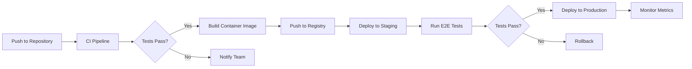

# Technology Stack Documentation

> **Last Updated**: January 2025
> **Version**: 1.0.0

## Table of Contents

- [Core Framework](#core-framework)
- [Testing Stack](#testing-stack)
- [Video Technologies](#video-technologies)
- [Performance & Monitoring](#performance--monitoring)
- [Build & Development](#build--development)
- [Analytics & Data](#analytics--data)
- [Infrastructure (Deployment)](#infrastructure-deployment)
- [Quick Start Guide](#quick-start-guide)

---

## Core Framework

### Next.js 14+
**Version**: `^14.2.0`
**Purpose**: Full-stack React framework with App Router

```bash
# Installation
npm install next@latest
```

**Configuration Notes**:
- App Router enabled by default
- Server Components for optimal performance
- Built-in API routes support
- Automatic code splitting

### React 18+
**Version**: `^18.3.0`
**Purpose**: UI component library with concurrent features

```bash
# Installation
npm install react@latest react-dom@latest
```

**Key Features Used**:
- Server Components
- Suspense boundaries
- Concurrent rendering
- Automatic batching

### TypeScript 5+
**Version**: `^5.4.0`
**Purpose**: Type-safe JavaScript development

```bash
# Installation
npm install --save-dev typescript @types/react @types/node
```

**Configuration** (`tsconfig.json`):
```json
{
  "compilerOptions": {
    "target": "ES2022",
    "lib": ["dom", "dom.iterable", "esnext"],
    "strict": true,
    "moduleResolution": "bundler",
    "jsx": "preserve"
  }
}
```

### Video.js 8+
**Version**: `^8.10.0`
**Purpose**: Primary HTML5 video player

```bash
# Installation
npm install video.js @types/video.js
```

**Configuration Notes**:
- Custom themes via CSS
- Plugin architecture for extensibility
- HLS/DASH support via plugins
- Accessibility features built-in

### Tailwind CSS 3+
**Version**: `^3.4.0`
**Purpose**: Utility-first CSS framework

```bash
# Installation
npm install --save-dev tailwindcss postcss autoprefixer
npx tailwindcss init -p
```

**Configuration** (`tailwind.config.js`):
```javascript
module.exports = {
  content: [
    './app/**/*.{js,ts,jsx,tsx,mdx}',
    './components/**/*.{js,ts,jsx,tsx,mdx}'
  ],
  theme: {
    extend: {
      // Custom video player themes
    }
  }
}
```

---

## Testing Stack

### Playwright
**Version**: `^1.42.0`
**Purpose**: Cross-browser end-to-end testing

```bash
# Installation
npm install --save-dev @playwright/test
npx playwright install
```

**Configuration** (`playwright.config.ts`):
```typescript
export default {
  testDir: './e2e',
  use: {
    baseURL: 'http://localhost:3000',
    trace: 'on-first-retry',
  },
  projects: [
    { name: 'chromium' },
    { name: 'firefox' },
    { name: 'webkit' },
    { name: 'mobile-chrome' },
    { name: 'mobile-safari' }
  ]
}
```

### Jest + React Testing Library
**Version**: Jest `^29.7.0`, RTL `^14.2.0`
**Purpose**: Unit and integration testing

```bash
# Installation
npm install --save-dev jest @testing-library/react @testing-library/jest-dom jest-environment-jsdom
```

**Configuration Notes**:
- Next.js built-in Jest configuration
- Coverage thresholds: 80% minimum
- Snapshot testing for components

### Storybook 7+
**Version**: `^7.6.0`
**Purpose**: Component development and documentation

```bash
# Installation
npx storybook@latest init
```

**Add-ons**:
- `@storybook/addon-essentials`
- `@storybook/addon-a11y`
- `@storybook/addon-interactions`

### MSW (Mock Service Worker)
**Version**: `^2.1.0`
**Purpose**: API mocking for testing

```bash
# Installation
npm install --save-dev msw
npx msw init public/ --save
```

**Configuration Notes**:
- Browser and Node.js support
- Request interception
- Response mocking

---

## Video Technologies

### HLS.js
**Version**: `^1.5.0`
**Purpose**: HTTP Live Streaming playback

```bash
# Installation
npm install hls.js
```

**Integration with Video.js**:
```javascript
import Hls from 'hls.js';
// Attach to video element when HLS source detected
```

### DASH.js
**Version**: `^4.7.0`
**Purpose**: MPEG-DASH streaming support

```bash
# Installation
npm install dashjs
```

**Configuration Notes**:
- Low latency mode support
- Multi-period support
- DRM integration ready

### Shaka Player
**Version**: `^4.7.0`
**Purpose**: Alternative player for comparison/fallback

```bash
# Installation
npm install shaka-player
```

**Use Cases**:
- Advanced DRM scenarios
- Offline playback support
- Subtitle/caption management

### DRM Support

#### Widevine
- **Level**: L1/L3 support
- **Platforms**: Chrome, Firefox, Edge
- **License Server**: Custom implementation required

#### FairPlay
- **Platforms**: Safari, iOS
- **Certificate**: Required from platform vendor
- **Server Key Module**: Custom implementation

#### PlayReady
- **Platforms**: Edge, Xbox, Windows
- **License Server**: Cloud media services compatible

### Supported Codecs

| Codec | Container | Browser Support | Use Case |
|-------|-----------|----------------|----------|
| **H.264** | MP4, HLS | Universal | Standard quality, broad compatibility |
| **H.265** | MP4, HLS | Safari, Edge | 4K content, better compression |
| **VP9** | WebM, DASH | Chrome, Firefox | YouTube-style delivery |
| **AV1** | WebM, MP4 | Chrome 90+, Firefox 67+ | Next-gen, best compression |

---

## Performance & Monitoring

### Web Vitals
**Version**: `^3.5.0`
**Purpose**: Core Web Vitals monitoring

```bash
# Installation
npm install web-vitals
```

**Metrics Tracked**:
- **LCP** (Largest Contentful Paint): < 2.5s
- **FID** (First Input Delay): < 100ms
- **CLS** (Cumulative Layout Shift): < 0.1
- **TTFB** (Time to First Byte): < 800ms
- **INP** (Interaction to Next Paint): < 200ms

### Custom Video Metrics

```javascript
// Key metrics to track
const videoMetrics = {
  startupTime: 'Time to first frame',
  rebufferingRate: 'Percentage of time buffering',
  bitrateChanges: 'Adaptive streaming switches',
  errorRate: 'Playback failure percentage',
  engagementTime: 'Total watch time'
};
```

### Error Tracking Platform
**Version**: `^7.100.0`
**Purpose**: Error tracking and performance monitoring

```bash
# Installation (Example: Sentry)
npm install @sentry/nextjs
npx @sentry/wizard@latest -i nextjs
```

**Configuration Notes**:
- Source map upload in CI/CD
- Custom error boundaries
- Performance tracing enabled
- Session replay for debugging

### Application Performance Monitoring (APM)
**Purpose**: Application Performance Monitoring

**APM Platform Configuration (Example: DataDog)**:
```bash
npm install dd-trace
```

**Alternative APM Platform (Example: New Relic)**:
```bash
npm install newrelic
```

**Metrics Collected**:
- API response times
- Database query performance
- CDN cache hit rates
- Real User Monitoring (RUM)

### Lighthouse CI
**Version**: `^0.13.0`
**Purpose**: Automated performance regression testing

```bash
# Installation
npm install --save-dev @lhci/cli
```

**CI Configuration**:
```yaml
# .lighthouserc.json
{
  "ci": {
    "assert": {
      "preset": "lighthouse:recommended",
      "assertions": {
        "categories:performance": ["error", { "minScore": 0.9 }]
      }
    }
  }
}
```

---

## Build & Development

### Turbopack
**Purpose**: Next.js development bundler (faster than Webpack)

```bash
# Enable in next.config.js
module.exports = {
  experimental: {
    turbo: {}
  }
}
```

**Benefits**:
- 10x faster HMR
- Incremental computation
- Better caching

### ESLint + Prettier
**Version**: ESLint `^8.56.0`, Prettier `^3.2.0`
**Purpose**: Code quality and formatting

```bash
# Installation
npm install --save-dev eslint prettier eslint-config-prettier
```

**Configuration** (`.eslintrc.json`):
```json
{
  "extends": [
    "next/core-web-vitals",
    "prettier"
  ],
  "rules": {
    "no-console": "warn",
    "@typescript-eslint/no-unused-vars": "error"
  }
}
```

### Husky + lint-staged
**Version**: Husky `^9.0.0`, lint-staged `^15.2.0`
**Purpose**: Pre-commit hooks

```bash
# Installation
npm install --save-dev husky lint-staged
npx husky init
```

**Configuration** (`.lintstagedrc.json`):
```json
{
  "*.{js,jsx,ts,tsx}": ["eslint --fix", "prettier --write"],
  "*.{json,md}": ["prettier --write"]
}
```

### Commitizen
**Version**: `^4.3.0`
**Purpose**: Conventional commit messages

```bash
# Installation
npm install --save-dev commitizen cz-conventional-changelog
npx commitizen init cz-conventional-changelog --save-dev
```

**Commit Types**:
- `feat:` New feature
- `fix:` Bug fix
- `docs:` Documentation
- `style:` Code style
- `refactor:` Code refactoring
- `test:` Tests
- `chore:` Maintenance

### CI/CD Platform
**Purpose**: Continuous Integration/Deployment

**Workflow Example** (`.github/workflows/ci.yml` for GitHub Actions):
```yaml
name: CI
on:
  push:
    branches: [main, develop]
  pull_request:
    branches: [main]

jobs:
  test:
    runs-on: ubuntu-latest
    steps:
      - uses: actions/checkout@v4
      - uses: actions/setup-node@v4
        with:
          node-version: '20'
      - run: npm ci
      - run: npm run test
      - run: npm run e2e
      - run: npm run build
```

---

## Analytics & Data

### Web Analytics Platform
**Purpose**: User behavior tracking

```bash
# Installation (Example: Google Analytics 4)
npm install @next/third-parties
```

**Implementation Example**:
```javascript
import { GoogleAnalytics } from '@next/third-parties/google'

export default function RootLayout() {
  return (
    <>
      <GoogleAnalytics gaId="G-XXXXXXXXXX" />
    </>
  )
}
```

### Custom Analytics Pipeline

**Event Structure**:
```typescript
interface VideoAnalyticsEvent {
  event: string;
  timestamp: number;
  userId?: string;
  sessionId: string;
  videoId: string;
  properties: {
    duration?: number;
    quality?: string;
    errorCode?: string;
  };
}
```

**Key Events**:
- `video_start`
- `video_play`
- `video_pause`
- `video_complete`
- `video_error`
- `quality_change`
- `buffering_start`
- `buffering_end`

### A/B Testing Frameworks

#### Feature Flag Platform
**Version**: `^5.3.0`
**Purpose**: Feature flags and experimentation

```bash
# Example: Optimizely
npm install @optimizely/optimizely-sdk
```

#### Alternative Feature Management Platform
**Version**: `^3.2.0`
**Purpose**: Feature management

```bash
# Example: LaunchDarkly
npm install launchdarkly-js-client-sdk
```

**Use Cases**:
- Player UI variations
- Bitrate ladder testing
- Buffer strategy experiments
- Recommendation algorithm tests

### Customer Data Platform (CDP)
**Version**: `^1.70.0`
**Purpose**: Customer Data Platform

```bash
# Installation (Example: Segment)
npm install @segment/analytics-next
```

**Configuration Example**:
```javascript
import { AnalyticsBrowser } from '@segment/analytics-next'

const analytics = AnalyticsBrowser.load({
  writeKey: 'YOUR_WRITE_KEY'
})
```

**Integrations**:
- Data warehouse platforms
- Marketing tools
- Customer support platforms
- Business intelligence tools

---

## Infrastructure (Deployment)

### Hosting Platform
**Purpose**: Hosting and deployment platform

```bash
# Deployment (Example: Vercel)
npm install -g vercel
vercel
```

**Configuration Example** (`vercel.json`):
```json
{
  "functions": {
    "app/api/*": {
      "maxDuration": 30
    }
  },
  "headers": [
    {
      "source": "/api/(.*)",
      "headers": [
        { "key": "Cache-Control", "value": "s-maxage=60" }
      ]
    }
  ]
}
```

### Content Delivery Network (CDN)
**Purpose**: Content delivery and edge computing

**CDN Platform Configuration Options**:
- Page Rules for caching
- Edge workers for logic
- Video streaming services
- Object storage integration

**Alternative CDN Features**:
- Custom edge logic
- Real-time analytics
- Instant purge capabilities

### Object Storage Service
**Purpose**: Video asset storage

```bash
# Cloud Storage SDK Installation (Example: AWS S3)
npm install @aws-sdk/client-s3
```

**Bucket Configuration**:
```javascript
{
  cors: {
    AllowedOrigins: ['https://yourdomain.com'],
    AllowedMethods: ['GET', 'HEAD'],
    AllowedHeaders: ['*'],
    MaxAgeSeconds: 3600
  }
}
```

### Video Transcoding Service
**Purpose**: Video transcoding pipeline

**Job Template**:
```json
{
  "OutputGroups": [
    {
      "Name": "HLS",
      "OutputGroupSettings": {
        "Type": "HLS_GROUP_SETTINGS",
        "HlsGroupSettings": {
          "SegmentLength": 10,
          "MinSegmentLength": 0
        }
      },
      "Outputs": [
        {
          "VideoDescription": {
            "Height": 1080,
            "Width": 1920,
            "CodecSettings": {
              "Codec": "H_264"
            }
          }
        }
      ]
    }
  ]
}
```

### In-Memory Data Store
**Version**: `^7.2`
**Purpose**: Caching and session management

```bash
# Client Installation (Example: Redis)
npm install redis
```

**Use Cases**:
- Session storage
- View count caching
- Rate limiting
- Real-time analytics buffer
- Playlist caching

**Configuration**:
```javascript
import { createClient } from 'redis';

const client = createClient({
  url: process.env.REDIS_URL,
  socket: {
    reconnectStrategy: (retries) => Math.min(retries * 100, 3000)
  }
});
```

---

## Quick Start Guide

### Initial Setup

```bash
# 1. Clone repository
git clone [repository-url]
cd video-js-demo

# 2. Install dependencies
npm install

# 3. Setup environment variables
cp .env.example .env.local

# 4. Setup pre-commit hooks
npx husky init

# 5. Install Playwright browsers
npx playwright install

# 6. Run development server
npm run dev
```

### Environment Variables

```env
# Application
NEXT_PUBLIC_APP_URL=http://localhost:3000

# Video CDN
NEXT_PUBLIC_CDN_URL=https://cdn.example.com

# Analytics
NEXT_PUBLIC_ANALYTICS_ID=G-XXXXXXXXXX
CDP_WRITE_KEY=xxx

# Monitoring
ERROR_TRACKING_DSN=https://xxx@error-tracking.io/xxx
APM_API_KEY=xxx

# Cloud Storage
CLOUD_ACCESS_KEY_ID=xxx
CLOUD_SECRET_ACCESS_KEY=xxx
CLOUD_REGION=us-east-1

# Cache Store
CACHE_URL=redis://localhost:6379

# Feature Flags
FEATURE_FLAG_SDK_KEY=xxx
```

### Development Commands

```bash
# Development
npm run dev           # Start development server
npm run build        # Production build
npm run start        # Start production server

# Testing
npm run test         # Run unit tests
npm run test:watch   # Watch mode
npm run test:coverage # Coverage report
npm run e2e          # Playwright tests
npm run e2e:ui       # Playwright UI mode

# Code Quality
npm run lint         # ESLint check
npm run lint:fix     # ESLint auto-fix
npm run format       # Prettier format
npm run typecheck    # TypeScript check

# Storybook
npm run storybook    # Start Storybook
npm run build-storybook # Build static Storybook

# Performance
npm run lighthouse   # Run Lighthouse CI
npm run analyze      # Bundle analysis
```

### Deployment Pipeline



---

## Version Compatibility Matrix

| Technology | Minimum Version | Recommended | Node.js Required |
|------------|----------------|-------------|------------------|
| Next.js | 14.0.0 | 14.2.x | 18.17+ |
| React | 18.2.0 | 18.3.x | 18.17+ |
| TypeScript | 5.0.0 | 5.4.x | 18.17+ |
| Video.js | 8.0.0 | 8.10.x | 18.17+ |
| Tailwind CSS | 3.3.0 | 3.4.x | 18.17+ |
| Playwright | 1.40.0 | 1.42.x | 18.17+ |
| Jest | 29.5.0 | 29.7.x | 18.17+ |
| Storybook | 7.0.0 | 7.6.x | 18.17+ |

---

## Support & Resources

### Documentation Links
- [Next.js Documentation](https://nextjs.org/docs)
- [Video.js Guide](https://videojs.com/guides/)
- [Tailwind CSS Docs](https://tailwindcss.com/docs)
- [Playwright Docs](https://playwright.dev/docs/intro)
- [Web Vitals Guide](https://web.dev/vitals/)

### Community
- Issue Tracker: `/issues`
- Chat Platform: `#video-player-dev`
- Q&A Platform: `[video.js] [nextjs]`

### License
MIT License - See LICENSE file for details

---

**Document Metadata**
- **Author**: Development Team
- **Last Review**: January 2025
- **Next Review**: April 2025
- **Change Log**: Available in git history